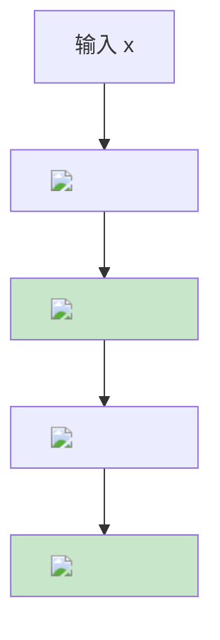

# Mermaid 公式显示方案 (CodeCogs SVG)

## 解决的问题

Mermaid 不支持直接在节点文本中使用括号 `()`，会导致解析错误。

## 解决方案

使用 CodeCogs 将 LaTeX 公式转换为 SVG 图片，嵌入到 Mermaid 中。

## 使用方法

### 1. 生成公式图片 URL

访问：https://www.codecogs.com/latex/eqneditor.php

输入 LaTeX 公式，例如：
```latex
W \sim N\left(0, \frac{2}{n_{in} + n_{out}}\right)
```

选择 **SVG 格式**，复制图片链接。

URL 格式：
```
https://www.codecogs.com/svg.latex?URL编码的公式
```

### 2. Markdown 直接插入

```markdown

```

效果：

### 3. Mermaid 内嵌图片


**注意**：必须添加 `%%{init: {'flowchart': {'htmlLabels': true}}}%%` 才能支持 HTML 标签。

## 常用公式编码

| 公式 | LaTeX | URL 编码 |
|------|-------|----------|
| Var(x) | `Var(x)` | `Var%28x%29` |
| W ~ N(0, 1) | `W \sim N(0, 1)` | `W%20%5Csim%20N%280%2C%201%29` |
| y = Wx | `y = Wx` | `y%20%3D%20Wx` |
| Var(y) ≈ Var(x) | `Var(y) ≈ Var(x)` | `Var%28y%29%20%5Capprox%20Var%28x%29` |
| frac{2}{n_in} | `\frac{2}{n_in}` | `%5Cfrac%7B2%7D%7Bn_%7Bin%7D%7D` |

## 示例代码

### Mermaid 流程图



## 注意事项

1. **离线不可用**：依赖 CodeCogs 在线服务
2. **图片可能失效**：如果 CodeCogs 服务下线，图片会失效
3. **加载速度**：首次加载可能较慢
4. **兼容性**：需要支持 HTML 标签的 Markdown 渲染器

## 替代方案

如果不需要在 Mermaid 中嵌入公式，可以：
- Mermaid 只显示流程逻辑
- 公式用独立的 LaTeX 块 `$$...$$` 显示


$$W \sim N\left(0, \frac{2}{n_{in} + n_{out}}\right)$$
