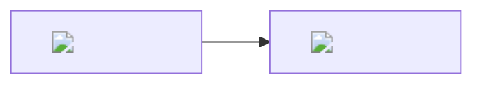

# CLAUDE.md

This file provides guidance to Claude Code when working with code in this repository.

## Project Overview

This is a learning project under the AI Learning project hub.

## Project Type

- Language: Detect from project files
- Purpose: Learning/Practice

## Commands

No specific commands configured yet.

## Mermaid 公式处理

### 本地存储
- 公式 SVG 保存在 `docs/assets/` 目录
- 文件名格式：`{hash}.svg`（基于公式内容的 MD5 hash）

### 生成方式
使用 `scripts/render-formula.py` 生成真正的 SVG（含 `<path>` 元素）：

```bash
# 前置依赖
pip install matplotlib

# 生成公式 SVG
python scripts/render-formula.py "\\mathbf{W}_1"
# 输出: docs/assets/d069d67e.svg
```

### Mermaid 引用格式


### 规则
1. 新公式使用 Python 脚本生成 SVG
2. 复用已有公式（相同 hash 不重复渲染）
3. SVG 随项目提交到 Git
4. 使用 Matplotlib 生成真正的 SVG 格式，避免 HTML+MathML 混合内容导致显示问题

## TikZ 图表处理

### 目录结构
```
charts/tikz/*.tex          # TikZ 源文件
docs/assets/*.svg          # 生成的 SVG 文件
```

### 命令
```bash
# 生成所有 TikZ 图表
npm run tikz

# 监听模式（自动重新编译）
npm run tikz:watch

# 使用 pdf2svg 备选方案
npm run tikz:pdf2svg
```

### 前置依赖
- **LaTeX 发行版** (lualatex + dvisvgm)
  - Windows: MiKTeX (https://miktex.org/)
  - Mac: TeX Live via Homebrew (`brew install --cask mactex`)
  - Linux: `sudo apt install texlive-latex-extra lualatex dvisvgm`

### 添加新图表
1. 在 `charts/tikz/` 创建 `.tex` 文件
2. 运行 `npm run tikz` 生成 SVG
3. 在文档中引用：``

## Mermaid 图表处理

### 工具定位
```
┌─────────────────────────────────────────────────────────┐
│  简单流程图 → Mermaid（代码驱动，易维护）                │
│  复杂架构图 → TikZ（公式完美集成，学术标准）             │
│  数据图表   → Matplotlib（数据驱动）                     │
└─────────────────────────────────────────────────────────┘
```

### 目录结构
```
charts/mermaid/*.mmd      # Mermaid 源文件
docs/assets/*.svg         # 生成的 SVG 文件
```

### 命令
```bash
# 生成所有 Mermaid 图表
npm run mermaid

# 监听模式（自动重新编译）
npm run mermaid:watch
```

### 前置依赖
- **Mermaid CLI**: `npm install --save-dev @mermaid-js/mermaid-cli`

### 添加新图表
1. 在 `charts/mermaid/` 创建 `.mmd` 文件
2. 运行 `npm run mermaid` 生成 SVG
3. 在文档中引用：``
