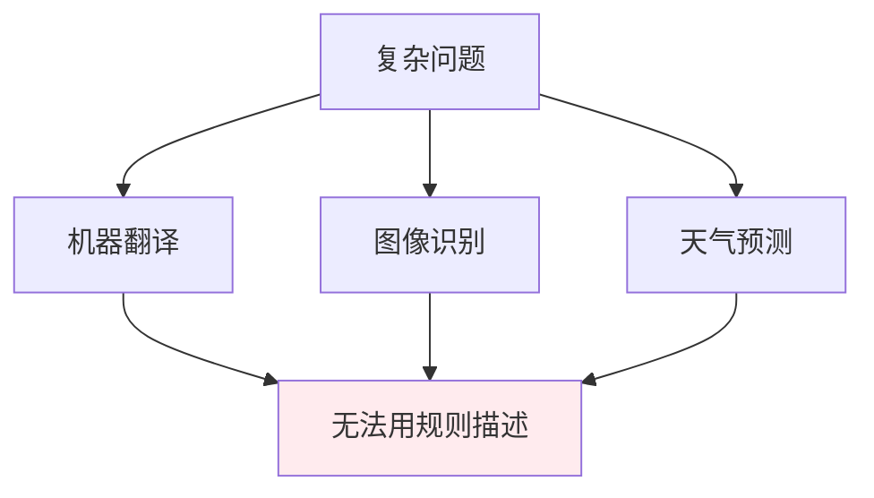
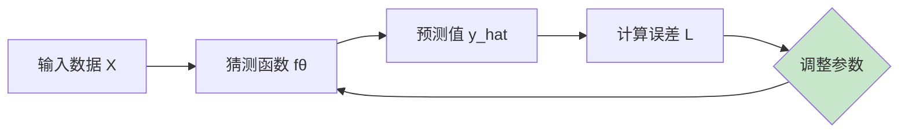
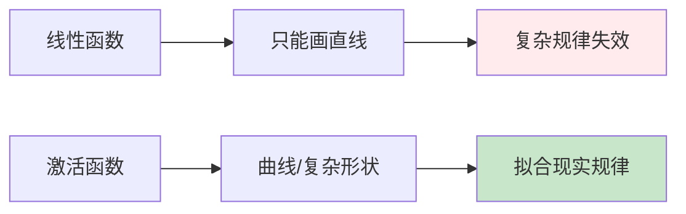

# 第一章：基础概念

> 用函数描述世界，理解两种思维范式

---

## 1.1 用函数描述世界

在深入理解现代深度学习之前，我们需要先理解一个核心思想：**用函数来描述世界的规律**。

无论是物理定律、经济规律还是语言规律，本质上都可以看作是一个函数：

$$y = f(x)$$

其中：
- $x$ 是输入（已知信息）
- $y$ 是输出（预测结果）
- $f$ 是函数本身（描述了输入和输出之间的规律）

**例子**：

| 领域 | 函数形式 | 说明 |
|------|----------|------|
| 物理 | $v = \frac{s}{t}$ | 速度等于路程除以时间 |
| 经济 | $C(q) = aq + b$ | 成本函数 |
| 机器学习 | $\hat{y} = f_\theta(x)$ | 预测函数 |

---

## 1.2 两种思维范式

### 符号主义（Symbolic AI）

符号主义的核心思想是：**通过人类的观察和总结，发现事物背后的规律，用明确的数学函数来描述**。

**典型例子**：
- 勾股定理：$a^2 + b^2 = c^2$
- 牛顿第二定律：$F = ma$
- 欧姆定律：$V = IR$

**局限性**：
随着问题复杂度增加，符号主义面临瓶颈：



### 连接主义（Connectionism）

连接主义的核心思想是：**不试图发现明确的规律，而是根据输入-输出数据来"学习"出规律**。

**核心思路**：



**关键步骤**：
1. 收集大量输入-输出数据对 $(x_i, y_i)$
2. 假设一个函数形式 $f_\theta(x)$（参数 $\theta$ 待定）
3. 计算预测值与真实值的偏差
4. 最小化偏差，调整参数 $\theta$
5. 最终得到的 $f_\theta$ 就是学到的规律

---

## 1.3 从线性到非线性

### 1.3.1 线性回归

最简单的一元线性函数：

$$y = kx + b$$

其中 $k$ 是斜率（权重），$b$ 是截距（偏置）。

**最小二乘法**用于求解最优的 $k$ 和 $b$：

$$k = \frac{n\sum(xy) - \sum x \sum y}{n\sum(x^2) - (\sum x)^2}$$

$$b = \frac{\sum y - k\sum x}{n}$$

### 1.3.2 为什么需要非线性？

现实世界中的规律往往是**非线性**的。线性函数（直线）无法拟合复杂的现实规律。



**解决方案**：引入**激活函数**（Activation Function）

### 1.3.3 常用激活函数

#### Sigmoid 函数

$$\sigma(x) = \frac{1}{1 + e^{-x}}$$

**特点**：
- 输出范围：$(0, 1)$
- 常用于二分类问题
- 缺点：梯度消失问题

#### ReLU 函数

$$\text{ReLU}(x) = \max(0, x)$$

**特点**：
- 输出范围：$[0, +\infty)$
- 解决了梯度消失问题
- **现代深度学习最常用的激活函数**

### 1.3.4 神经网络的结构

神经网络 = 多个线性变换 + 激活函数 组合：

$$z = W \cdot x + b \quad \text{(线性变换)}$$

$$a = \text{激活函数}(z) \quad \text{(非线性变换)}$$

---

## 1.4 概率论基础

### 1.4.1 为什么要学概率？

深度学习本质上是**概率问题**：

| 应用场景 | 概率视角 |
|----------|----------|
| 图像分类 | 输出每个类别的概率 P(类别\|图像) |
| 文本生成 | 预测下一个词的概率分布 P(词\|上下文) |
| 目标检测 | 输出边界框的概率和位置分布 |

**核心思想**：神经网络的输出是不确定的，概率帮助我们量化这种不确定性。

### 1.4.2 随机变量与概率分布

**随机变量（Random Variable）**：取值不确定的变量

| 类型 | 描述 | 例子 |
|------|------|------|
| 离散随机变量 | 取有限或可数个值 | 抛硬币结果 {0, 1} |
| 连续随机变量 | 取区间内任意值 | 身高、测量误差 |

**概率分布**：
- **离散**：$P(X=x)$ 或 $P(x)$
- **连续**：概率密度函数 $p(x)$，$P(a \le X \le b) = \int_a^b p(x)dx$

### 1.4.3 常见概率分布

| 分布名称 | 公式 | 应用场景 |
|----------|------|----------|
| 伯努利分布 | $P(X=1) = p$ | 二分类 |
| 分类分布 | $P(X=i) = p_i, \sum p_i = 1$ | 多分类 |
| 高斯分布 | $p(x) = \frac{1}{\sqrt{2\pi\sigma^2}} e^{-\frac{(x-\mu)^2}{2\sigma^2}}$ | 连续值、VAE |
| 拉普拉斯分布 | $p(x) = \frac{1}{2b} e^{-\frac{\vert x-\mu \vert}{b}}$ | 稀疏建模 |

### 1.4.4 期望与方差

**期望（Expectation）**：随机变量的"平均值"

$$E[X] = \sum_i x_i \cdot P(X=x_i) \quad \text{（离散）}$$

$$E[X] = \int_{-\infty}^{+\infty} x \cdot p(x) dx \quad \text{（连续）}$$

**方差（Variance）**：随机变量的"波动程度"

$$\text{Var}(X) = E[(X - E[X])^2] = E[X^2] - (E[X])^2$$

### 1.4.5 什么是散度？

**散度（Divergence）**：衡量两个概率分布之间"距离"的非对称度量。

$$D(P \| Q) \ge 0 \quad \text{且} \quad D(P \| Q) = 0 \iff P = Q$$

### 1.4.6 KL 散度（KL Divergence）

**定义**（离散形式）：

$$D_{KL}(P \| Q) = \sum_i P(i) \cdot \log \frac{P(i)}{Q(i)}$$

**定义**（连续形式）：

$$D_{KL}(P \| Q) = \int_{-\infty}^{+\infty} p(x) \cdot \log \frac{p(x)}{q(x)} dx$$

**例子**：

```python
import numpy as np

# 两个简单的概率分布
P = np.array([0.5, 0.3, 0.2])  # 真实分布
Q = np.array([0.4, 0.4, 0.2])  # 预测分布

# 计算 KL 散度 D_KL(P || Q)
kl_div = np.sum(P * np.log(P / Q))
print(f"D_KL(P || Q) = {kl_div:.4f}")  # 约 0.087
```

### 1.4.7 KL 散度的性质

| 性质 | 描述 |
|------|------|
| 非负性 | $D_{KL}(P \| Q) \ge 0$ |
| 非对称性 | $D_{KL}(P \| Q) \neq D_{KL}(Q \| P)$ |
| 链式法则 | $D_{KL}(P(X,Y) \| Q(X,Y)) = D_{KL}(P(X) \| Q(X)) + D_{KL}(P(Y\|X) \| Q(Y\|X))$ |

### 1.4.8 KL 散度在深度学习中的应用

| 应用 | 用途 |
|------|------|
| VAE | 最小化 $D_{KL}(q(z\|x) \| p(z))$ 使近似后验接近先验 |
| 风格迁移 | 最小化特征分布的 KL 散度 |
| 知识蒸馏 | 学生分布逼近教师分布 |

---

## 1.5 Softmax 函数

### 1.5.1 为什么需要 Softmax？

在多分类问题中，我们需要将神经网络的输出转换为**概率分布**。

例如：图像分类（猫、狗、鸟）
- 神经网络输出：[-2.1, 0.5, 3.2]
- 需要转换为：[P(猫), P(狗), P(鸟)]，且和为 1

### 1.5.2 Softmax 公式

$$\text{Softmax}(x_i) = \frac{e^{x_i}}{\sum_{j=1}^{n} e^{x_j}}$$

**例子**：
```
输入: x = [2.0, 1.0, 0.1]

e^x = [7.389, 2.718, 1.105]
sum = 11.212

Softmax = [7.389/11.212, 2.718/11.212, 1.105/11.212]
        = [0.659, 0.242, 0.099]
```

### 1.5.3 PyTorch 实现

```python
import torch
import torch.nn as nn

# 方法1：使用 nn.CrossEntropyLoss（内部包含 Softmax）
criterion = nn.CrossEntropyLoss()

# 方法2：手动 Softmax
logits = torch.tensor([2.0, 1.0, 0.1])
probabilities = torch.softmax(logits, dim=0)
print(probabilities)  # tensor([0.659, 0.242, 0.099])

# 方法3：使用 nn.Softmax
softmax = nn.Softmax(dim=0)
print(softmax(logits))
```

### 1.5.4 Softmax vs Sigmoid

| 特性 | Softmax | Sigmoid |
|------|---------|---------|
| 用途 | 多分类（>2类） | 二分类 |
| 输出范围 | (0, 1)，和为 1 | (0, 1) |
| 相互排斥 | 是，各类别竞争 | 否，独立概率 |
| 公式 | $e^{x_i} / \sum e^{x_j}$ | $1 / (1 + e^{-x})$ |

---

## 1.6 N-gram 语言模型

### 1.6.1 什么是 N-gram？

N-gram 是**统计语言模型**的基础概念，表示**连续的 n 个词**。

| N | 名称 | 例子 |
|---|------|------|
| 1 | Unigram | "我", "爱", "学习" |
| 2 | Bigram | "我爱", "爱学习" |
| 3 | Trigram | "我爱学习", "爱机器学习" |

### 1.6.2 N-gram 的作用

**预测下一个词**：

```python
# 基于 Bigram 的词预测
# P(学习|我爱) = count(我爱学习) / count(我爱)

# 语料库：
# "我爱学习机器学习"
# "我爱深度学习"

# "我爱" 后面跟 "学习" 的概率
P(学习|我爱) = 2 / 2 = 1.0
```

### 1.6.3 N-gram 的局限性

| 问题 | 描述 |
|------|------|
| 数据稀疏 | 很多 N-gram 组合在语料库中从未出现 |
| 维度爆炸 | 词表越大，N-gram 组合数指数增长 |
| 语义缺失 | 无法理解词的语义相似性 |

**例子**：
- "狗咬人" 和 "人咬狗" 的 Ngram 统计可能完全不同，但语义相关

### 1.6.4 从 N-gram 到词嵌入

```
N-gram（统计方法）     →     词嵌入（表示学习）
缺点：稀疏、高维          优点：稠密、低维、语义相似
```

词嵌入（如 word2vec）解决了 N-gram 的问题：
- "狗" 和 "猫" 的向量相近
- 可以泛化到未见过的词组合

---

## 代码示例

```python
import numpy as np

# 示例：最小二乘法线性回归
np.random.seed(42)
X = np.linspace(0, 10, 20)
y_true = 2 * X + 1
y = y_true + np.random.randn(20) * 2  # 添加噪声

# 最小二乘法求解
n = len(X)
k = (n * np.sum(X * y) - np.sum(X) * np.sum(y)) / (n * np.sum(X**2) - np.sum(X)**2)
b = (np.sum(y) - k * np.sum(X)) / n

print(f"真实关系: y = 2x + 1")
print(f"拟合结果: y = {k:.4f}x + {b:.4f}")
```

---

## 思考题

1. 为什么线性函数无法拟合复杂规律？
2. 符号主义和连接主义的核心区别是什么？
3. 激活函数的作用是什么？

---

## 下一步

下一章我们将详细讨论神经网络的结构。
