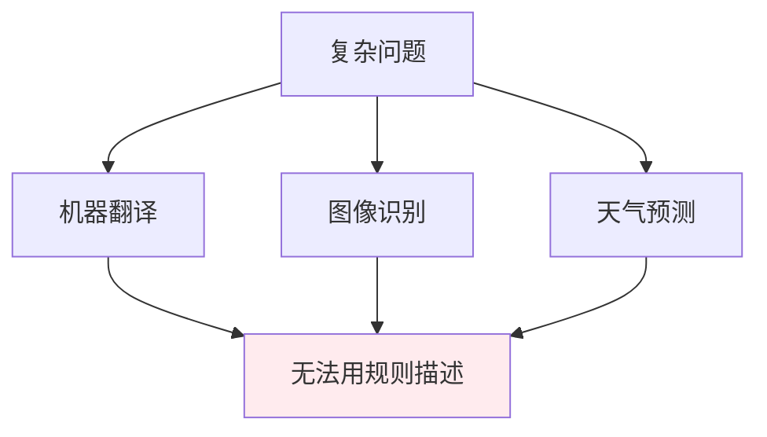
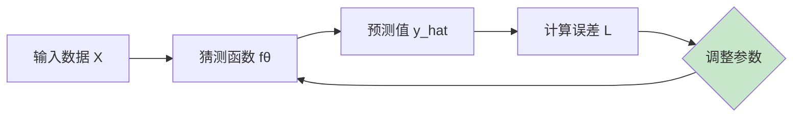
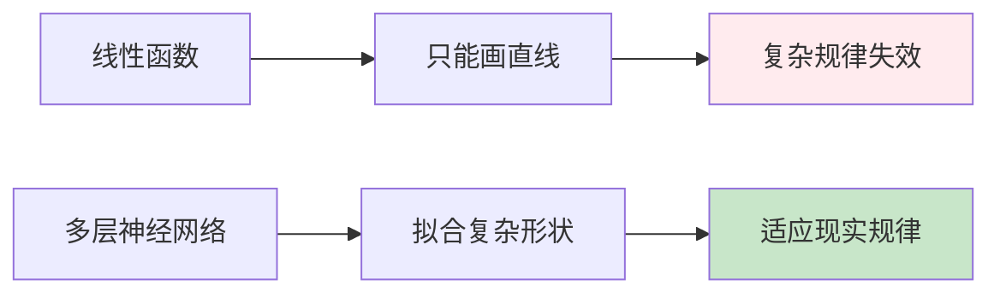
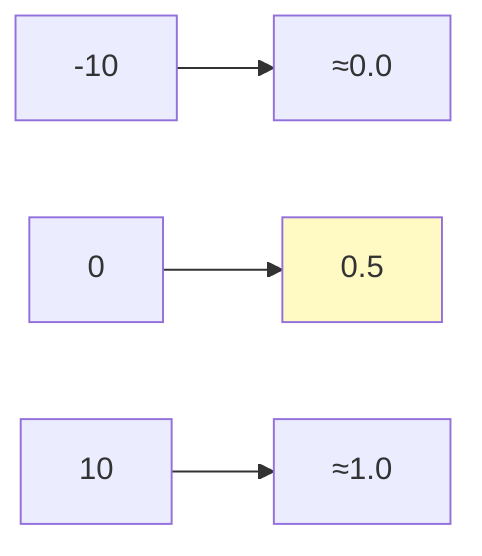
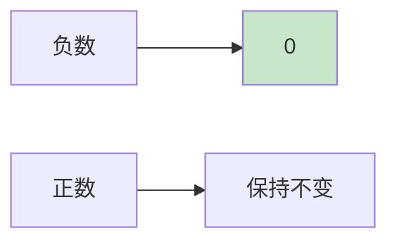

# 第一章：从函数到神经网络

> 从函数思维到深度学习的基础构建

---

## 1.1 用函数描述世界

在深入理解现代深度学习之前，我们需要先理解一个核心思想：**用函数来描述世界的规律**。

无论是物理定律、经济规律还是语言规律，本质上都可以看作是一个函数：

$$y = f(x)$$

其中：

- $x$ 是输入（已知信息）
- $y$ 是输出（预测结果）
- $f$ 是函数本身（描述了输入和输出之间的规律）

**例子**：

| 领域 | 函数形式 | 说明 |
|------|----------|------|
| 物理 | $v = \frac{s}{t}$ | 速度等于路程除以时间 |
| 经济 | $C(q) = aq + b$ | 成本函数 |
| 机器学习 | $\hat{y} = f_\theta(x)$ | 预测函数 |

---

## 1.2 两种思维范式

### 符号主义（Symbolic AI）

符号主义的核心思想是：**通过人类的观察和总结，发现事物背后的规律，用明确的数学函数来描述**。

**典型例子**：

- 勾股定理：$a^2 + b^2 = c^2$
- 牛顿第二定律：$F = ma$
- 欧姆定律：$V = IR$

**局限性**：
随着问题复杂度增加，符号主义面临瓶颈：



### 连接主义（Connectionism）

连接主义的核心思想是：**不试图发现明确的规律，而是根据输入-输出数据来"学习"出规律**。

**核心思路**：



**关键步骤**：

1. 收集大量输入-输出数据对 $(x_i, y_i)$
2. 假设一个函数形式 $f_\theta(x)$（参数 $\theta$ 待定）
3. 计算预测值与真实值的偏差
4. 最小化偏差，调整参数 $\theta$
5. 最终得到的 $f_\theta$ 就是学到的规律

---

## 1.3 从线性回归到单层网络

### 1.3.1 线性回归问题

假设我们有一组房屋数据：

| 面积 (m²) | 价格 (万) |
|------------|----------|
| 50 | 150 |
| 80 | 240 |
| 100 | 300 |
| 120 | 360 |

我们想找到面积和价格之间的关系。最简单的假设是**线性关系**：

$$y = kx + b$$

其中：

- $x$ 是房屋面积
- $y$ 是价格
- $k$ 是每平方米的价格（权重）
- $b$ 是基础价格（偏置）

### 1.3.2 最小二乘法求解

给定 $n$ 个数据点 $(x_i, y_i)$，最优的 $k$ 和 $b$ 可以通过最小二乘法计算：

$$k = \frac{n\sum(xy) - \sum x \sum y}{n\sum(x^2) - (\sum x)^2}$$

$$b = \frac{\sum y - k\sum x}{n}$$

**代码实现**：

```python
import numpy as np

# 数据
X = np.array([50, 80, 100, 120])
y = np.array([150, 240, 300, 360])

# 最小二乘法求解
n = len(X)
k = (n * np.sum(X * y) - np.sum(X) * np.sum(y)) / (n * np.sum(X**2) - np.sum(X)**2)
b = (np.sum(y) - k * np.sum(X)) / n

print(f"拟合结果: y = {k:.4f}x + {b:.4f}")
# 输出: y = 3.0000x + 0.0000
```

### 1.3.3 从线性回归到神经网络视角

让我们用神经网络的语言重新描述线性回归：

**输入**：$x$（房屋面积）
**权重**：$k$（斜率）
**偏置**：$b$（截距）
**输出**：$\hat{y} = k \cdot x + b$

这就是一个**单层神经网络**（没有激活函数）：

```plaintext
    输入 x
      │
      ▼
┌─────────┐
│  乘 k   │
└────┬────┘
     │
     ▼
┌─────────┐
│  加 b   │
└────┬────┘
     │
     ▼
   输出 ŷ
```

### 1.3.4 损失函数

如何知道我们的预测好坏？我们需要一个**损失函数**（Loss Function）来衡量预测值与真实值的差距。

对于回归问题，常用**均方误差（MSE）**：

$$L = \frac{1}{n}\sum_{i=1}^{n}(y_i - \hat{y}_i)^2$$

**目标**：找到最优的 $k$ 和 $b$，使得损失 $L$ 最小。

---

## 1.4 为什么需要深度？

### 1.4.1 线性模型的局限性

线性模型（如线性回归）只能拟合**直线关系**，但现实世界往往是非线性的。

**例子**：如果房屋价格与面积的关系是这样的：

- 小面积时，价格增长快
- 大面积时，价格增长慢
- 这不是一条直线！



### 1.4.2 通用近似定理

**Cybenko 定理（1989）**：一个足够大的单隐层神经网络可以逼近任何连续函数。

**直观理解**：

- 线性模型：只能画直线/平面
- 多层神经网络：可以组合多条直线，逼近任意曲线

**类比**：

- 线性模型：就像用尺子画图，只能画直线
- 多层神经网络：就像用无数小线段拼接，可以画出任意形状

### 1.4.3 层次化特征学习的思想

深度学习的核心思想：**层次化地学习特征**

```
原始图像
    │
    ▼
第一层：边缘、颜色
    │
    ▼
第二层：形状、纹理
    │
    ▼
第三层：物体部件
    │
    ▼
第四层：完整物体
    │
    ▼
输出：识别结果
```

每一层学习更高级的特征，这就是"深度"的意义。

---

## 1.5 激活函数

### 1.5.1 为什么需要激活函数？

如果没有激活函数，无论多少层神经网络都可以简化为：

$$y = W_n \cdot (... W_2 \cdot (W_1 \cdot x + b_1) + b_2) ... + b_n$$

$$= W' \cdot x + b'$$

**结论**：没有激活函数的多层网络 = 单层线性网络！

**激活函数的作用**：引入非线性，让神经网络能够拟合复杂关系。

### 1.5.2 Sigmoid 函数

$$\sigma(x) = \frac{1}{1 + e^{-x}}$$



**特点**：

- 输出范围：$(0, 1)$
- 常用于二分类问题
- **缺点**：梯度消失问题（在正负无穷处梯度接近0）

### 1.5.3 ReLU 函数

$$\text{ReLU}(x) = \max(0, x)$$



**特点**：

- 输出范围：$[0, +\infty)$
- 解决了梯度消失问题（正区间梯度恒为1）
- **现代深度学习最常用的激活函数**

### 1.5.4 神经网络的结构

神经网络 = 多个线性变换 + 激活函数的组合：

$$z = W \cdot x + b \quad \text{(线性变换)}$$

$$a = \text{激活函数}(z) \quad \text{(非线性变换)}$$

**多层神经网络示例**：

```
输入层 (x)
    │
    ▼
    z1 = W1·x + b1
    a1 = ReLU(z1)  ← 第一层
    │
    ▼
    z2 = W2·a1 + b2
    a2 = ReLU(z2)  ← 第二层
    │
    ▼
    z3 = W3·a2 + b3
    ŷ = softmax(z3)  ← 输出层
    │
    ▼
输出 (ŷ)
```

---

## 1.6 概率论基础（快速回顾）

### 1.6.1 为什么需要概率？

深度学习的输出通常是不确定的，概率帮助我们量化这种不确定性。

**例子**：

- 图像分类：这是猫的概率是多少？
- 文本生成：下一个词是"学习"的概率是多少？

### 1.6.2 常见概率分布

| 分布名称 | 公式 | 应用场景 |
|----------|------|----------|
| 伯努利分布 | $P(X=1) = p$ | 二分类 |
| 分类分布 | $P(X=i) = p_i, \sum p_i = 1$ | 多分类 |
| 高斯分布 | $p(x) = \frac{1}{\sqrt{2\pi\sigma^2}} e^{-\frac{(x-\mu)^2}{2\sigma^2}}$ | 连续值、VAE |

### 1.6.3 期望与方差

**期望**（平均值）：
$$E[X] = \sum_i x_i \cdot P(X=x_i) \quad \text{（离散）}$$

**方差**（波动程度）：
$$\text{Var}(X) = E[(X - E[X])^2] = E[X^2] - (E[X])^2$$

---

## 1.7 Softmax 函数

### 1.7.1 为什么需要 Softmax？

在多分类问题中，我们需要将神经网络的输出转换为**概率分布**。

例如：图像分类（猫、狗、鸟）

- 神经网络输出：[-2.1, 0.5, 3.2]
- 需要转换为：[P(猫), P(狗), P(鸟)]，且和为 1

### 1.7.2 Softmax 公式

$$\text{Softmax}(x_i) = \frac{e^{x_i}}{\sum_{j=1}^{n} e^{x_j}}$$

**例子**：

```
输入: x = [2.0, 1.0, 0.1]

e^x = [7.389, 2.718, 1.105]
sum = 11.212

Softmax = [7.389/11.212, 2.718/11.212, 1.105/11.212]
        = [0.659, 0.242, 0.099]
```

### 1.7.3 PyTorch 实现

```python
import torch

logits = torch.tensor([2.0, 1.0, 0.1])
probabilities = torch.softmax(logits, dim=0)
print(probabilities)  # tensor([0.659, 0.242, 0.099])
```

### 1.7.4 Softmax vs Sigmoid

| 特性 | Softmax | Sigmoid |
|------|---------|---------|
| 用途 | 多分类（>2类） | 二分类 |
| 输出范围 | (0, 1)，和为 1 | (0, 1) |
| 相互排斥 | 是，各类别竞争 | 否，独立概率 |

---

## 代码示例

### 示例 1：线性回归到单层网络

```python
import numpy as np

# 房屋数据
X = np.array([50, 80, 100, 120])
y = np.array([150, 240, 300, 360])

# 线性回归（最小二乘法）
n = len(X)
k = (n * np.sum(X * y) - np.sum(X) * np.sum(y)) / (n * np.sum(X**2) - np.sum(X)**2)
b = (np.sum(y) - k * np.sum(X)) / n

# 预测
def predict(area):
    return k * area + b

print(f"拟合结果: y = {k:.2f}x + {b:.2f}")
print(f"预测100平: {predict(100):.0f}万")
```

### 示例 2：激活函数对比

```python
import numpy as np
import matplotlib.pyplot as plt

x = np.linspace(-5, 5, 100)

def sigmoid(x):
    return 1 / (1 + np.exp(-x))

def relu(x):
    return np.maximum(0, x)

# 可视化
plt.figure(figsize=(10, 3))

plt.subplot(1, 2, 1)
plt.plot(x, sigmoid(x))
plt.title('Sigmoid')
plt.grid(True)

plt.subplot(1, 2, 2)
plt.plot(x, relu(x))
plt.title('ReLU')
plt.grid(True)

plt.tight_layout()
plt.show()
```

---

## 本章小结

**核心概念**：

1. ✅ 函数思维：$y = f(x)$
2. ✅ 连接主义：从数据学习函数参数
3. ✅ 线性回归 = 单层神经网络（无激活函数）
4. ✅ 激活函数引入非线性
5. ✅ 多层网络可以拟合复杂函数
6. ✅ Softmax 将输出转换为概率分布

**关键公式**：

- 线性模型：$y = Wx + b$
- 激活后：$a = \sigma(Wx + b)$
- Softmax：$\frac{e^{x_i}}{\sum e^{x_j}}$

---

## 思考题

1. 为什么没有激活函数的多层神经网络等于单层网络？
2. 如果线性模型已经可以拟合一些关系，为什么还需要深度网络？
3. ReLU 相比 Sigmoid 有什么优势？为什么它更常用？

---

## 练习题

**选择题**：

1. 以下哪个激活函数的输出范围是 (0, 1)？
   A. ReLU  B. Sigmoid  C. Tanh  D. Linear

2. Softmax 函数输出的特点是什么？
   A. 所有输出之和为 1
   B. 只能用于二分类
   C. 输出范围是 [0, 1]
   D. 梯度不会消失

**答案**：

1. B. Sigmoid
2. A. 所有输出之和为 1

---

## 下一步

下一章我们将深入探讨**深度神经网络**的结构，包括：

- 多层前向传播
- 反向传播算法（如何自动学习参数）
- 常见激活函数的详细分析
- 过拟合与正则化

准备好构建你的第一个深度神经网络了吗？
