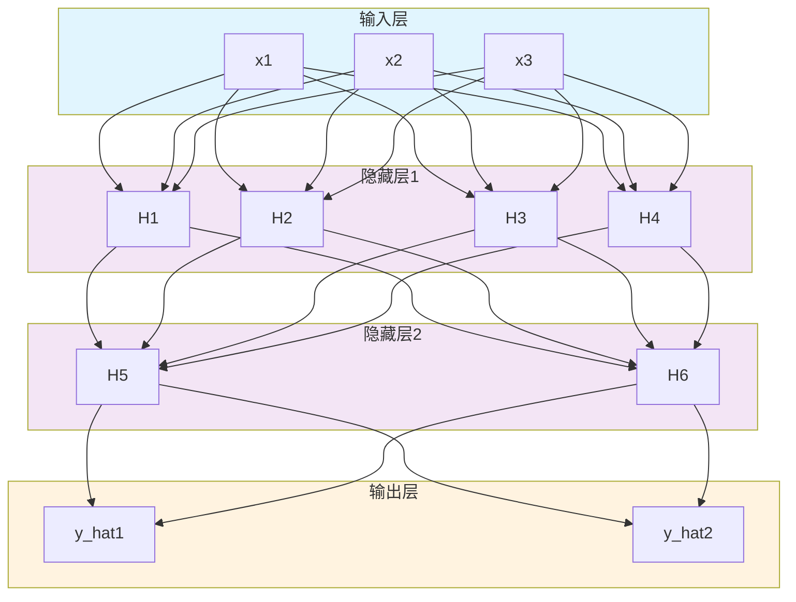
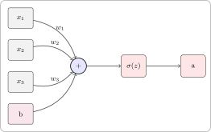
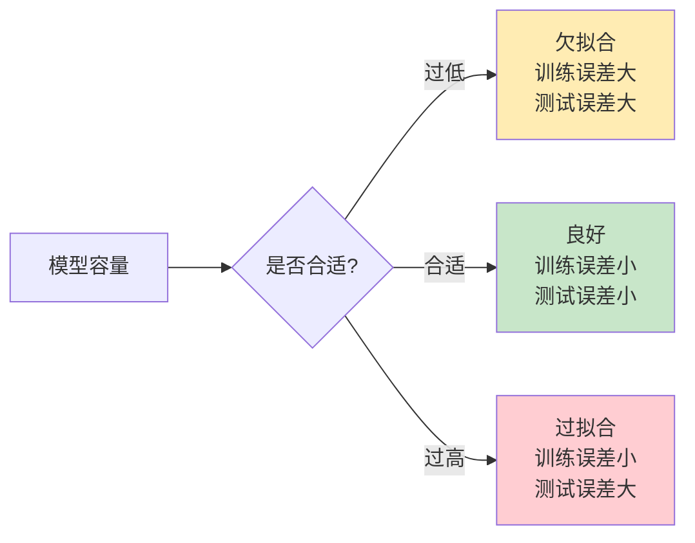

# 第二章：深度神经网络


> 理解多层网络结构、前向传播与反向传播

---

## 2.1 网络层次结构

### 2.1.1 三种基本层

神经网络由三种层组成：**输入层**、**隐藏层**和**输出层**。




### 2.1.2 术语解释

| 术语 | 英文 | 说明 |
|------|------|------|
| 输入层 | Input Layer | 接收原始数据 |
| 隐藏层 | Hidden Layer | 中间的计算层，不直接与外界交互 |
| 输出层 | Output Layer | 产生最终预测结果 |
| 神经元 | Neuron | 每个圆圈代表一个神经元 |
| 全连接 | Fully Connected | 每个神经元与前一层的所有神经元相连 |

### 2.1.3 网络维度表示

**网络结构表示法**：输入维度 → 隐藏维度 → ... → 输出维度

| 网络类型 | 表示法 | 例子 |
|----------|--------|------|
| 单层网络 | `784 → 10` | MNIST数字识别 |
| 两层网络 | `784 → 128 → 10` | 简单分类 |
| 深度网络 | `784 → 512 → 256 → 128 → 10` | 复杂任务 |

---

## 2.2 前向传播

### 2.2.1 数学表示

**前向传播**（Forward Propagation）：数据从输入层到输出层的计算过程。

对于第 $l$ 层：

$$z^{(l)} = W^{(l)} \cdot a^{(l-1)} + b^{(l)}$$

$$a^{(l)} = \phi(z^{(l)})$$

其中：

- $W^{(l)}$：第 $l$ 层的权重矩阵
- $b^{(l)}$：第 $l$ 层的偏置向量
- $a^{(l-1)}$：第 $l-1$ 层的输出（激活值）
- $\phi(\cdot)$：激活函数

### 2.2.2 完整前向传播流程


**步骤**：

1. 输入层：$a^{(0)} = x$（原始输入）
2. 第一层：$z^{(1)} = W^{(1)}a^{(0)} + b^{(1)}, \quad a^{(1)} = \phi(z^{(1)})$
3. 第二层：$z^{(2)} = W^{(2)}a^{(1)} + b^{(2)}, \quad a^{(2)} = \phi(z^{(2)})$
4. ...
5. 输出层：$\hat{y} = a^{(L)}$（最终预测）

### 2.2.3 单个神经元的计算

一个神经元接收多个输入 $x_1, x_2, ..., x_n$，计算：

$$z = w_1 x_1 + w_2 x_2 + ... + w_n x_n + b$$

$$a = \sigma(z)$$



---

## 2.3 反向传播

### 2.3.1 为什么需要反向传播？

**问题**：神经网络有几万甚至几亿个参数，如何知道哪个参数应该调整？

**解决方案**：反向传播算法（Backpropagation）

- 从输出层向输入层传播误差
- 使用链式法则计算梯度
- 指导每个参数的更新方向

### 2.3.2 损失函数

损失函数衡量预测值与真实值的差距。

**均方误差（MSE）**（回归问题）：
$$L = \frac{1}{n}\sum_{i=1}^{n}(y_i - \hat{y}_i)^2$$

**交叉熵损失**（分类问题）：
$$L = -\sum_{i=1}^{n} y_i \log(\hat{y}_i)$$

### 2.3.3 梯度下降

**目标**：找到使损失函数最小的参数。

**梯度下降**：沿着梯度相反方向更新参数。

$$W \leftarrow W - \alpha \frac{\partial L}{\partial W}$$

$$b \leftarrow b - \alpha \frac{\partial L}{\partial b}$$

其中：

- $\alpha$ 是学习率（Learning Rate）
- $\frac{\partial L}{\partial W}$ 是损失对权重的梯度

### 2.3.4 链式法则

**链式法则**（Chain Rule）：计算复合函数的导数。

$$\frac{\partial L}{\partial W^{(1)}} = \frac{\partial L}{\partial a^{(2)}} \cdot \frac{\partial a^{(2)}}{\partial z^{(2)}} \cdot \frac{\partial z^{(2)}}{\partial a^{(1)}} \cdot \frac{\partial a^{(1)}}{\partial z^{(1)}} \cdot \frac{\partial z^{(1)}}{\partial W^{(1)}}$$

**直观理解**：

- 误差从输出层"反向"传播到输入层
- 每一层计算自己的梯度，传递给前一层

### 2.3.5 反向传播算法


**步骤**：

1. **前向传播**：计算每层的激活值 $a^{(l)}$
2. **计算损失**：$L = \text{loss}(\hat{y}, y)$
3. **反向传播**：
   - 输出层：$\delta^{(L)} = \frac{\partial L}{\partial a^{(L)}} \cdot \phi'(z^{(L)})$
   - 隐藏层：$\delta^{(l)} = (\delta^{(l+1)} W^{(l+1)}) \cdot \phi'(z^{(l)})$
4. **参数更新**：
   - $W^{(l)} \leftarrow W^{(l)} - \alpha \cdot \delta^{(l)} (a^{(l-1)})^T$
   - $b^{(l)} \leftarrow b^{(l)} - \alpha \cdot \delta^{(l)}$

### 2.3.6 手动计算示例（单神经元）

考虑一个简单的单神经元网络：

$$z = w \cdot x + b$$

$$a = \sigma(z)$$

$$L = (a - y)^2$$

**计算梯度**：

$$\frac{\partial L}{\partial w} = \frac{\partial L}{\partial a} \cdot \frac{\partial a}{\partial z} \cdot \frac{\partial z}{\partial w}$$

$$= 2(a - y) \cdot \sigma'(z) \cdot x$$

$$\frac{\partial L}{\partial b} = \frac{\partial L}{\partial a} \cdot \frac{\partial a}{\partial z} \cdot \frac{\partial z}{\partial b}$$

$$= 2(a - y) \cdot \sigma'(z) \cdot 1$$

**参数更新**：

$$w \leftarrow w - \alpha \cdot 2(a - y) \cdot \sigma'(z) \cdot x$$

$$b \leftarrow b - \alpha \cdot 2(a - y) \cdot \sigma'(z)$$

---

## 2.4 常见激活函数详解

### 2.4.1 Sigmoid

**公式**：
$$\sigma(x) = \frac{1}{1 + e^{-x}}$$

**导数**：
$$\sigma'(x) = \sigma(x)(1 - \sigma(x))$$

**特点**：

- 输出范围：$(0, 1)$
- 适合二分类
- **缺点**：梯度消失问题（在正负无穷处，$\sigma'(x) \approx 0$）

```python
import torch
import torch.nn as nn

# Sigmoid
sigmoid = nn.Sigmoid()
x = torch.tensor([-5.0, 0.0, 5.0])
print(sigmoid(x))  # tensor([0.0067, 0.5000, 0.9933])
```


### 2.4.2 Tanh

**公式**：
$$\tanh(x) = \frac{e^x - e^{-x}}{e^x + e^{-x}}$$

**导数**：
$$\tanh'(x) = 1 - \tanh^2(x)$$

**特点**：

- 输出范围：$(-1, 1)$
- 以0为中心，比Sigmoid收敛更快
- 仍然存在梯度消失

```python
tanh = nn.Tanh()
print(tanh(x))  # tensor([-1.0000, 0.0000, 1.0000])
```


### 2.4.3 ReLU

**公式**：
$$\text{ReLU}(x) = \max(0, x)$$

**导数**：
$$\text{ReLU}'(x) = \begin{cases} 1, & x > 0 \\ 0, & x \le 0 \end{cases}$$

**特点**：

- 输出范围：$[0, +\infty)$
- **解决梯度消失**：正区间梯度恒为1
- 计算简单：只需判断是否大于0
- **缺点**：Dead ReLU问题（神经元"死亡"）

```python
relu = nn.ReLU()
print(relu(x))  # tensor([0., 0., 5.])
```


### 2.4.4 Leaky ReLU

**公式**：
$$\text{LeakyReLU}(x) = \max(0.01x, x)$$

**特点**：

- 解决 Dead ReLU：负区间有小梯度
- 保持 ReLU 的优点

```python
leaky_relu = nn.LeakyReLU(negative_slope=0.01)
print(leaky_relu(x))  # tensor([-0.0500, 0.0000, 5.0000])
```


### 2.4.5 GELU（Gaussian Error Linear Unit）

**公式**：
$$\text{GELU}(x) = x \cdot \Phi(x)$$

其中 $\Phi(x)$ 是标准正态分布的累积分布函数。

**特点**：

- Transformer 模型常用
- 比 ReLU 更平滑

```python
gelu = nn.GELU()
print(gelu(x))  # tensor([-0.0036, 0.0000, 5.0000])
```


### 2.4.6 激活函数对比

| 激活函数 | 输出范围 | 梯度消失 | 计算成本 | 推荐场景 |
|----------|----------|----------|----------|----------|
| Sigmoid | (0, 1) | 严重 | 低 | 二分类输出层 |
| Tanh | (-1, 1) | 中等 | 低 | RNN |
| ReLU | [0, ∞) | 无 | 极低 | 隐藏层首选 |
| Leaky ReLU | (-∞, ∞) | 无 | 低 | 避免 Dead ReLU |
| GELU | (-∞, ∞) | 无 | 中 | Transformer |

---

## 2.5 网络容量与过拟合

### 2.5.1 网络容量

**网络容量**（Model Capacity）：神经网络能够学习的函数复杂度。

- **参数数量**：$\sum_{l} (n_{l-1} \times n_l + n_l)$
- **层数**：深度
- **每层神经元数**：宽度

**规律**：

- 容量过低 → 欠拟合（Underfitting）
- 容量过高 → 过拟合（Overfitting）

### 2.5.2 过拟合与欠拟合




**例子**：

```

训练集准确率: 99%
测试集准确率: 70%
→ 过拟合（死记硬背训练数据）

```

### 2.5.3 数据集划分

| 数据集 | 用途 | 比例 |
|--------|------|------|
| 训练集 | 训练模型 | 70-80% |
| 验证集 | 调整超参数 | 10-15% |
| 测试集 | 最终评估 | 10-15% |

---

## 2.6 代码实现

### 2.6.1 完整的前向传播

```python
import numpy as np

def sigmoid(x):
    return 1 / (1 + np.exp(-x))

def sigmoid_derivative(x):
    return sigmoid(x) * (1 - sigmoid(x))

def relu(x):
    return np.maximum(0, x)

def relu_derivative(x):
    return (x > 0).astype(float)

# 初始化网络参数
np.random.seed(42)

# 输入层 -> 隐藏层 (3 -> 4)
W1 = np.random.randn(3, 4) * 0.01
b1 = np.zeros(4)

# 隐藏层 -> 输出层 (4 -> 2)
W2 = np.random.randn(4, 2) * 0.01
b2 = np.zeros(2)

def forward(X):
    """前向传播"""
    # 第一层
    z1 = np.dot(X, W1) + b1
    a1 = relu(z1)

    # 第二层
    z2 = np.dot(a1, W2) + b2
    a2 = sigmoid(z2)

    cache = {'z1': z1, 'a1': a1, 'z2': z2, 'a2': a2}
    return a2, cache

def compute_loss(y_pred, y_true):
    """交叉熵损失"""
    m = y_true.shape[0]
    loss = -np.sum(y_true * np.log(y_pred + 1e-15)) / m
    return loss

# 测试
X_test = np.array([[0.5, 1.0, -0.5]])
y_pred, cache = forward(X_test)
print(f"输入: {X_test}")
print(f"输出: {y_pred}")
```


### 2.6.2 反向传播实现

```python
def backward(X, y, cache):
    """反向传播"""
    m = X.shape[0]

    # 从缓存中获取前向传播的中间值
    a1 = cache['a1']
    a2 = cache['a2']
    z1 = cache['z1']
    z2 = cache['z2']

    # 输出层梯度
    dz2 = a2 - y  # 交叉熵 + sigmoid 的导数简化
    dW2 = np.dot(a1.T, dz2) / m
    db2 = np.sum(dz2, axis=0) / m

    # 隐藏层梯度
    dz1 = np.dot(dz2, W2.T) * relu_derivative(z1)
    dW1 = np.dot(X.T, dz1) / m
    db1 = np.sum(dz1, axis=0) / m

    gradients = {'dW1': dW1, 'db1': db1, 'dW2': dW2, 'db2': db2}
    return gradients

def update_parameters(gradients, learning_rate=0.01):
    """更新参数"""
    global W1, b1, W2, b2

    W1 -= learning_rate * gradients['dW1']
    b1 -= learning_rate * gradients['db1']
    W2 -= learning_rate * gradients['dW2']
    b2 -= learning_rate * gradients['db2']

# 训练循环
def train(X, y, epochs=1000, learning_rate=0.01):
    losses = []

    for epoch in range(epochs):
        # 前向传播
        y_pred, cache = forward(X)

        # 计算损失
        loss = compute_loss(y_pred, y)
        losses.append(loss)

        # 反向传播
        gradients = backward(X, y, cache)

        # 更新参数
        update_parameters(gradients, learning_rate)

        if epoch % 100 == 0:
            print(f"Epoch {epoch}, Loss: {loss:.4f}")

    return losses
```


---

## 本章小结

**核心概念**：

1. ✅ 神经网络由输入层、隐藏层、输出层组成
2. ✅ 前向传播：$z = Wa + b, \quad a = \phi(z)$
3. ✅ 反向传播：使用链式法则计算梯度
4. ✅ 常见激活函数：Sigmoid、ReLU、GELU等
5. ✅ 网络容量与过拟合的关系

**关键公式**：

- 前向传播：$a^{(l)} = \phi(W^{(l)}a^{(l-1)} + b^{(l)})$
- 链式法则：$\frac{\partial L}{\partial W} = \frac{\partial L}{\partial a} \cdot \frac{\partial a}{\partial z} \cdot \frac{\partial z}{\partial W}$
- ReLU导数：$\text{ReLU}'(x) = \begin{cases} 1, & x > 0 \\ 0, & x \le 0 \end{cases}$

---

## 思考题

1. 为什么深度网络比宽网络更能学习层次化特征？
2. 反向传播中，为什么需要链式法则？
3. ReLU 相比 Sigmoid 有什么优势？为什么它成为现代深度学习的默认选择？
4. 如何判断模型是否过拟合？如何缓解？

---

## 练习题

**计算题**：
给定单神经元网络：

- 输入：$x = [1, 2]$
- 权重：$w = [0.5, -0.3]$
- 偏置：$b = 0.1$
- 激活函数：ReLU

计算：

1. 线性变换 $z$ 的值
2. 激活后的输出 $a$
3. 如果损失 $L = (a - 1)^2$，求 $\frac{\partial L}{\partial w_1}$

**答案**：

1. $z = 0.5 \times 1 + (-0.3) \times 2 + 0.1 = 0$
2. $a = \text{ReLU}(0) = 0$
3. $\frac{\partial L}{\partial w_1} = \frac{\partial L}{\partial a} \cdot \frac{\partial a}{\partial z} \cdot \frac{\partial z}{\partial w_1} = -2 \times 0 \times 1 = 0$

---

## 下一步

下一章我们将深入探讨**训练深度神经网络**的方法，包括：

- 损失函数的详细分类与选择
- 优化算法：从SGD到Adam
- 参数初始化策略
- 正则化技术：Dropout、Batch Normalization
- 超参数调优技巧

准备好训练你的神经网络了吗？
