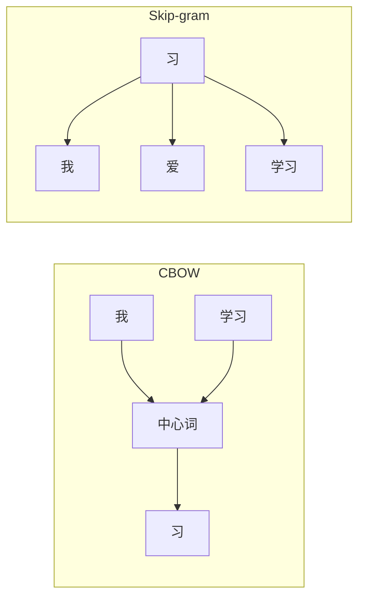
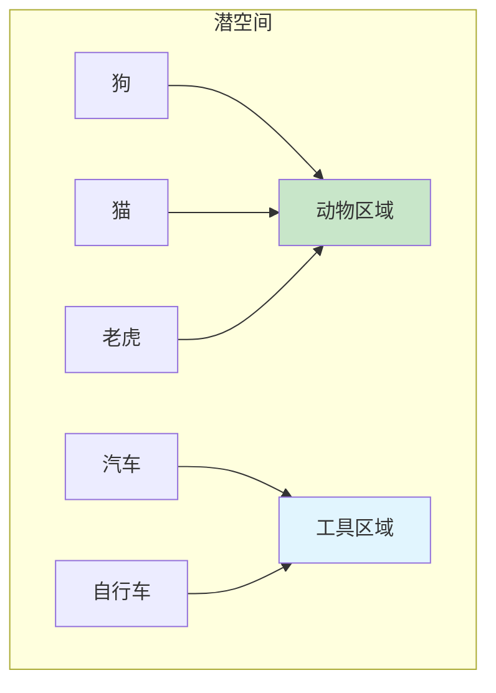

# 第二章：词嵌入与表示学习

> 理解词的分布式表示与语义空间

---

## 2.1 什么是词嵌入？

**词嵌入（Word Embedding）**：将词映射为稠密向量的技术。

**问题**：神经网络无法直接处理文本

**解决**：将词转换为向量

| 方法 | 例子 | 维度 | 缺点 |
|------|------|------|------|
| One-Hot | 猫=[1,0,0,...0] | 词表大小（万维） | 稀疏、高维、无语义 |
| **词嵌入** | 猫=[0.2, -0.1, ...] | 50-300维 | 稠密、含语义信息 |

**直观理解**：
```
"狗" → [0.8, 0.1, -0.3]
"猫" → [0.7, 0.2, -0.2]   ← 与"狗"相近

"国王" → [0.9, 0.8, 0.1]
"女王" → [0.8, 0.9, 0.2]  ← 与"国王"相近
```

---

## 2.2 Word2Vec

**提出者**：Tomas Mikolov (Google)

**论文**：《Efficient Estimation of Word Representations in Vector Space》, 2013

**两种架构**：

| 模型 | 目标 | 特点 |
|------|------|------|
| CBOW | 用周围词预测中心词 | 适合小数据集 |
| Skip-gram | 用中心词预测周围词 | 适合大数据集 |



---

## 2.3 潜空间

**潜空间（Latent Space）**：嵌入向量所在的语义空间。

```
潜空间 = {所有词的嵌入向量}

特性：
1. 语义相近的词，距离更近
2. 可以进行向量运算：
   国王 - 男人 + 女人 ≈ 女王
   Paris - France + Italy ≈ Rome
```



---

## 2.4 PyTorch 词嵌入

```python
import torch
import torch.nn as nn

# 创建词嵌入层
vocab_size = 10000    # 词表大小
embedding_dim = 300   # 嵌入维度

embedding = nn.Embedding(vocab_size, embedding_dim)

# 使用：输入词的索引，得到嵌入向量
word_index = torch.tensor([42])  # 第 42 个词的索引
word_vector = embedding(word_index)
print(word_vector.shape)  # torch.Size([1, 300])

# 预训练词向量（使用 GloVe）
import torchtext
 glove = torchtext.vocab.GloVe(name="6B", dim=300)
 word_vec = glove["cat"]
```

---

## 思考题

1. 为什么 One-Hot 表示不适合作为神经网络的输入？
2. Word2Vec 的 CBOW 和 Skip-gram 有什么区别？
3. 潜空间的"语义运算"能力说明了什么？

---

## 下一步

下一章我们将讨论卷积神经网络（CNN）。
