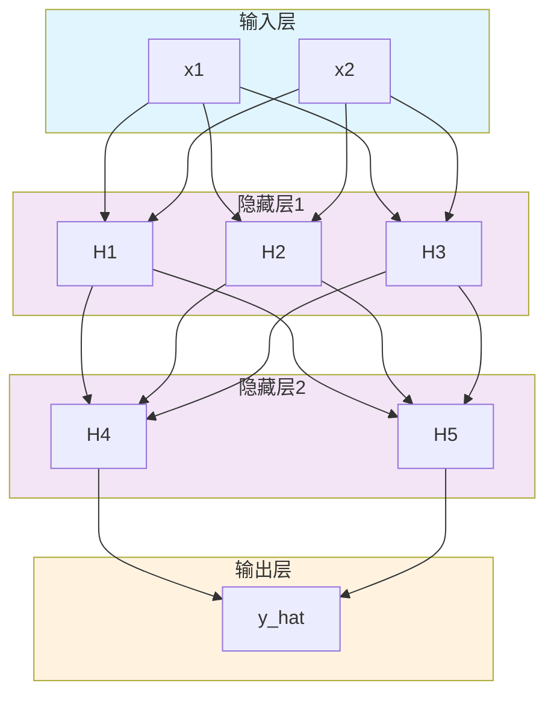
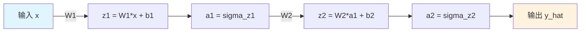
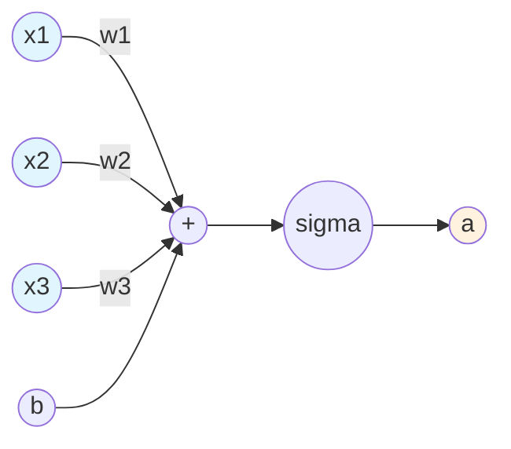
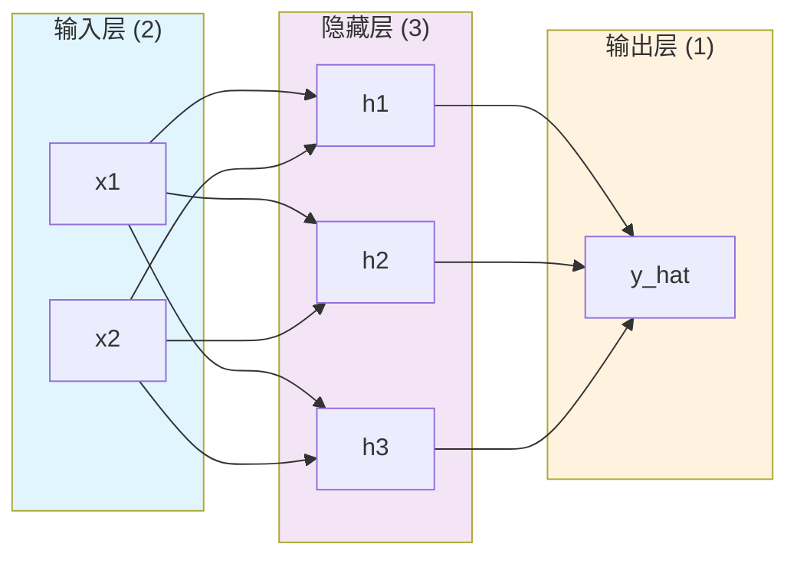
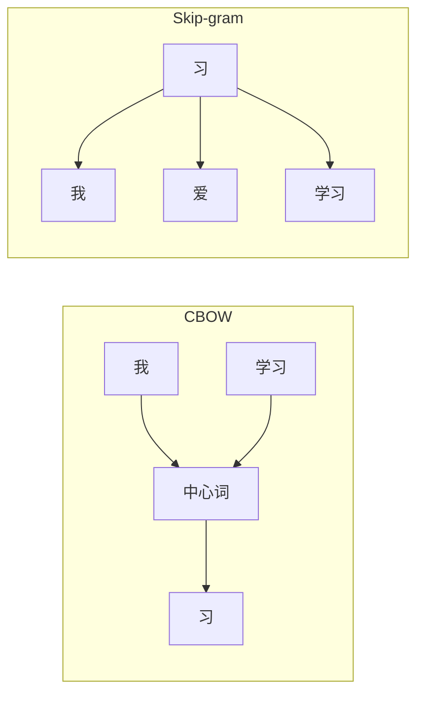
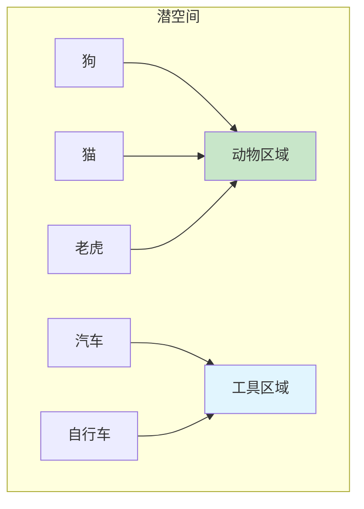
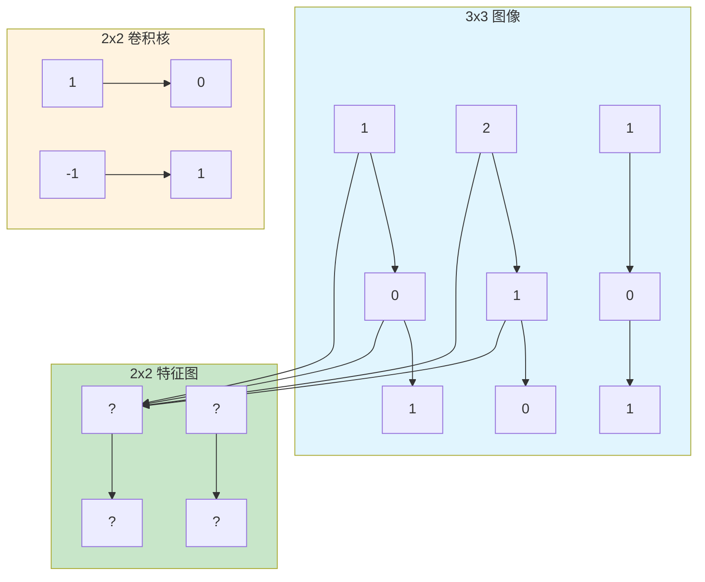
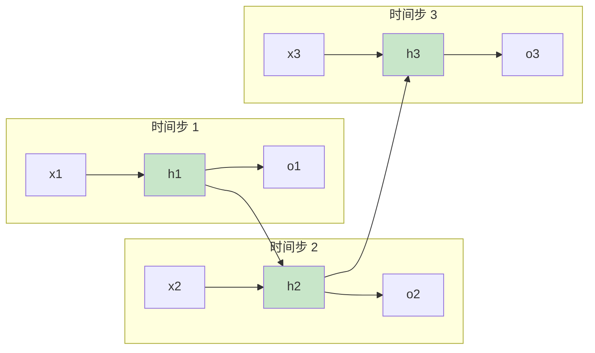

# 第二章：神经网络结构

> 理解前向传播和网络层次

---

## 2.1 网络层次结构

神经网络由三种层组成：**输入层**、**隐藏层**和**输出层**。



### 术语解释

| 层次 | 英文 | 说明 |
|------|------|------|
| 输入层 | Input Layer | 接收原始数据 |
| 隐藏层 | Hidden Layer | 中间的计算层，不直接与外界交互 |
| 输出层 | Output Layer | 产生最终预测结果 |
| 神经元 | Neuron | 每个圆圈代表一个神经元 |

### 重要概念

- **层数**：计算隐藏层的数量（不包含输入层和输出层）
- **神经元数量**：每层中神经元的个数
- **全连接**：每个神经元与前一层的所有神经元相连

---

## 2.2 前向传播

**前向传播**（Forward Propagation）：数据从输入层到输出层的计算过程。

### 2.2.1 数学表示

对于第 $l$ 层：

$$z^{(l)} = W^{(l)} \cdot a^{(l-1)} + b^{(l)}$$

$$a^{(l)} = \text{激活函数}(z^{(l)})$$

其中：
- $W^{(l)}$：第 $l$ 层的权重矩阵
- $b^{(l)}$：第 $l$ 层的偏置向量
- $a^{(l-1)}$：第 $l-1$ 层的输出

### 2.2.2 前向传播流程



### 2.2.3 单个神经元的计算

一个神经元接收多个输入 $x_1, x_2, ..., x_n$，计算：

$$z = w_1 x_1 + w_2 x_2 + ... + w_n x_n + b$$

$$a = \sigma(z)$$



---

## 2.3 完整的前向传播示例

假设有一个简单的两层神经网络：
- 输入层：2 个神经元
- 隐藏层：3 个神经元（ReLU 激活）
- 输出层：1 个神经元（Sigmoid 激活）



---

## 2.4 词嵌入与表示学习

### 2.4.1 什么是词嵌入？

**词嵌入（Word Embedding）**：将词映射为稠密向量的技术。

**问题**：神经网络无法直接处理文本

**解决**：将词转换为向量

| 方法 | 例子 | 维度 | 缺点 |
|------|------|------|------|
| One-Hot | 猫=[1,0,0,...0] | 词表大小（万维） | 稀疏、高维、无语义 |
| **词嵌入** | 猫=[0.2, -0.1, ...] | 50-300维 | 稠密、含语义信息 |

**直观理解**：
```
"狗" → [0.8, 0.1, -0.3]
"猫" → [0.7, 0.2, -0.2]   ← 与"狗"相近

"国王" → [0.9, 0.8, 0.1]
"女王" → [0.8, 0.9, 0.2]  ← 与"国王"相近
```

### 2.4.2 Word2Vec

**提出者**：Tomas Mikolov (Google)

**论文**：《Efficient Estimation of Word Representations in Vector Space》, 2013

**两种架构**：

| 模型 | 目标 | 特点 |
|------|------|------|
| CBOW | 用周围词预测中心词 | 适合小数据集 |
| Skip-gram | 用中心词预测周围词 | 适合大数据集 |



### 2.4.3 潜空间

**潜空间（Latent Space）**：嵌入向量所在的语义空间。

```
潜空间 = {所有词的嵌入向量}

特性：
1. 语义相近的词，距离更近
2. 可以进行向量运算：
   国王 - 男人 + 女人 ≈ 女王
   Paris - France + Italy ≈ Rome
```



### 2.4.4 PyTorch 词嵌入

```python
import torch
import torch.nn as nn

# 创建词嵌入层
vocab_size = 10000    # 词表大小
embedding_dim = 300   # 嵌入维度

embedding = nn.Embedding(vocab_size, embedding_dim)

# 使用：输入词的索引，得到嵌入向量
word_index = torch.tensor([42])  # 第 42 个词的索引
word_vector = embedding(word_index)
print(word_vector.shape)  # torch.Size([1, 300])

# 预训练词向量（使用 GloVe）
import torchtext
 glove = torchtext.vocab.GloVe(name="6B", dim=300)
 word_vec = glove["cat"]
```

---

## 2.5 CNN（卷积神经网络）

### 2.5.1 什么是 CNN？

**CNN（Convolutional Neural Network）**：利用卷积操作提取局部特征的神经网络。

**核心思想**：图像的规律是局部的（边缘、纹理、形状）

**应用领域**：
- 图像分类（ResNet, VGG）
- 目标检测（YOLO, Faster R-CNN）
- 语义分割（U-Net）

### 2.5.2 卷积层

**卷积操作**：用一个小窗口在图像上滑动，计算特征。



**计算示例**：
```
输入：      卷积核：      输出：
[1, 0]     [1, 0]     [1*1+0*0 + 2*(-1)+1*1 = 0]
[2, 1]     [-1, 1]
```

### 2.5.3 卷积核

**卷积核（Kernel）**：卷积操作的核心小矩阵。

| 类型 | 作用 |
|------|------|
| 边缘检测 | 提取图像边缘 |
| 模糊 | 平滑图像 |
| 锐化 | 增强细节 |
| 纹理 | 提取纹理特征 |

**特点**：
- 尺寸通常为 3x3 或 5x5
- 可学习（通过训练自动发现）
- 数量决定输出通道数

```python
import torch.nn as nn

# 定义卷积层
conv = nn.Conv2d(
    in_channels=3,    # 输入通道（RGB图像=3）
    out_channels=64,  # 输出通道（特征图数量）
    kernel_size=3,    # 卷积核大小 3x3
    stride=1,         # 步长
    padding=1         # 填充
)
```

### 2.5.4 池化层

**池化（Pooling）**：下采样操作，减小特征图尺寸。

| 类型 | 公式 | 特点 |
|------|------|------|
| Max Pooling | 取最大值 | 保留显著特征 |
| Average Pooling | 取平均值 | 保留整体信息 |

```mermaid
graph LR
    subgraph 输入["2x2 池化窗口"]
    p1[1] --> p2[3]
    p3[2] --> p4[4]
    end

    subgraph 输出
    m[3]  <!-- Max Pooling 结果 -->
    end

    p1 --> m
    p4 --> m

    style 输入 fill:#e1f5fe
    style 输出 fill:#c8e6c9
```

**作用**：
- 减少计算量
- 防止过拟合
- 提供平移不变性

```python
import torch.nn as nn

# 最大池化
max_pool = nn.MaxPool2d(kernel_size=2, stride=2)

# 平均池化
avg_pool = nn.AvgPool2d(kernel_size=2, stride=2)

# 全局平均池化（常用于分类网络最后）
global_avg_pool = nn.AdaptiveAvgPool2d((1, 1))
```

### 2.5.5 CNN 完整示例

```python
import torch
import torch.nn as nn

class SimpleCNN(nn.Module):
    def __init__(self, num_classes=10):
        super().__init__()

        # 卷积层 1：32 个 3x3 卷积核
        self.conv1 = nn.Sequential(
            nn.Conv2d(3, 32, kernel_size=3, padding=1),
            nn.ReLU(),
            nn.MaxPool2d(2, 2)  # 28x28 -> 14x14
        )

        # 卷积层 2：64 个 3x3 卷积核
        self.conv2 = nn.Sequential(
            nn.Conv2d(32, 64, kernel_size=3, padding=1),
            nn.ReLU(),
            nn.MaxPool2d(2, 2)  # 14x14 -> 7x7
        )

        # 全连接层
        self.fc = nn.Sequential(
            nn.Flatten(),
            nn.Linear(64 * 7 * 7, 128),
            nn.ReLU(),
            nn.Linear(128, num_classes)
        )

    def forward(self, x):
        x = self.conv1(x)
        x = self.conv2(x)
        x = self.fc(x)
        return x

# 使用
model = SimpleCNN(num_classes=10)
x = torch.randn(1, 3, 28, 28)  # batch=1, RGB, 28x28
output = model(x)
print(output.shape)  # torch.Size([1, 10])
```

---

## 2.6 RNN（循环神经网络）

### 2.6.1 什么是 RNN？

**RNN（Recurrent Neural Network）**：处理序列数据的神经网络。

**核心思想**：记忆之前的输入，影响当前输出

```
序列数据：              RNN 处理：
"我 爱你"          →    [记忆]→[记忆]→[记忆]
                        ↑       ↑       ↑
                       词1     词2     词3
```

**应用领域**：
- 机器翻译
- 文本生成
- 语音识别
- 时间序列预测

### 2.6.2 RNN 结构



**公式**：
$$h_t = \text{tanh}(W_{xh} \cdot x_t + W_{hh} \cdot h_{t-1} + b_h)$$

$$y_t = W_{hy} \cdot h_t$$

### 2.6.3 PyTorch RNN 实现

```python
import torch
import torch.nn as nn

class SimpleRNN(nn.Module):
    def __init__(self, vocab_size, embed_dim, hidden_dim, num_classes):
        super().__init__()

        # 词嵌入层
        self.embedding = nn.Embedding(vocab_size, embed_dim)

        # RNN 层
        self.rnn = nn.RNN(
            input_size=embed_dim,
            hidden_size=hidden_dim,
            num_layers=1,
            batch_first=True
        )

        # 输出层
        self.fc = nn.Linear(hidden_dim, num_classes)

    def forward(self, x):
        # x: (batch, seq_len)
        embedded = self.embedding(x)  # (batch, seq_len, embed_dim)

        # RNN 输出
        # hidden: (num_layers, batch, hidden_dim)
        output, hidden = self.rnn(embedded)

        # 取最后一个时间步的输出
        last_output = output[:, -1, :]  # (batch, hidden_dim)

        return self.fc(last_output)

# 使用
model = SimpleRNN(
    vocab_size=10000,
    embed_dim=300,
    hidden_dim=128,
    num_classes=2
)

# 输入：batch=2, 序列长度=10
x = torch.randint(0, 10000, (2, 10))
output = model(x)
print(output.shape)  # torch.Size([2, 2])
```

### 2.6.4 RNN 的问题

| 问题 | 描述 | 解决方案 |
|------|------|----------|
| 梯度消失 | 长序列信息丢失 | LSTM, GRU |
| 梯度爆炸 | 训练不稳定 | 梯度裁剪 |
| 并行化差 | 无法并行计算 | Transformer |

### 2.6.5 LSTM vs RNN

**LSTM（Long Short-Term Memory）**：带门控机制的 RNN

```
RNN：只有一种记忆
LSTM：长期记忆 + 短期记忆

LSTM 门控：
- 遗忘门：决定丢弃什么信息
- 输入门：决定记住什么信息
- 输出门：决定输出什么
```

```python
# PyTorch LSTM
self.lstm = nn.LSTM(
    input_size=embed_dim,
    hidden_size=hidden_dim,
    num_layers=2,      # 多层
    batch_first=True,
    dropout=0.2        # 防止过拟合
)
```

---

## 代码实现

```python
import numpy as np

def sigmoid(x):
    """Sigmoid 激活函数"""
    return 1 / (1 + np.exp(-x))

def relu(x):
    """ReLU 激活函数"""
    return np.maximum(0, x)

# 初始化网络参数
np.random.seed(42)

# 输入层 -> 隐藏层 (2 -> 3)
W1 = np.random.randn(2, 3)   # 权重矩阵
b1 = np.random.randn(3)      # 偏置

# 隐藏层 -> 输出层 (3 -> 1)
W2 = np.random.randn(3, 1)
b2 = np.random.randn(1)

def forward(X):
    """前向传播"""
    # 输入 -> 隐藏层
    z1 = np.dot(X, W1) + b1
    a1 = relu(z1)

    # 隐藏层 -> 输出层
    z2 = np.dot(a1, W2) + b2
    a2 = sigmoid(z2)

    return a2

# 测试
X_test = np.array([[0.5, 1.0]])
output = forward(X_test)
print(f"输入: {X_test}")
print(f"输出: {output[0][0]:.4f}")
```

---

## 思考题

1. 如果增加隐藏层的层数，会发生什么？
2. 为什么需要非线性激活函数？如果全部用线性函数会怎样？
3. 神经网络的"深度"指的是什么？

---

## 下一步

下一章我们将讨论如何训练神经网络：损失函数、梯度下降和反向传播。
