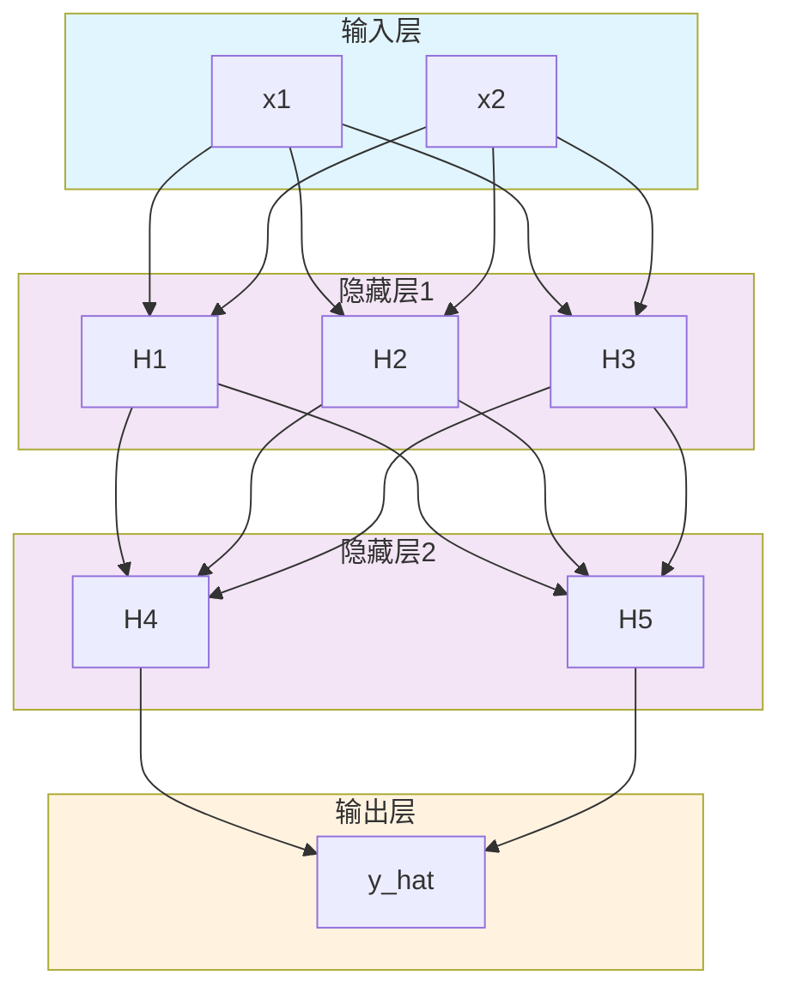
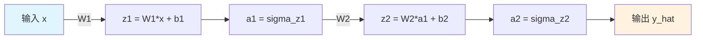
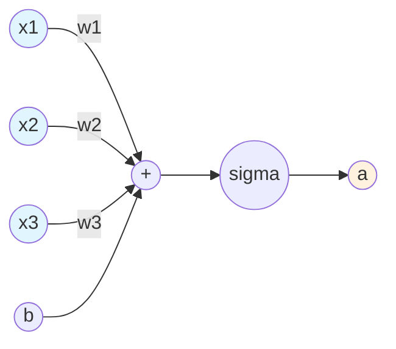
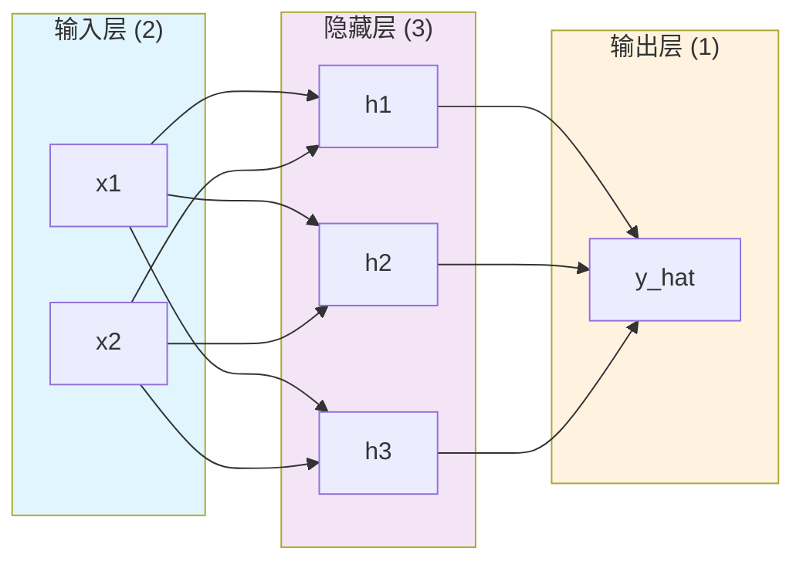

# 第二章：神经网络结构

> 理解前向传播和网络层次

---

## 2.1 网络层次结构

神经网络由三种层组成：**输入层**、**隐藏层**和**输出层**。



### 术语解释

| 层次 | 英文 | 说明 |
|------|------|------|
| 输入层 | Input Layer | 接收原始数据 |
| 隐藏层 | Hidden Layer | 中间的计算层，不直接与外界交互 |
| 输出层 | Output Layer | 产生最终预测结果 |
| 神经元 | Neuron | 每个圆圈代表一个神经元 |

### 重要概念

- **层数**：计算隐藏层的数量（不包含输入层和输出层）
- **神经元数量**：每层中神经元的个数
- **全连接**：每个神经元与前一层的所有神经元相连

---

## 2.2 前向传播

**前向传播**（Forward Propagation）：数据从输入层到输出层的计算过程。

### 2.2.1 数学表示

对于第 $l$ 层：

$$z^{(l)} = W^{(l)} \cdot a^{(l-1)} + b^{(l)}$$

$$a^{(l)} = \text{激活函数}(z^{(l)})$$

其中：
- $W^{(l)}$：第 $l$ 层的权重矩阵
- $b^{(l)}$：第 $l$ 层的偏置向量
- $a^{(l-1)}$：第 $l-1$ 层的输出

### 2.2.2 前向传播流程



### 2.2.3 单个神经元的计算

一个神经元接收多个输入 $x_1, x_2, ..., x_n$，计算：

$$z = w_1 x_1 + w_2 x_2 + ... + w_n x_n + b$$

$$a = \sigma(z)$$



---

## 2.3 完整的前向传播示例

假设有一个简单的两层神经网络：
- 输入层：2 个神经元
- 隐藏层：3 个神经元（ReLU 激活）
- 输出层：1 个神经元（Sigmoid 激活）



---

## 代码实现

```python
import numpy as np

def sigmoid(x):
    """Sigmoid 激活函数"""
    return 1 / (1 + np.exp(-x))

def relu(x):
    """ReLU 激活函数"""
    return np.maximum(0, x)

# 初始化网络参数
np.random.seed(42)

# 输入层 -> 隐藏层 (2 -> 3)
W1 = np.random.randn(2, 3)   # 权重矩阵
b1 = np.random.randn(3)      # 偏置

# 隐藏层 -> 输出层 (3 -> 1)
W2 = np.random.randn(3, 1)
b2 = np.random.randn(1)

def forward(X):
    """前向传播"""
    # 输入 -> 隐藏层
    z1 = np.dot(X, W1) + b1
    a1 = relu(z1)

    # 隐藏层 -> 输出层
    z2 = np.dot(a1, W2) + b2
    a2 = sigmoid(z2)

    return a2

# 测试
X_test = np.array([[0.5, 1.0]])
output = forward(X_test)
print(f"输入: {X_test}")
print(f"输出: {output[0][0]:.4f}")
```

---

## 思考题

1. 如果增加隐藏层的层数，会发生什么？
2. 为什么需要非线性激活函数？如果全部用线性函数会怎样？
3. 神经网络的"深度"指的是什么？

---

## 下一步

下一章我们将讨论如何训练神经网络：损失函数、梯度下降和反向传播。
