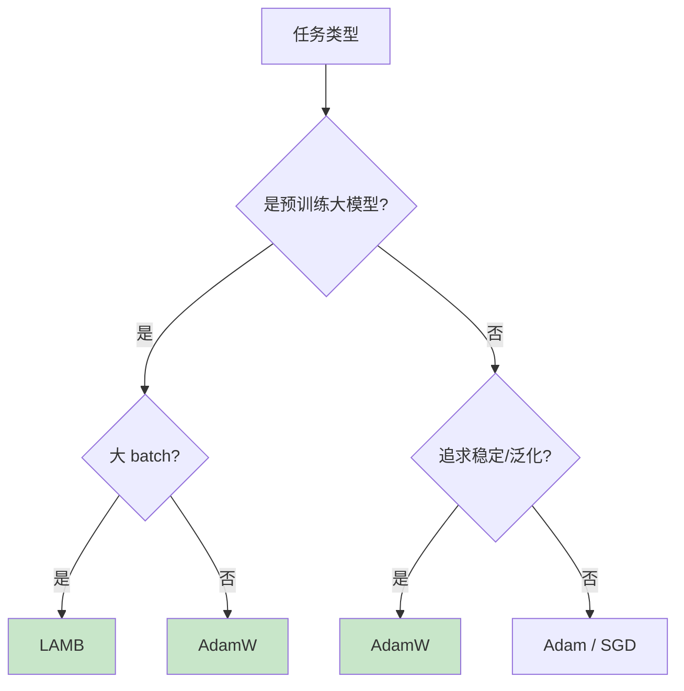
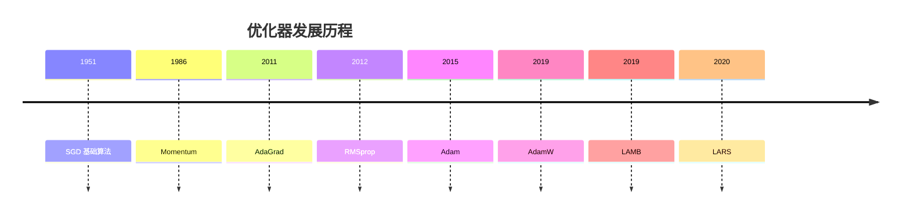

# 第三章：优化器

> 梯度下降的改进算法与学习率调度

---

## 3.1 为什么需要优化器？

基础梯度下降算法存在以下问题：

| 问题 | 描述 |
|------|------|
| 收敛慢 | 在平坦区域移动缓慢 |
| 局部极小值 | 容易困在局部最优解 |
| 学习率统一 | 所有参数用相同学习率 |
| 梯度消失/爆炸 | 深层网络梯度不稳定 |

**优化器**是对基础梯度下降的改进，通过不同的策略加速收敛和提高性能。

---

## 3.2 优化器详解

### 3.2.1 SGD（随机梯度下降）

**提出者**：未明确署名，是最基础的优化算法

**论文**：无特定论文，是机器学习基础算法

$$W_{new} = W_{old} - \eta \cdot g$$

其中 $g$ 是梯度，$\eta$ 是学习率。

#### 3.2.1.1 三种梯度下降方式

| 类型 | 每批样本数 | 更新次数 | 特点 |
|------|-----------|----------|------|
| Batch GD | 全部数据（N个） | 1次/epoch | 梯度准确，但计算慢 |
| **SGD** | **1个** | **N次/epoch** | 梯度噪声大，收敛震荡 |
| **Mini-Batch** | **32/64/128** | **N/batch次/epoch** | **实际常用** |

#### 3.2.1.2 SGD 具体步骤

```
for 每个 epoch:
    随机打乱数据集

    for 每个样本 (x_i, y_i):
        前向传播 → 计算预测值
        计算损失 → 计算梯度
        更新参数
```

**简单代码示例**：

```python
# 假设拟合 y = 2x + 1
w = 0.0
b = 0.0
lr = 0.01

for epoch in range(1000):
    # 随机选一个样本
    idx = random.randint(0, len(X) - 1)
    x_i, y_i = X[idx], y[idx]

    # 前向传播
    y_pred = w * x_i + b

    # 计算损失和梯度
    loss = (y_pred - y_i) ** 2
    d_w = 2 * (y_pred - y_i) * x_i
    d_b = 2 * (y_pred - y_i)

    # 更新参数
    w = w - lr * d_w
    b = b - lr * d_b
```

#### 3.2.1.3 为什么需要 Mini-Batch SGD？

**batch_size=1 的问题**：
- 梯度噪声太大，收敛不稳定
- GPU 利用率极低（浪费算力）

**batch_size 选择指南**：

| 场景 | batch_size |
|------|------------|
| 小数据集/调参 | 16, 32, 64 |
| 标准选择 | 32, 64, 128 |
| 大模型/显存足 | 256, 512, 1024 |
| 超大规模预训练 | 2048, 4096, 8192 |

#### 3.2.1.4 PyTorch Mini-Batch 示例

```python
from torch.utils.data import DataLoader

# DataLoader 自动实现 Mini-Batch
loader = DataLoader(dataset, batch_size=32, shuffle=True)  # shuffle=随机打乱

for batch_x, batch_y in loader:      # 每个 batch 32 个样本
    # PyTorch 自动计算 batch 的平均梯度
    loss = criterion(model(batch_x), batch_y)
    loss.backward()
    optimizer.step()     # 用这个 batch 的梯度更新一次
```

**总结**：深度学习中说的 "SGD" 几乎都是 **Mini-Batch SGD**，真正的 batch_size=1 很少用。

### 3.2.2 Momentum（动量法）

**提出者**：Rumelhart, Hinton, Williams

**论文**：《Learning representations by back-propagating errors》, Nature 1986

$$v_{new} = \gamma \cdot v_{old} + \eta \cdot g$$
$$W_{new} = W_{old} - v_{new}$$

其中 $\gamma$ 通常取 0.9（动量系数）。

**核心思想**：
- 模拟物理中的动量概念
- 累积历史梯度信息
- 加速收敛，减少震荡


**特点**：
- 加速收敛，尤其是在峡谷型损失函数中
- 减少参数更新的震荡
- 有助于跳出局部最优

### 3.2.3 AdaGrad（自适应梯度）

**提出者**：John Duchi, Elad Hazan, Yoram Singer

**论文**：《Adaptive Subgradient Methods for Online Learning and Stochastic Optimization》, JMLR 2011

$$W_{new} = W_{old} - \frac{\eta}{\sqrt{G + \epsilon}} \cdot g$$

其中 $G = \sum_{t=1}^{T} g_t^2$ 是历史梯度的平方和。

**特点**：
- 自适应调整每个参数的学习率
- 稀疏特征效果好
- 后期学习率可能过小（累积平方和不断增大）

### 3.2.4 RMSprop（均方根传播）

**提出者**：Geoff Hinton（未正式发表，在课程中提出）

**课程**：Stanford CS231n, Lecture 6

$$E[g^2]_{new} = \rho \cdot E[g^2]_{old} + (1-\rho) \cdot g^2$$
$$W_{new} = W_{old} - \frac{\eta}{\sqrt{E[g^2]_{new} + \epsilon}} \cdot g$$

其中 $\rho$ 通常取 0.99。

**特点**：
- 使用指数移动平均替代累积和
- 解决 AdaGrad 学习率衰减过快问题
- 适合非平稳目标和 RNN

### 3.2.5 Adam（自适应矩估计）

**提出者**：Diederik P. Kingma, Jimmy Ba

**论文**：《Adam: A Method for Stochastic Optimization》, ICLR 2015

**论文链接**：https://arxiv.org/abs/1412.6980

**引用数**：超过 10 万次（截至 2024 年）

**核心公式**：

结合 Momentum 和 RMSprop：

$$m_{new} = \beta_1 \cdot m_{old} + (1-\beta_1) \cdot g \quad \text{(一阶矩估计)}$$
$$v_{new} = \beta_2 \cdot v_{old} + (1-\beta_2) \cdot g^2 \quad \text{(二阶矩估计)}$$

**偏差校正**：

$$\hat{m} = \frac{m_{new}}{1-\beta_1^t}, \quad \hat{v} = \frac{v_{new}}{1-\beta_2^t}$$

**参数更新**：

$$W_{new} = W_{old} - \frac{\eta}{\sqrt{\hat{v}} + \epsilon} \cdot \hat{m}$$

**默认参数**（论文推荐）：
- $\eta = 0.001$
- $\beta_1 = 0.9$
- $\beta_2 = 0.999$
- $\epsilon = 10^{-8}$

**特点**：
- **最常用的优化器**
- 自适应学习率
- 对超参数不敏感
- 适用于大多数深度学习任务

### 3.2.6 AdamW（带权重衰减的 Adam）

**提出者**：Ilya Loshchilov, Frank Hutter

**论文**：《Decoupled Weight Decay Regularization》, ICLR 2019

**论文链接**：https://arxiv.org/abs/1711.05101

**核心改进**：
解耦权重衰减（weight decay）和 Adam 的自适应学习率

$$W_{new} = W_{old} - \eta \cdot \left( \frac{\hat{m}}{\sqrt{\hat{v}} + \epsilon} + \lambda \cdot W_{old} \right)$$

其中 $\lambda$ 是权重衰减系数。

**为什么需要 AdamW？**
- 原始 Adam 的权重衰减与自适应学习率耦合
- L2 正则化效果不如预期
- AdamW 提供更好的正则化效果

**特点**：
- Hugging Face Transformers 库的默认优化器
- 训练更稳定
- 泛化性能更好

### 3.2.7 LAMB（Layer-wise Adaptive Moments optimizer）

**提出者**：Yang You, Jing Li, Hsiang-Fu Yu 等

**论文**：《Large Batch Optimization for Deep Learning: Training BERT in 76 minutes》, ICLR 2020

**论文链接**：https://arxiv.org/abs/1904.00962

**核心公式**：

$$W_{new} = W_{old} - \frac{\eta}{\|W_{old}\|} \cdot \frac{\hat{m}}{\sqrt{\hat{v}} + \epsilon}$$

**关键改进**：
- 层-wise 学习率缩放
- 使用逐层归一化防止梯度爆炸

**特点**：
- 支持超大 batch（如 8k, 32k）
- 用于 BERT 预训练的突破性工作
- 可以在 76 分钟内训练完 BERT

**应用场景**：
- 大规模分布式训练
- 预训练大模型

### 3.2.8 其他优化器

| 优化器 | 提出者/论文 | 特点 |
|--------|-------------|------|
| NAdam | Timothy Dozat (2016) | Adam + Nesterov Momentum |
| AMSGrad | Reddi et al. (2018) | 修正 Adam 的收敛性 |
| RAdam | Liu et al. (2019) | 修正 Adam 的warmup问题 |
| AdaBound | Luo et al. (2019) | 自适应梯度边界 |
| SGDW | Loshchilov & Hutter (2019) | 解耦的 SGD 权重衰减 |

---

## 3.3 优化器对比

### 3.3.1 性能对比表

| 优化器 | 收敛速度 | 稳定性 | 泛化性 | 计算开销 |
|--------|----------|--------|--------|----------|
| SGD | 慢 | 高 | 最好 | 低 |
| Momentum | 中 | 中 | 好 | 低 |
| AdaGrad | 中 | 低 | 一般 | 低 |
| RMSprop | 快 | 中 | 好 | 低 |
| **Adam** | **最快** | **高** | **好** | **中** |
| AdamW | 快 | 很高 | 最好 | 中 |
| LAMB | 快 | 高 | 好 | 中 |

### 3.3.2 选择决策树



### 3.3.3 实际推荐

| 场景 | 推荐优化器 | 学习率 |
|------|-----------|--------|
| 默认选择 | Adam | 0.001 |
| 图像分类 | SGD + Momentum | 0.01 |
| NLP / Transformer | AdamW | 0.0001 ~ 0.001 |
| 大批量训练 | LAMB | 0.001 ~ 0.01 |
| 轻量模型 | Adam | 0.001 |

---

## 3.4 学习率调度器

学习率调度器用于在训练过程中动态调整学习率。

### 3.4.1 常见调度器

| 调度器 | 公式/策略 | 适用场景 |
|--------|-----------|----------|
| StepLR | $\eta_{t} = \eta_0 \times \gamma^{\lfloor t/T \rfloor}$ | 固定步长衰减 |
| ExponentialLR | $\eta_{t} = \eta_0 \times \gamma^t$ | 指数衰减 |
| CosineAnnealingLR | $\eta_t = \eta_{min} + \frac{1}{2}(\eta_{max} - \eta_{min})(1 + \cos(\frac{t}{T}\pi))$ | 余弦退火 |
| CosineAnnealingWarmRestarts | $\eta_t$ 按余弦周期重启 | 跳出局部最优 |
| ReduceLROnPlateau | 监控指标不降时衰减 | 自动调整 |
| Warmup | 初期逐渐增大学习率 | 稳定训练开头 |
| Polynomial | 多项式衰减 | BERT 预训练 |

### 3.4.2 Warmup + Cosine 组合


这是 BERT 预训练中常用的策略。

---

## 3.5 PyTorch 代码示例

```python
import torch
import torch.nn as nn
import torch.optim as optim
import torch.optim.lr_scheduler as sched
import matplotlib.pyplot as plt

# 生成训练数据
torch.manual_seed(42)
X = torch.randn(200, 1) * 5
y = 2 * X + 1 + torch.randn(200, 1)

# 定义简单网络
class SimpleNet(nn.Module):
    def __init__(self):
        super().__init__()
        self.fc = nn.Linear(1, 1)
    def forward(self, x):
        return self.fc(x)

# 不同优化器对比
optimizers = {
    'SGD': optim.SGD,
    'Momentum': optim.SGD,
    'RMSprop': optim.RMSprop,
    'Adam': optim.Adam,
    'AdamW': optim.AdamW,
}

params = {
    'SGD': {'lr': 0.01},
    'Momentum': {'lr': 0.01, 'momentum': 0.9},
    'RMSprop': {'lr': 0.01, 'alpha': 0.99},
    'Adam': {'lr': 0.01},
    'AdamW': {'lr': 0.01, 'weight_decay': 0.01},
}

losses_dict = {}

for name, OptClass in optimizers.items():
    model = SimpleNet()
    optimizer = OptClass(model.parameters(), **params[name])
    criterion = nn.MSELoss()

    losses = []
    for epoch in range(100):
        optimizer.zero_grad()
        pred = model(X)
        loss = criterion(pred, y)
        loss.backward()
        optimizer.step()
        losses.append(loss.item())

    losses_dict[name] = losses
    print(f'{name}: Final Loss = {losses[-1]:.4f}')

# 绘制收敛曲线
plt.figure(figsize=(10, 6))
for name, losses in losses_dict.items():
    plt.plot(losses, label=name)
plt.xlabel('Epoch')
plt.ylabel('Loss')
plt.title('优化器对比')
plt.legend()
plt.grid(True, alpha=0.3)
plt.show()

# 学习率调度器示例
model = SimpleNet()
optimizer = optim.Adam(model.parameters(), lr=0.01)

# Cosine Annealing with Warmup
scheduler = optim.lr_scheduler.CosineAnnealingWarmRestarts(
    optimizer,
    T_0=10,       # 第一个周期
    T_mult=2,     # 周期倍数
)

# StepLR 示例
scheduler_step = optim.lr_scheduler.StepLR(
    optimizer,
    step_size=30,
    gamma=0.1
)

# ReduceLROnPlateau 示例
scheduler_plateau = optim.lr_scheduler.ReduceLROnPlateau(
    optimizer,
    mode='min',
    factor=0.5,
    patience=10
)
```

---

## 3.6 优化器发展时间线



---

## 思考题

1. 为什么 Adam 比 SGD 更受欢迎？
2. AdamW 和 Adam 的区别是什么？
3. 什么情况下应该使用 LAMB？
4. 为什么需要学习率调度器？
5. Warmup 的作用是什么？

---

## 参考文献

1. Rumelhart, D. E., Hinton, G. E., & Williams, R. J. (1986). Learning representations by back-propagating errors. Nature.
2. Duchi, J., Hazan, E., & Singer, Y. (2011). Adaptive subgradient methods for online learning and stochastic optimization. JMLR.
3. Kingma, D. P., & Ba, J. (2014). Adam: A method for stochastic optimization. ICLR.
4. Loshchilov, I., & Hutter, F. (2017). Decoupled weight decay regularization. ICLR.
5. You, Y., Li, J., & Hsiang-Fu, Y. et al. (2019). Large batch optimization for deep learning: Training BERT in 76 minutes. ICLR.

---

## 上一步

先学习 [第三章：训练过程（基础篇）](./03-1-training-basics.md)，了解损失函数、梯度下降和反向传播。

---

## 下一步

继续学习 [第四章：模型评估](./03-3-model-evaluation.md)，了解过拟合、正则化和超参数调优。
