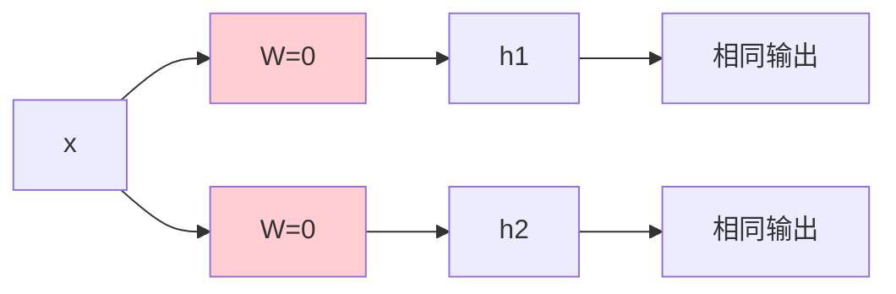
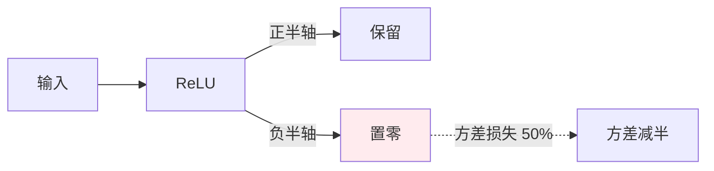
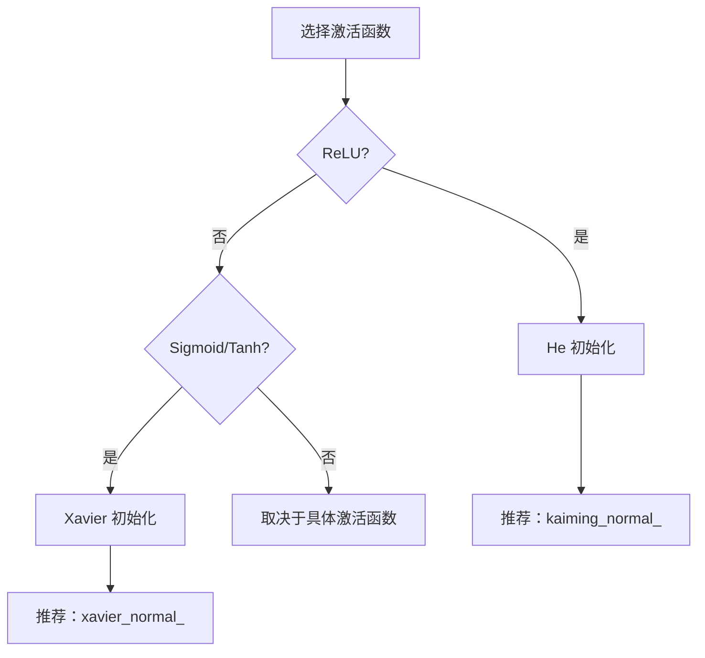

# 第三章：参数初始化

> 权重的初始化方法与训练稳定性的关系

---

## 3.1 为什么初始化很重要？

### 3.1.1 初始化的核心问题

神经网络训练不稳定的主要根源之一是**初始化不当**：

| 问题 | 原因 | 结果 |
|------|------|------|
| 梯度消失 | 初始化值太小 | 反向传播时梯度指数级衰减 |
| 梯度爆炸 | 初始化值太大 | 反向传播时梯度指数级增长 |
| 对称性问题 | 所有神经元初始相同 | 神经元学习相同特征 |


### 3.1.2 深层网络的挑战

网络越深，初始化不当的影响越严重：

```
10层网络：
初始值: 0.1 → 第1层激活: 0.1 → 第2层: 0.01 → ... → 第10层: 10^-10 (梯度消失)

10层网络：
初始值: 2.0 → 第1层激活: 2.0 → 第2层: 4.0 → ... → 第10层: 1024 (梯度爆炸)
```

---

## 3.2 全零初始化的问题

### 3.2.1 对称性问题

如果所有权重初始化为 0，会导致**所有神经元学习相同的特征**：

```python
# 错误示例：全零初始化
W = torch.zeros(10, 10)  # 所有神经元输出相同
```

**问题分析**：

$$h_1 = \sigma(W_1 x), \quad h_2 = \sigma(W_2 x)$$

如果 $W_1 = W_2 = 0$，则 $h_1 = h_2$，两个神经元无法学习不同的特征。



### 3.2.2 正确的零初始化

**偏置可以初始化为 0**（不会导致对称问题）：

```python
# 偏置初始化为 0（推荐）
bias = torch.zeros(out_features)
```

---

## 3.3 随机初始化

### 3.3.1 小随机数初始化

早期常用的方法是将权重初始化为小的随机数：

```python
# 简单随机初始化（已较少使用）
W = torch.randn(n_in, n_out) * 0.01
```

**问题**：
- 对于深层网络，"0.01" 的尺度仍然太小或太大
- 没有考虑激活函数的特性

### 3.3.2 为什么简单随机初始化不够？

假设 Sigmoid 激活函数：

- 当 $|x|$ 较大时，Sigmoid 梯度接近 0
- 如果初始权重使 $|W x|$ 很大，神经元会饱和
- 梯度无法有效传播

---

## 3.4 Xavier/Glorot 初始化

### 3.4.1 提出背景

**提出者**：Xavier Glorot, Yoshua Bengio

**论文**：《Understanding the difficulty of training deep feedforward neural networks》, AISTATS 2010

**论文链接**：https://proceedings.mlr.press/v9/glorot10a.html

**核心思想**：让输入和输出的方差保持一致

### 3.4.2 公式

**均匀分布**：
$$W \sim U\left(-\frac{\sqrt{6}}{\sqrt{n_{in} + n_{out}}}, \frac{\sqrt{6}}{\sqrt{n_{in} + n_{out}}}\right)$$

**高斯分布**：
$$W \sim N\left(0, \frac{2}{n_{in} + n_{out}}\right)$$

**变量含义**：
- $n_{in}$：输入神经元数量
- $n_{out}$：输出神经元数量

### 3.4.3 适用场景

| 激活函数 | 推荐程度 | 原因 |
|----------|----------|------|
| Sigmoid | 最佳 | 保持方差稳定 |
| Tanh | 最佳 | 线性区间的近似保持 |
| ReLU | 不推荐 | 负半轴会被截断 |
| Leaky ReLU | 不推荐 | 同样有截断问题 |

### 3.4.4 PyTorch 实现

```python
import torch.nn as nn

# 方法1：手动初始化
def init_xavier(layer):
    if isinstance(layer, nn.Linear):
        nn.init.xavier_uniform_(layer.weight)
        if layer.bias is not None:
            nn.init.zeros_(layer.bias)

# 方法2：使用 PyTorch 内置
layer = nn.Linear(128, 256)
nn.init.xavier_uniform_(layer.weight)  # 均匀分布
# 或
nn.init.xavier_normal_(layer.weight)   # 高斯分布

# 方法3：在模型中统一应用
class MyModel(nn.Module):
    def __init__(self):
        super().__init__()
        self.fc1 = nn.Linear(784, 256)
        self.fc2 = nn.Linear(256, 10)

    def reset_parameters(self):
        for layer in [self.fc1, self.fc2]:
            nn.init.xavier_uniform_(layer.weight)

# 方法4：PyTorch 的 apply
model.apply(init_xavier)
```

### 3.4.5 原理可视化

```mermaid
%%{init: {'flowchart': {'htmlLabels': true}}}%%
flowchart TB
    subgraph Xavier 初始化
    A[输入 x] --> B[方差 Var(x)]
    B --> C[""]
    C --> D[输出 y = Wx]
    D --> E[方差 Var(y) ≈ Var(x)]
    end

    style C fill:#c8e6c9
    style E fill:#c8e6c9
```

**公式说明**：权重从高斯分布 $N\left(0, \frac{2}{n_{in} + n_{out}}\right)$ 中采样。

---

## 3.5 He/Kaiming 初始化

### 3.5.1 提出背景

**提出者**：Kaiming He, Xiangyu Zhang, Shaoqing Ren, Jian Sun

**论文**：《Delving Deep into Rectifiers: Surpassing Human-Level Performance on ImageNet Classification》, ICCV 2015

**论文链接**：https://arxiv.org/abs/1502.01852

**核心思想**：针对 ReLU 激活函数的特殊性设计

### 3.5.2 公式

**ReLU（原始论文）**：
$$W \sim N\left(0, \frac{2}{n_{in}}\right)$$

**Leaky ReLU**：
$$W \sim N\left(0, \frac{2}{(1 + \alpha^2)n_{in}}\right)$$

**变量含义**：
- $n_{in}$：输入神经元数量
- $\alpha$：Leaky ReLU 的负斜率（通常 0.01）

### 3.5.3 为什么 ReLU 需要特殊初始化？

ReLU 的特性：$f(x) = \max(0, x)$

- 一半的输入被置为 0（方差减半）
- 需要将初始方差加倍来补偿



### 3.5.4 PyTorch 实现

```python
import torch.nn as nn

# 方法1：手动初始化（推荐用于 ReLU）
def init_he(layer):
    if isinstance(layer, nn.Linear):
        nn.init.kaiming_normal_(layer.weight, mode='fan_out', nonlinearity='relu')
        if layer.bias is not None:
            nn.init.zeros_(layer.bias)

# 方法2：使用 PyTorch 内置
layer = nn.Linear(128, 256)
nn.init.kaiming_uniform_(layer.weight, mode='fan_out', nonlinearity='relu')
# 或
nn.init.kaiming_normal_(layer.weight, mode='fan_out', nonlinearity='relu')

# 方法3：mode 参数说明
# 'fan_in': 保持前向传播方差
# 'fan_out': 保持反向传播方差

# Leaky ReLU 的初始化
def init_leaky_relu(layer):
    if isinstance(layer, nn.Linear):
        nn.init.kaiming_normal_(
            layer.weight,
            mode='fan_out',
            nonlinearity='leaky_relu'  # 指定激活函数类型
        )
```

### 3.5.5 Xavier vs He 对比

| 特性 | Xavier | He |
|------|--------|-----|
| 适用激活函数 | Sigmoid, Tanh | ReLU, Leaky ReLU |
| 方差缩放 | $1/(n_{in} + n_{out})$ | $2/n_{in}$ |
| 提出年份 | 2010 | 2015 |
| PyTorch 函数 | `xavier_` | `kaiming_` |

```python
# 选择规则
if activation == 'relu' or activation == 'leaky_relu':
    nn.init.kaiming_normal_(weight, mode='fan_out', nonlinearity=activation)
else:  # sigmoid, tanh
    nn.init.xavier_normal_(weight)
```

---

## 3.6 偏置初始化

### 3.6.1 常用策略

| 初始化方法 | 公式 | 适用场景 |
|------------|------|----------|
| 零初始化 | $b = 0$ | 大多数情况 |
| 零初始化 | $b = 0$ | 防止偏移激活输出 |
| 特定值 | $b = 1$ | LSTM 门控、归一化层 |

### 3.6.2 特殊情况

**LSTM 的偏置初始化**：

```python
# LSTM 的遗忘门偏置初始化为 1（帮助记忆）
nn.init.zeros_(lstm.bias_ih_l0)
nn.init.ones_(lstm.bias_hh_l0)  # 遗忘门偏置为 1
```

**BatchNorm 的偏置**：

```python
# BatchNorm 的 scale (gamma) 和 shift (beta)
nn.init.ones_(bn.weight)   # gamma
nn.init.zeros_(bn.bias)    # beta
```

---

## 3.7 PyTorch 默认初始化

PyTorch 的层默认已经有初始化策略：

| 层类型 | 默认初始化 | 说明 |
|--------|------------|------|
| `nn.Linear` | $U(-k, k)$，$k = 1/\sqrt{fan\_in}$ | 近似 Xavier |
| `nn.Conv2d` | $U(-k, k)$，$k = 1/\sqrt{fan\_in}$ | 类似 Xavier |
| `nn.BatchNorm2d` | $\gamma = 1, \beta = 0$ | 标准初始化 |
| `nn.LSTM` | 正交初始化 | 保持范数 |

### 7.1 查看默认初始化

```python
import torch.nn as nn

# 查看 Linear 层的默认初始化
linear = nn.Linear(128, 256)
print(linear.weight[:5, :5])  # 前5x5的权重
# 输出类似：均匀分布 U(-0.04, 0.04)

# 自定义初始化覆盖默认
nn.init.kaiming_normal_(linear.weight, mode='fan_out', nonlinearity='relu')
```

---

## 3.8 实战：初始化对比实验

```python
import torch
import torch.nn as nn
import matplotlib.pyplot as plt

# 20层网络，不同初始化方法的对比
class DeepNet(nn.Module):
    def __init__(self, init_type='xavier'):
        super().__init__()
        self.layers = nn.ModuleList([
            nn.Linear(100, 100) for _ in range(20)
        ])
        self.init_type = init_type
        self.apply(self.init_weights)

    def init_weights(self, layer):
        if isinstance(layer, nn.Linear):
            if self.init_type == 'zeros':
                nn.init.zeros_(layer.weight)
            elif self.init_type == 'small':
                nn.init.normal_(layer.weight, mean=0, std=0.01)
            elif self.init_type == 'xavier':
                nn.init.xavier_uniform_(layer.weight)
            elif self.init_type == 'he':
                nn.init.kaiming_uniform_(layer.weight, nonlinearity='relu')
            nn.init.zeros_(layer.bias)

    def forward(self, x):
        for layer in self.layers:
            x = torch.relu(layer(x))
        return x

# 测试不同初始化的梯度情况
def test_init(init_type):
    torch.manual_seed(42)
    model = DeepNet(init_type)
    x = torch.randn(32, 100)
    y = model(x)

    # 检查各层梯度的范数
    grad_norms = []
    for layer in model.layers:
        if layer.weight.grad is not None:
            grad_norms.append(layer.weight.grad.norm().item())

    return grad_norms

# 对比实验
init_types = ['zeros', 'small', 'xavier', 'he']
plt.figure(figsize=(12, 4))

for i, init_type in enumerate(init_types):
    grad_norms = test_init(init_type)
    plt.subplot(1, 4, i+1)
    plt.bar(range(len(grad_norms)), grad_norms)
    plt.title(f'{init_type}\n初始化')
    plt.xlabel('层')
    plt.ylabel('梯度范数')

plt.tight_layout()
plt.show()
```

---

## 3.9 初始化策略选择指南



### 快速参考表

| 激活函数 | 推荐初始化 | PyTorch 代码 |
|----------|------------|--------------|
| ReLU | He (Kaiming) | `kaiming_normal_(w, mode='fan_out', nonlinearity='relu')` |
| Leaky ReLU | He (Kaiming) | `kaiming_normal_(w, mode='fan_out', nonlinearity='leaky_relu')` |
| Sigmoid | Xavier | `xavier_normal_(w)` |
| Tanh | Xavier | `xavier_normal_(w)` |
| Softmax | Xavier | `xavier_normal_(w)` |

---

## 3.10 思考题

1. 为什么全零初始化会导致对称问题？
2. Xavier 和 He 初始化的根本区别是什么？
3. 为什么 ReLU 需要比 Xavier 更大的初始化方差？
4. 偏置初始化为什么通常设为 0？
5. 深层网络（50+层）只用 Xavier 或 He 初始化够吗？

---

## 参考文献

1. Glorot, X., & Bengio, Y. (2010). Understanding the difficulty of training deep feedforward neural networks. AISTATS.
2. He, K., Zhang, X., Ren, S., & Sun, J. (2015). Delving deep into rectifiers: Surpassing human-level performance on ImageNet classification. ICCV.
3. Ioffe, S., & Szegedy, C. (2015). Batch normalization: Accelerating deep network training by reducing internal covariate shift. ICML.

---

## 上一步

先学习 [第三章：优化器](./03-2-optimizers.md)，了解各种优化算法。

---

## 下一步

继续学习 [第四章：模型评估](./03-3-model-evaluation.md)，了解过拟合、正则化和超参数调优。

或继续学习 [第四章-next-steps](./04-next-steps.md)，了解 Transformer 前置知识。
