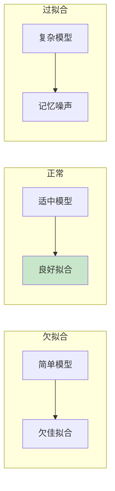
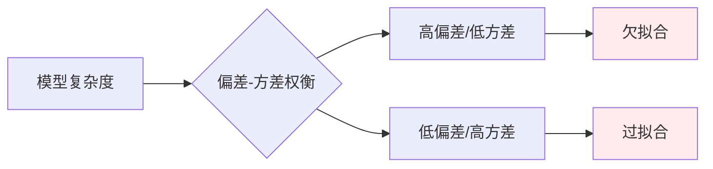
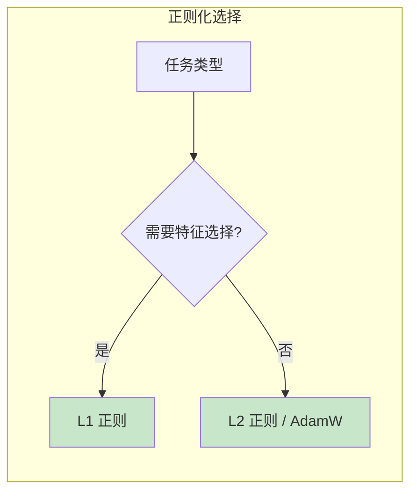
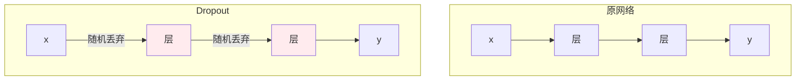
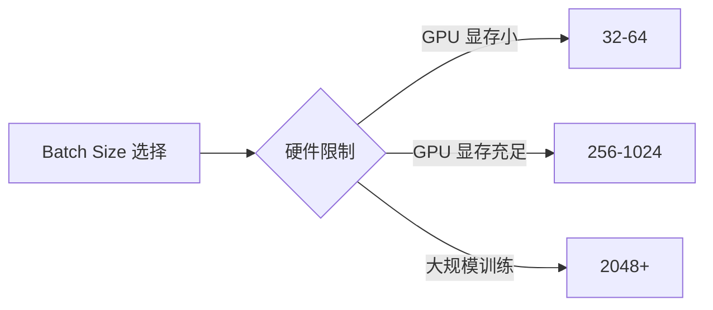
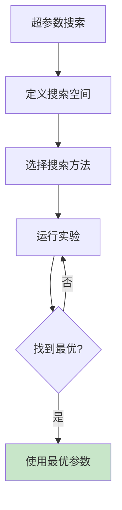

# 第四章：模型评估与调优

> 过拟合、正则化与超参数

---

## 4.1 过拟合与欠拟合

训练模型时，模型与数据的关系有三种状态：



| 状态 | 描述 | 训练误差 | 测试误差 |
|------|------|----------|----------|
| 欠拟合 | 模型太简单 | 高 | 高 |
| 正常 | 模型适中 | 低 | 低 |
| 过拟合 | 模型太复杂 | 极低 | 高 |

### 4.1.1 欠拟合（Underfitting）

**原因**：
- 模型表达能力不足
- 训练时间不够
- 特征不够丰富

**解决方法**：
- 增加模型复杂度
- 增加特征
- 增加训练轮数

### 4.1.2 过拟合（Overfitting）

**原因**：
- 模型太复杂
- 训练数据太少
- 训练时间过长

**解决方法**：
- 正则化
- 增加训练数据
- 早停（Early Stopping）
- Dropout

### 4.1.3 偏差-方差权衡（Bias-Variance Tradeoff）

$$E[(y - \hat{f})^2] = \text{Bias}^2 + \text{Variance} + \text{Irreducible Error}$$



| 指标 | 高偏差 | 低偏差 |
|------|--------|--------|
| 含义 | 模型欠拟合 | 模型过拟合 |
| 训练误差 | 高 | 低 |
| 测试误差 | 高 | 高/低 |

---

## 4.2 泛化性与鲁棒性

### 4.2.1 泛化性（Generalization）

**定义**：
- 模型在**未见过的数据**上的表现能力
- 好的泛化性意味着模型不仅记住训练数据，还能处理新数据


**提高泛化性的方法**：
- 正则化
- 数据增强
- 早停
- Dropout

### 4.2.2 鲁棒性（Robustness）

**定义**：
- 模型对**噪声、异常值、分布偏移**的抵抗能力
- 鲁棒的模型在输入有干扰时仍能给出合理输出

| 性质 | 关注点 | 评估方式 |
|------|--------|----------|
| 泛化性 | 未见数据的准确率 | 训练集 vs 测试集性能 |
| 鲁棒性 | 干扰下的稳定性 | 对抗样本、噪声测试 |

---

## 4.3 正则化技术

### 4.3.1 什么是正则化？

**正则化（Regularization）**：
- 在损失函数中添加**惩罚项**，限制模型复杂度
- 防止过拟合，提高泛化性

### 4.3.2 L1 正则（Lasso）

**提出者**：Robert Tibshirani (1996)

**论文**：《Regression Shrinkage and Selection via the Lasso》

**公式**：

$$\text{Loss} = \text{MSE} + \lambda \sum_{i=1}^{n}|w_i|$$

**特点**：
- 产生稀疏解（很多权重为 0）
- 可用于特征选择
- 适合高维稀疏数据

### 4.3.3 L2 正则（Ridge）

**提出者**：Hoerl and Kennard (1970)

**论文**：《Ridge Regression: Biased Estimation for Nonorthogonal Problems》

**公式**：

$$\text{Loss} = \text{MSE} + \lambda \sum_{i=1}^{n}w_i^2$$

**特点**：
- 权重趋向于小值
- 不产生稀疏解
- 适合一般场景

### 4.3.4 L1 vs L2 对比

| 特性 | L1 正则 | L2 正则 |
|------|---------|---------|
| 公式 | $\lambda \vert w \vert$ | $\lambda w^2$ |
| 解的性质 | 稀疏（特征选择） | 平滑（权重衰减） |
| 几何解释 | 菱形约束 | 圆形约束 |
| 适用场景 | 高维稀疏数据 | 一般场景 |



---

## 4.4 Dropout

### 4.4.1 原理

**Dropout**：
- 训练时**随机丢弃**部分神经元
- 迫使模型学习更鲁棒的特征
- 相当于训练多个子网络的集成



### 4.4.2 PyTorch 实现

```python
import torch.nn as nn

# Dropout 层
self.dropout = nn.Dropout(p=0.5)  # p = 丢弃概率

# 在 forward 中使用
def forward(self, x):
    x = self.layer1(x)
    x = self.dropout(x)  # 随机丢弃 50% 神经元
    x = self.layer2(x)
    return x
```

### 4.4.3 Dropout 的作用

| 方面 | 解释 |
|------|------|
| 防止共适应 | 神经元不依赖特定其他神经元 |
| 集成效果 | 相当于训练多个网络 |
| 正则化 | 减少过拟合 |

### 4.4.4 Dropout 变体

| 变体 | 描述 |
|------|------|
| Dropout | 随机丢弃神经元 |
| DropConnect | 随机丢弃权重 |
| Spatial Dropout | 丢弃整个通道 |
| Gaussian Dropout | 用噪声替代丢弃 |

---

## 4.5 Batch Size

### 4.5.1 什么是 Batch Size？

**Batch Size（批量大小）**：
- 每次参数更新使用的样本数量

### 4.5.2 大 Batch vs 小 Batch

| Batch Size | 优点 | 缺点 |
|------------|------|------|
| 小（1-32） | 泛化性好，有噪声帮助逃离局部最优 | 收敛慢，GPU 利用率低 |
| 大（256+） | 收敛快，GPU 利用率高 | 可能泛化差，需要调整学习率 |

**经验法则**：
- 搜索：32, 64, 128, 256
- 大模型常用 512, 1024, 2048



### 4.5.3 Batch Size 与学习率

**线性缩放规则**（Linear Scaling Rule）：
- Batch Size 翻倍，学习率也翻倍

$$lr_{new} = lr_{old} \times \frac{bs_{new}}{bs_{old}}$$

#### 为什么学习率要随 Batch Size 增大？

**核心原因**：Batch Size 越大，梯度估计越准确，方差越小。

```
batch_size = 1:   梯度噪声大，像喝醉的人走路 → 需要小步长
batch_size = 256: 梯度方向确定，像清醒的人走路 → 可以迈大步
```

**数学原理**：

用 batch 计算的梯度：
$$g_{batch} = \frac{1}{bs} \sum_{i=1}^{bs} \nabla L_i$$

梯度的方差与 batch size 成反比：
$$\text{Var}(g_{batch}) \approx \frac{\text{Var}(\nabla L)}{bs}$$

| Batch Size | 梯度方差 | 合适步长 |
|------------|----------|----------|
| 小（32） | 大 | 小 |
| 大（256） | 小 | 大 |

#### 具体例子

| Batch Size | 学习率 |
|------------|--------|
| 32 | 0.01 |
| 64 | 0.02 |
| 128 | 0.04 |
| 256 | 0.08 |

#### 注意事项

- **不是越大越好**：超大 batch 可能导致泛化性能下降
- **配合 Warmup**：大 batch + 学习率缩放时，建议使用 Warmup
- **显存限制**：实际受 GPU 显存约束

---

## 4.6 超参数

### 4.6.1 什么是超参数？

**超参数（Hyperparameter）**：
- 训练前**手动设定**的参数（不是学习到的）
- 需要通过实验调优

### 4.6.2 常见超参数

| 类别 | 超参数 | 默认值 | 常用范围 |
|------|--------|--------|----------|
| 学习率 | lr | 0.001 | 0.0001 ~ 0.1 |
| 正则化 | weight_decay | 0.01 | 0 ~ 0.1 |
| Dropout | p | 0.5 | 0 ~ 0.9 |
| Batch Size | batch_size | 32 | 16 ~ 4096 |
| 层数 | num_layers | - | 1 ~ 100 |
| 隐藏单元 | hidden_size | - | 32 ~ 4096 |
| 训练轮数 | epochs | 10 | 1 ~ 1000 |
| 动量 | momentum | 0.9 | 0.8 ~ 0.99 |

### 4.6.3 超参数搜索方法

| 方法 | 描述 | 优点 | 缺点 |
|------|------|------|------|
| 网格搜索 | 遍历所有组合 | 全面 | 计算量大 |
| 随机搜索 | 随机采样 | 高维友好 | 可能遗漏 |
| 贝叶斯优化 | 基于概率模型 | 效率高 | 实现复杂 |
| 早停 | 提前终止不佳实验 | 节省资源 | 需要耐心 |



### 4.6.4 超参数优先级

```
第一优先级（影响最大）：
1. 学习率 (lr)
2. Batch Size

第二优先级：
3. 模型深度/宽度
4. 正则化参数

第三优先级：
5. 优化器参数
6. 激活函数选择
```

---

## 4.7 实战：对比不同配置

```python
import torch
import torch.nn as nn
import torch.optim as optim
import matplotlib.pyplot as plt

# 生成非线性数据
torch.manual_seed(42)
X = torch.linspace(-3, 3, 100).reshape(-1, 1)
y = X.pow(3) - X.pow(2) + 0.5 * torch.randn_like(X)

# 不同复杂度的模型
class SimpleNet(nn.Module):
    def __init__(self, hidden_size=32, dropout=0.0):
        super().__init__()
        self.net = nn.Sequential(
            nn.Linear(1, hidden_size),
            nn.ReLU(),
            nn.Dropout(dropout),
            nn.Linear(hidden_size, hidden_size),
            nn.ReLU(),
            nn.Dropout(dropout),
            nn.Linear(hidden_size, 1)
        )

    def forward(self, x):
        return self.net(x)

# 对比：欠拟合 vs 正常 vs 过拟合
configs = [
    ('欠拟合 (太小)', 4, 0.0),
    ('正常', 32, 0.0),
    ('过拟合 (太大)', 128, 0.0),
    ('正常+Dropout', 128, 0.3),
]

fig, axes = plt.subplots(1, 2, figsize=(12, 4))

for name, hidden, drop in configs:
    model = SimpleNet(hidden, drop)
    optimizer = optim.Adam(model.parameters(), lr=0.01, weight_decay=0.01)
    criterion = nn.MSELoss()

    losses = []
    for epoch in range(300):
        optimizer.zero_grad()
        pred = model(X)
        loss = criterion(pred, y)
        loss.backward()
        optimizer.step()
        losses.append(loss.item())

    # 绘制损失曲线
    axes[0].plot(losses, label=name)

    # 绘制拟合曲线
    with torch.no_grad():
        axes[1].plot(X.numpy(), model(X).numpy(), label=name)

axes[0].set_xlabel('Epoch')
axes[0].set_ylabel('Loss')
axes[0].set_title('训练损失')
axes[0].legend()
axes[0].grid(True, alpha=0.3)

axes[1].scatter(X.numpy(), y.numpy(), alpha=0.3, label='数据')
axes[1].set_title('拟合效果')
axes[1].legend()
axes[1].grid(True, alpha=0.3)

plt.tight_layout()
plt.show()
```

---

## 4.8 概念总结

| 概念 | 定义 | 防止问题 |
|------|------|----------|
| 过拟合 | 记住噪声 | 正则化、Dropout、数据增强 |
| 欠拟合 | 模型太简单 | 增加复杂度、增加特征 |
| 泛化性 | 处理新数据能力 | 正则化、Early Stopping |
| 鲁棒性 | 抗干扰能力 | 数据增强、噪声训练 |
| L1 正则 | 稀疏惩罚 | 特征选择 |
| L2 正则 | 权重衰减 | 过拟合 |
| Dropout | 随机丢弃 | 过拟合 |
| Batch Size | 批量大小 | 影响收敛和泛化 |
| 超参数 | 手动设置参数 | - |

---

## 思考题

1. 过拟合和欠拟合的本质区别是什么？
2. L1 和 L2 正则分别适合什么场景？
3. 为什么 Dropout 能防止过拟合？
4. 为什么要区分超参数和模型参数？
5. Batch Size 对训练有什么影响？

---

## 上一步

先学习 [第三章：初始化](./03-3-initialization.md)，了解各种优化算法。

---

## 下一步

下一章我们将讨论 Transformer 的前置知识，为学习 Transformer 做准备。
