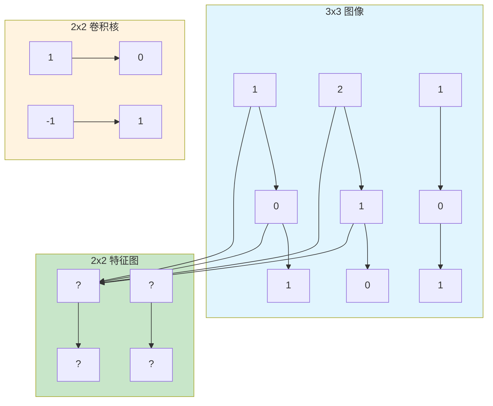

# 第三章：CNN（卷积神经网络）

> 利用卷积操作提取图像局部特征

---

## 3.1 什么是 CNN？

**CNN（Convolutional Neural Network）**：利用卷积操作提取局部特征的神经网络。

**核心思想**：图像的规律是局部的（边缘、纹理、形状）

**应用领域**：
- 图像分类（ResNet, VGG）
- 目标检测（YOLO, Faster R-CNN）
- 语义分割（U-Net）

---

## 3.2 卷积层

**卷积操作**：用一个小窗口在图像上滑动，计算特征。



**计算示例**：
```
输入：      卷积核：      输出：
[1, 0]     [1, 0]     [1*1+0*0 + 2*(-1)+1*1 = 0]
[2, 1]     [-1, 1]
```

---

## 3.3 卷积核

**卷积核（Kernel）**：卷积操作的核心小矩阵。

| 类型 | 作用 |
|------|------|
| 边缘检测 | 提取图像边缘 |
| 模糊 | 平滑图像 |
| 锐化 | 增强细节 |
| 纹理 | 提取纹理特征 |

**特点**：
- 尺寸通常为 3x3 或 5x5
- 可学习（通过训练自动发现）
- 数量决定输出通道数

```python
import torch.nn as nn

# 定义卷积层
conv = nn.Conv2d(
    in_channels=3,    # 输入通道（RGB图像=3）
    out_channels=64,  # 输出通道（特征图数量）
    kernel_size=3,    # 卷积核大小 3x3
    stride=1,         # 步长
    padding=1         # 填充
)
```

---

## 3.4 池化层

**池化（Pooling）**：下采样操作，减小特征图尺寸。

| 类型 | 公式 | 特点 |
|------|------|------|
| Max Pooling | 取最大值 | 保留显著特征 |
| Average Pooling | 取平均值 | 保留整体信息 |

```mermaid
graph LR
    subgraph 输入["2x2 池化窗口"]
    p1[1] --> p2[3]
    p3[2] --> p4[4]
    end

    subgraph 输出
    m[3]  <!-- Max Pooling 结果 -->
    end

    p1 --> m
    p4 --> m

    style 输入 fill:#e1f5fe
    style 输出 fill:#c8e6c9
```

**作用**：
- 减少计算量
- 防止过拟合
- 提供平移不变性

```python
import torch.nn as nn

# 最大池化
max_pool = nn.MaxPool2d(kernel_size=2, stride=2)

# 平均池化
avg_pool = nn.AvgPool2d(kernel_size=2, stride=2)

# 全局平均池化（常用于分类网络最后）
global_avg_pool = nn.AdaptiveAvgPool2d((1, 1))
```

---

## 3.5 CNN 完整示例

```python
import torch
import torch.nn as nn

class SimpleCNN(nn.Module):
    def __init__(self, num_classes=10):
        super().__init__()

        # 卷积层 1：32 个 3x3 卷积核
        self.conv1 = nn.Sequential(
            nn.Conv2d(3, 32, kernel_size=3, padding=1),
            nn.ReLU(),
            nn.MaxPool2d(2, 2)  # 28x28 -> 14x14
        )

        # 卷积层 2：64 个 3x3 卷积核
        self.conv2 = nn.Sequential(
            nn.Conv2d(32, 64, kernel_size=3, padding=1),
            nn.ReLU(),
            nn.MaxPool2d(2, 2)  # 14x14 -> 7x7
        )

        # 全连接层
        self.fc = nn.Sequential(
            nn.Flatten(),
            nn.Linear(64 * 7 * 7, 128),
            nn.ReLU(),
            nn.Linear(128, num_classes)
        )

    def forward(self, x):
        x = self.conv1(x)
        x = self.conv2(x)
        x = self.fc(x)
        return x

# 使用
model = SimpleCNN(num_classes=10)
x = torch.randn(1, 3, 28, 28)  # batch=1, RGB, 28x28
output = model(x)
print(output.shape)  # torch.Size([1, 10])
```

---

## 思考题

1. 卷积操作相比全连接层有什么优势？
2. 为什么卷积核的大小通常选择 3x3？
3. 池化层的作用是什么？

---

## 下一步

下一章我们将讨论循环神经网络（RNN），用于处理序列数据。
