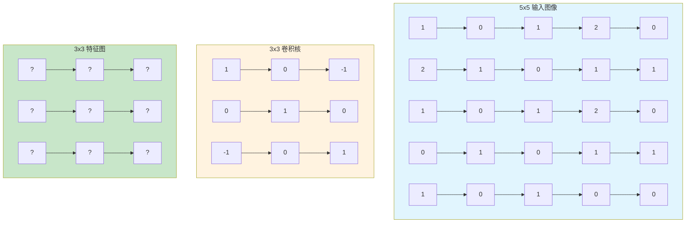
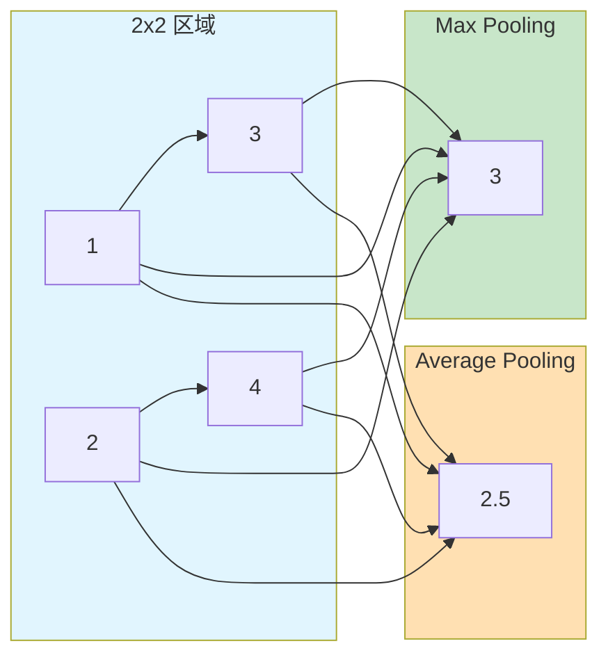

# 第三章：CNN（卷积神经网络）

> 利用卷积操作提取图像局部特征

---

## 3.1 为什么需要 CNN？

### 1.1 全连接层的问题

在讨论 CNN 之前，我们先看看**全连接神经网络**处理图像会遇到什么问题。

假设我们要处理一张 **224×224×3** 的 RGB 图像（这是 ImageNet 数据集的常见尺寸）：

```
输入维度 = 224 × 224 × 3 = 150,528
```

如果第一个隐藏层有 1000 个神经元：

```
参数数量 = 150,528 × 1,000 ≈ **1.5 亿**
```

这会产生严重问题：

| 问题 | 描述 |
|------|------|
| 参数爆炸 | 图像越大，参数越多 |
| 过拟合风险 | 大量参数容易记忆训练数据 |
| 丢失空间信息 | 将图像展平后，位置关系丢失 |
| 计算量大 | 上亿参数需要巨大算力 |

### 1.2 图像的两个关键特性

**关键洞察 1**：图像的规律是**局部的**

```
检测"眼睛"：只需要看眼睛周围的像素
检测"边缘"：只需要看相邻像素的变化
```

**关键洞察 2**：图像的规律是**可重复的**

```
左上角的"边缘" = 右下角的"边缘"
学习到的"眼睛检测器"应该对所有位置有效
```

### 1.3 CNN 的核心思想

CNN 通过两个关键设计解决上述问题：

| 技术 | 作用 |
|------|------|
| **局部连接** | 每个神经元只连接局部区域 |
| **权重共享** | 同一卷积核在整个图像上复用 |

---

## 3.2 什么是卷积？

### 2.1 卷积的历史来源

**卷积（Convolution）** 不是神经网络发明的，它是一个**数学概念**：

- **1822 年**：法国数学家傅里叶（Fourier）在研究热传导时提出
- **1940s-1950s**：信号处理领域广泛应用
- **1980s**：日本学者 Fukushima 在 Neocognitron 中首次用于图像识别
- **1998 年**：LeCun 提出 LeNet-5，现代 CNN 的雏形

### 2.2 通俗理解卷积

**卷积的本质**：用一个"小窗户"（卷积核）在图像上滑动，提取局部特征。

```
比喻：用一个放大镜（卷积核）在图片上滑动

- 放大镜看到的是局部区域
- 不同的放大镜关注不同的特征（边缘、纹理...）
- 移动放大镜覆盖整个图片
```

### 2.3 一维卷积示例（理解核心概念）

先从简单的一维情况开始理解：

```
输入信号：    [1, 2, 3, 4, 5]
卷积核：      [0.5, 1, 0.5]    （大小为3）

卷积过程：
位置0：  (1×0.5) + (2×1) + (3×0.5) = 0.5 + 2 + 1.5 = 4.0
位置1：  (2×0.5) + (3×1) + (4×0.5) = 1 + 3 + 2 = 6.0
位置2：  (3×0.5) + (4×1) + (5×0.5) = 1.5 + 4 + 2.5 = 8.0

输出：      [4.0, 6.0, 8.0]
```

**核心操作**：`对应位置相乘，然后求和`

### 2.4 二维卷积（图像卷积）

对于图像（二维数据），卷积操作扩展为：



### 2.5 详细计算示例

让我们一步步计算卷积的第一个输出值：

```
位置 (0,0) 的计算：

输入局部区域：      卷积核：
┌ 1  0  1 ┐        ┌ 1  0 -1 ┐
│ 2  1  0 │        │ 0  1  0 │
└ 1  0  1 ┘        └ -1 0  1 ┘

计算过程：
(1×1) + (0×0) + (1×-1) +
(2×0) + (1×1) + (0×0) +
(1×-1) + (0×0) + (1×1)

= 1 + 0 - 1 +
  0 + 1 + 0 +
  -1 + 0 + 1

= 1
```

**二维卷积公式**：
$$(f * g)(i, j) = \sum_{m=-k}^{k} \sum_{n=-k}^{k} f(i+m, j+n) \cdot g(m, n)$$

其中：
- $f$ 是输入图像
- $g$ 是卷积核
- $k$ 是卷积核半径（3×3 则 k=1）

---

## 3.3 卷积核的作用

### 3.1 不同卷积核的效果

卷积核的值决定了它能检测什么特征：

| 卷积核类型 | 核的值 | 检测效果 |
|------------|--------|----------|
| 垂直边缘 | `[[-1,0,1], [-2,0,2], [-1,0,1]]` | 垂直边缘 |
| 水平边缘 | `[[1,2,1], [0,0,0], [-1,-2,-1]]` | 水平边缘 |
| 模糊 | `[[1/9,1/9,1/9], [1/9,1/9,1/9], [1/9,1/9,1/9]]` | 平滑模糊 |
| 锐化 | `[[0,-1,0], [-1,5,-1], [0,-1,0]]` | 增强边缘 |

### 3.2 可学习的卷积核

在 CNN 中，**卷积核的值不是手工设计的，而是通过学习得到的**：

```
传统方法：人工设计卷积核（如边缘检测）
CNN方法：卷积核从数据中自动学习
```

---

## 3.4 池化层

### 4.1 什么是池化？

**池化（Pooling）**：对局部区域进行下采样，减小特征图尺寸。

### 4.2 Max Pooling vs Average Pooling



| 类型 | 计算 | 特点 |
|------|------|------|
| Max Pooling | max(1,3,2,4) = 3 | 保留最显著特征 |
| Average Pooling | avg(1,3,2,4) = 2.5 | 保留整体信息 |

### 4.3 池化的作用

1. **减少计算量**：特征图变小，后续计算量减少
2. **防止过拟合**：减少参数，降低过拟合风险
3. **平移不变性**：物体稍微移动，池化后结果不变

---

## 3.5 CNN 完整示例

```python
import torch
import torch.nn as nn

class SimpleCNN(nn.Module):
    def __init__(self, num_classes=10):
        super().__init__()

        # 卷积层 1：32 个 3x3 卷积核
        self.conv1 = nn.Sequential(
            nn.Conv2d(3, 32, kernel_size=3, padding=1),
            nn.ReLU(),
            nn.MaxPool2d(2, 2)  # 28x28 -> 14x14
        )

        # 卷积层 2：64 个 3x3 卷积核
        self.conv2 = nn.Sequential(
            nn.Conv2d(32, 64, kernel_size=3, padding=1),
            nn.ReLU(),
            nn.MaxPool2d(2, 2)  # 14x14 -> 7x7
        )

        # 全连接层
        self.fc = nn.Sequential(
            nn.Flatten(),
            nn.Linear(64 * 7 * 7, 128),
            nn.ReLU(),
            nn.Linear(128, num_classes)
        )

    def forward(self, x):
        x = self.conv1(x)
        x = self.conv2(x)
        x = self.fc(x)
        return x

# 使用
model = SimpleCNN(num_classes=10)
x = torch.randn(1, 3, 28, 28)  # batch=1, RGB, 28x28
output = model(x)
print(output.shape)  # torch.Size([1, 10])
```

---

## 3.6 CNN 的训练过程

CNN 的训练过程与其他神经网络相同，分为以下步骤：

### 6.1 前向传播

```python
# 前向传播：输入 -> 卷积 -> 池化 -> 全连接 -> 输出
logits = model(x)  # logits = [batch_size, num_classes]
```

### 6.2 计算损失

```python
import torch.nn as nn

criterion = nn.CrossEntropyLoss()
loss = criterion(logits, labels)  # 计算预测与真实标签的差距
```

### 6.3 反向传播

```python
optimizer.zero_grad()      # 清空梯度
loss.backward()            # 反向传播计算梯度
optimizer.step()           # 更新参数
```

### 6.4 完整训练循环

```python
import torch
import torch.nn as nn
import torch.optim as optim
from torch.utils.data import DataLoader

# 超参数
batch_size = 64
learning_rate = 0.001
epochs = 10

# 数据加载（CIFAR-10 示例）
transform = transforms.Compose([
    transforms.ToTensor(),
    transforms.Normalize((0.5, 0.5, 0.5), (0.5, 0.5, 0.5))
])
train_dataset = datasets.CIFAR10(root='./data', train=True,
                                 download=True, transform=transform)
train_loader = DataLoader(train_dataset, batch_size=batch_size, shuffle=True)

# 初始化模型、损失函数、优化器
model = SimpleCNN(num_classes=10)
criterion = nn.CrossEntropyLoss()
optimizer = optim.Adam(model.parameters(), lr=learning_rate)

# 训练循环
for epoch in range(epochs):
    for images, labels in train_loader:
        # 前向传播
        outputs = model(images)
        loss = criterion(outputs, labels)

        # 反向传播
        optimizer.zero_grad()
        loss.backward()
        optimizer.step()

    print(f'Epoch [{epoch+1}/{epochs}], Loss: {loss.item():.4f}')
```

### 6.5 卷积层如何更新？

卷积核的值是通过**反向传播**自动学习的：

1. 计算损失对输出的梯度
2. 链式法则传递到卷积核
3. 梯度下降更新卷积核的值

例如：
$$
\frac{\partial \text{loss}}{\partial \text{kernel}} = \frac{\partial \text{loss}}{\partial \text{output}} \times \frac{\partial \text{output}}{\partial \text{kernel}}
$$

这就是 CNN 强大的地方：**不需要人工设计卷积核，网络自己从数据中学习**。

---

## 思考题

1. 为什么全连接层处理大图像时参数会爆炸？
2. 卷积操作的"局部连接"和"权重共享"如何解决参数爆炸问题？
3. 卷积核的值是固定的还是学习来的？
4. Max Pooling 和 Average Pooling 有什么区别？

---

## 下一步

下一章我们将讨论循环神经网络（RNN），用于处理序列数据。
