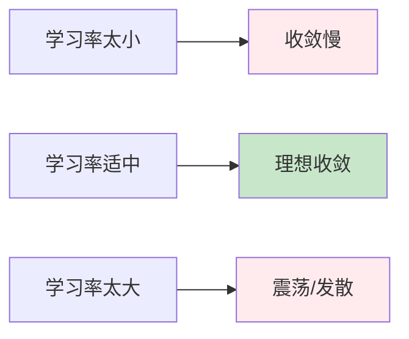
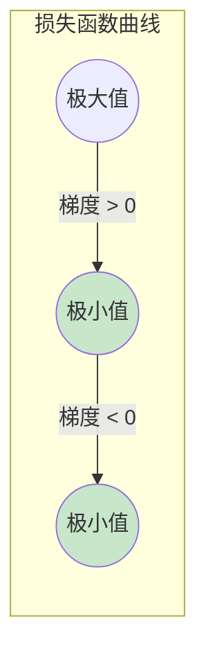
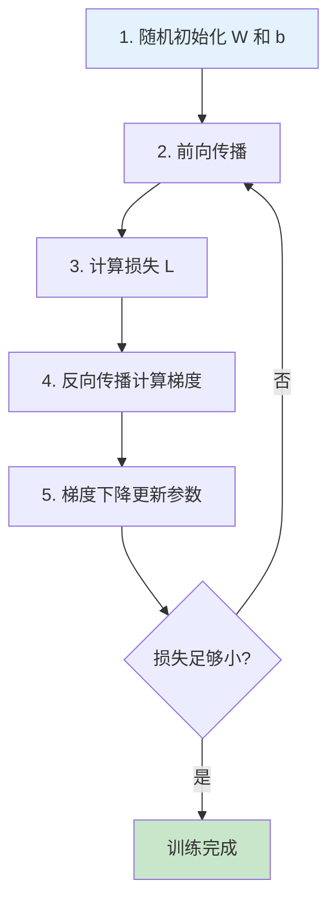
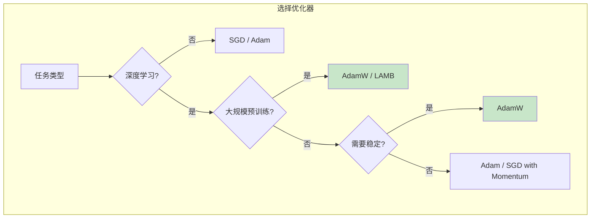
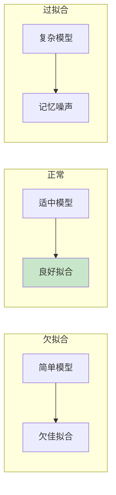
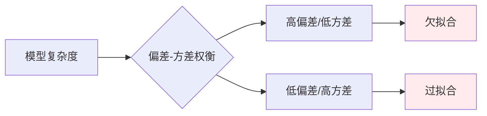
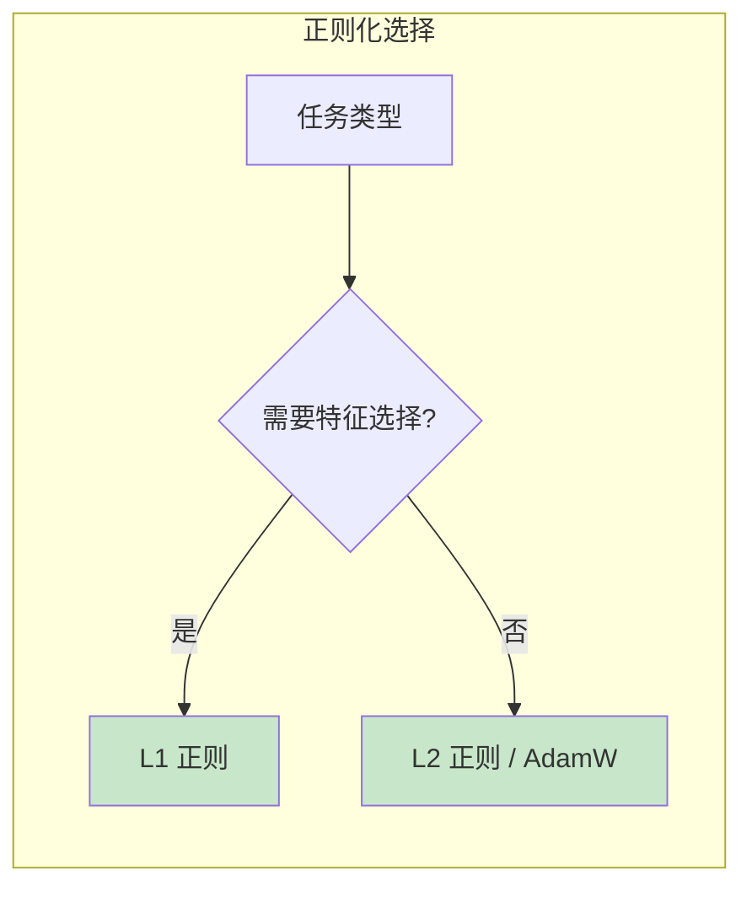
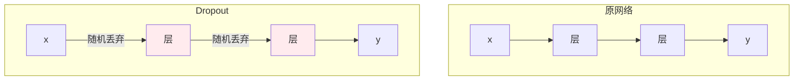
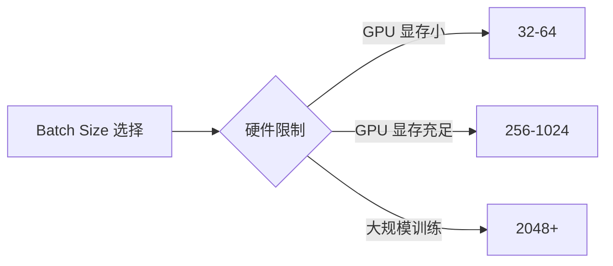
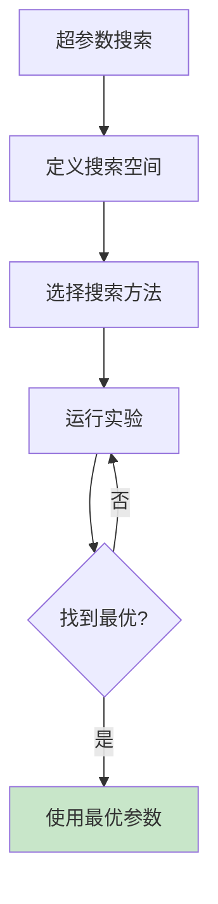

# 第三章：训练过程

> 损失函数、梯度下降与反向传播

---

## 3.1 损失函数

### 3.1.1 什么是损失函数？

**损失函数**（Loss Function）：衡量预测值与真实值之间差距的函数。

$$\text{Loss} = f(\hat{y}, y)$$

### 3.1.2 均方误差（MSE）

$$\text{MSE} = \frac{1}{n}\sum_{i=1}^{n}(y_i - \hat{y}_i)^2$$

**为什么用平方而不是绝对值？**

| 优点 | 说明 |
|------|------|
| 可导 | 平方函数处处可导，便于优化 |
| 惩罚大误差 | 平方让大误差受到更大惩罚 |

### 3.1.3 训练目标

> 训练神经网络的目标：找到使损失函数最小化的参数 $W$ 和 $b$

$$\min_{W, b} \text{Loss}(W, b) = \frac{1}{n}\sum_{i=1}^{n}(y_i - \hat{y}_i)^2$$

---

## 3.2 梯度下降算法

### 3.2.1 核心思想

想象一个乒乓球在凹凸不平的地面上滚动：
- 重力让它往低处滚
- 最终停在某个"坑底"（极小值点）


### 3.2.2 梯度下降公式

$$W_{new} = W_{old} - \eta \cdot \frac{\partial L}{\partial W}$$

其中 $\eta$ 是**学习率**（learning rate）。

### 3.2.3 学习率的影响



| 学习率 | 效果 |
|--------|------|
| 太小 | 收敛极慢，需要很多轮迭代 |
| 适中 | 快速收敛到最优解 |
| 太大 | 跳过最优解，甚至发散 |

### 3.2.4 梯度下降可视化



---

## 3.3 反向传播算法

### 3.3.1 链式法则（Chain Rule）

神经网络是一个**复合函数**：

$$L = f(g(h(x)))$$

**链式法则**：

$$\frac{\partial L}{\partial x} = \frac{\partial L}{\partial f} \cdot \frac{\partial f}{\partial g} \cdot \frac{\partial g}{\partial h} \cdot \frac{\partial h}{\partial x}$$

### 3.3.2 神经网络中的链式法则

$$\frac{\partial L}{\partial W} = \frac{\partial L}{\partial \hat{y}} \cdot \frac{\partial \hat{y}}{\partial a} \cdot \frac{\partial a}{\partial z} \cdot \frac{\partial z}{\partial W}$$

### 3.3.3 反向传播路径


### 3.3.4 反向传播过程

**前向传播**：
$$x \rightarrow z_1 = W_1x + b_1 \rightarrow a_1 = \sigma(z_1) \rightarrow z_2 = W_2a_1 + b_2 \rightarrow \hat{y} = \sigma(z_2) \rightarrow L$$

**反向传播**：
$$\frac{\partial L}{\partial W_2} = \frac{\partial L}{\partial \hat{y}} \cdot \frac{\partial \hat{y}}{\partial z_2} \cdot \frac{\partial z_2}{\partial W_2}$$

$$\frac{\partial L}{\partial W_1} = \frac{\partial L}{\partial \hat{y}} \cdot \frac{\partial \hat{y}}{\partial z_2} \cdot \frac{\partial z_2}{\partial a_1} \cdot \frac{\partial a_1}{\partial z_1} \cdot \frac{\partial z_1}{\partial W_1}$$

---

## 3.4 完整训练流程

### 3.4.1 训练步骤



### 3.4.2 数学总结

| 步骤 | 公式 |
|------|------|
| 前向传播 | $z^{(l)} = W^{(l)} \cdot a^{(l-1)} + b^{(l)}$ |
| 激活 | $a^{(l)} = \sigma(z^{(l)})$ |
| 损失 | $L = \frac{1}{n}\sum(y_i - \hat{y}_i)^2$ |
| 参数更新 | $W \leftarrow W - \eta \cdot \frac{\partial L}{\partial W}$ |

---

## 代码实现

```python
import torch
import torch.nn as nn
import torch.optim as optim

# 生成训练数据: y = 2x + 1 + 噪声
np.random.seed(42)
torch.manual_seed(42)

X_train = torch.randn(100, 1) * 5
y_train = 2 * X_train + 1 + torch.randn(100, 1)

# 定义神经网络
class SimpleNN(nn.Module):
    def __init__(self):
        super().__init__()
        self.hidden = nn.Linear(1, 10)
        self.relu = nn.ReLU()
        self.output = nn.Linear(10, 1)

    def forward(self, x):
        x = self.relu(self.hidden(x))
        x = self.output(x)
        return x

model = SimpleNN()
criterion = nn.MSELoss()
optimizer = optim.SGD(model.parameters(), lr=0.01)

# 训练
losses = []
for epoch in range(100):
    predictions = model(X_train)
    loss = criterion(predictions, y_train)

    optimizer.zero_grad()
    loss.backward()
    optimizer.step()

    losses.append(loss.item())

    if (epoch + 1) % 20 == 0:
        print(f'Epoch {epoch+1}, Loss: {loss.item():.4f}')
```

---

## 核心概念总结

| 概念 | 含义 |
|------|------|
| 前向传播 | 数据从输入层到输出层的计算过程 |
| 反向传播 | 从输出层向输入层计算梯度的过程 |
| 损失函数 | 衡量预测值与真实值差距的函数 |
| 梯度下降 | 通过梯度方向找到损失函数最小值的优化算法 |
| 链式法则 | 复合函数求导的法则，用于反向传播 |
| 学习率 | 控制参数更新步长的超参数 |

---

## 思考题

1. 为什么需要计算梯度而不是直接搜索最优参数？
2. 学习率太大或太小分别会导致什么问题？
3. 链式法则在反向传播中起什么作用？

---

## 下一步

下一章我们将讨论 Transformer 的前置知识，为学习 Transformer 做准备。

---

## 3.5 优化器

### 3.5.1 为什么需要优化器？

基础梯度下降算法存在以下问题：

| 问题 | 描述 |
|------|------|
| 收敛慢 | 在平坦区域移动缓慢 |
| 局部极小值 | 容易困在局部最优解 |
| 学习率统一 | 所有参数用相同学习率 |
| 梯度消失/爆炸 | 深层网络梯度不稳定 |

**优化器**是对基础梯度下降的改进，通过不同的策略加速收敛和提高性能。

### 3.5.2 常用优化器

#### SGD（随机梯度下降）

$$W_{new} = W_{old} - \eta \cdot g$$

其中 $g$ 是梯度。

**特点**：
- 简单直观
- 收敛速度慢
- 容易陷入局部最优

#### Momentum（动量法）

$$v_{new} = \gamma \cdot v_{old} + \eta \cdot g$$
$$W_{new} = W_{old} - v_{new}$$

**特点**：
- 引入动量项 $\gamma$（通常 0.9）
- 加速收敛
- 减少震荡


#### AdaGrad（自适应梯度）

$$W_{new} = W_{old} - \frac{\eta}{\sqrt{G + \epsilon}} \cdot g$$

其中 $G$ 是历史梯度的平方和。

**特点**：
- 自适应调整学习率
- 稀疏特征效果好
- 后期学习率可能过小

#### RMSprop（均方根传播）

$$E[g^2]_{new} = \rho \cdot E[g^2]_{old} + (1-\rho) \cdot g^2$$
$$W_{new} = W_{old} - \frac{\eta}{\sqrt{E[g^2]_{new} + \epsilon}} \cdot g$$

**特点**：
- 使用指数移动平均
- 解决 AdaGrad 学习率衰减过快问题
- 适合非平稳目标

#### Adam（Adaptive Moment Estimation）

结合 Momentum 和 RMSprop：

$$m_{new} = \beta_1 \cdot m_{old} + (1-\beta_1) \cdot g$$
$$v_{new} = \beta_2 \cdot v_{old} + (1-\beta_2) \cdot g^2$$
$$\hat{m} = \frac{m_{new}}{1-\beta_1^t}, \quad \hat{v} = \frac{v_{new}}{1-\beta_2^t}$$
$$W_{new} = W_{old} - \frac{\eta}{\sqrt{\hat{v}} + \epsilon} \cdot \hat{m}$$

**特点**：
- 最常用的优化器
- 默认参数：$\eta=0.001, \beta_1=0.9, \beta_2=0.999$
- 适用于大多数场景

#### AdamW（带权重衰减的 Adam）

Adam 的改进版本，解耦权重衰减：

$$W_{new} = W_{old} - \eta \cdot (\hat{m} / (\sqrt{\hat{v}} + \epsilon) + \lambda \cdot W_{old})$$

**特点**：
- 更好的正则化效果
- Hugging Face 推荐使用
- 训练更稳定

#### LAMB（Layer-wise Adaptive Moments optimizer for Batch training）

专门为大 batch size 设计：

$$W_{new} = W_{old} - \frac{\eta}{\|W_{old}\|} \cdot \frac{\hat{m}}{\sqrt{\hat{v}} + \epsilon}$$

**特点**：
- 支持超大 batch（如 8k+）
- 用于 BERT 预训练

### 3.5.3 优化器对比

| 优化器 | 学习率策略 | 适用场景 | 特点 |
|--------|------------|----------|------|
| SGD | 固定/衰减 | 简单任务 | 稳定，但收敛慢 |
| Momentum | 固定 | 深度网络 | 加速收敛 |
| AdaGrad | 自适应 | 稀疏数据 | 历史梯度累积 |
| RMSprop | 自适应 | RNN/非平稳 | 指数移动平均 |
| **Adam** | 自适应 | **默认选择** | 综合最优 |
| AdamW | 自适应 | NLP/大模型 | 更好的正则化 |
| LAMB | 自适应 | 大 batch | 超大规模训练 |



### 3.5.4 PyTorch 代码示例

```python
import torch
import torch.nn as nn
import torch.optim as optim
import matplotlib.pyplot as plt

# 生成训练数据
torch.manual_seed(42)
X = torch.randn(200, 1) * 5
y = 2 * X + 1 + torch.randn(200, 1)

# 定义简单网络
class SimpleNet(nn.Module):
    def __init__(self):
        super().__init__()
        self.fc = nn.Linear(1, 1)
    def forward(self, x):
        return self.fc(x)

# 不同优化器对比
optimizers = {
    'SGD': optim.SGD,
    'Momentum': optim.SGD,
    'RMSprop': optim.RMSprop,
    'Adam': optim.Adam,
    'AdamW': optim.AdamW,
}

params = {
    'SGD': {'lr': 0.01},
    'Momentum': {'lr': 0.01, 'momentum': 0.9},
    'RMSprop': {'lr': 0.01, 'alpha': 0.99},
    'Adam': {'lr': 0.01},
    'AdamW': {'lr': 0.01, 'weight_decay': 0.01},
}

losses_dict = {}

for name, OptClass in optimizers.items():
    model = SimpleNet()
    optimizer = OptClass(model.parameters(), **params[name])
    criterion = nn.MSELoss()

    losses = []
    for epoch in range(100):
        optimizer.zero_grad()
        pred = model(X)
        loss = criterion(pred, y)
        loss.backward()
        optimizer.step()
        losses.append(loss.item())

    losses_dict[name] = losses
    print(f'{name}: Final Loss = {losses[-1]:.4f}')

# 绘制收敛曲线
plt.figure(figsize=(10, 6))
for name, losses in losses_dict.items():
    plt.plot(losses, label=name)
plt.xlabel('Epoch')
plt.ylabel('Loss')
plt.title('优化器对比')
plt.legend()
plt.grid(True, alpha=0.3)
plt.show()
```

### 3.5.5 学习率调度器

除了优化器，学习率调度器也很重要：

| 调度器 | 描述 |
|--------|------|
| StepLR | 固定步长衰减 |
| ExponentialLR | 指数衰减 |
| CosineAnnealingLR | 余弦退火 |
| ReduceLROnPlateau | 指标不降时衰减 |
| Warmup | 预热策略 |

---

## 思考题

1. 为什么 Adam 比 SGD 更受欢迎？
2. AdamW 和 Adam 的区别是什么？
3. 什么情况下应该使用 LAMB？

---

## 3.6 训练核心概念

### 3.6.1 过拟合与欠拟合

训练模型时，模型与数据的关系有三种状态：



| 状态 | 描述 | 训练误差 | 测试误差 |
|------|------|----------|----------|
| 欠拟合 | 模型太简单 | 高 | 高 |
| 正常 | 模型适中 | 低 | 低 |
| 过拟合 | 模型太复杂 | 极低 | 高 |

**欠拟合（Underfitting）**：
- 模型表达能力不足
- 解决方法：增加模型复杂度、增加特征

**过拟合（Overfitting）**：
- 模型"记住"了训练数据的噪声
- 解决方法：正则化、增加数据、早停

**偏差-方差权衡（Bias-Variance Tradeoff）**：

$$E[(y - \hat{f})^2] = \text{Bias}^2 + \text{Variance} + \text{Irreducible Error}$$



### 3.6.2 泛化性与鲁棒性

**泛化性（Generalization）**：
- 模型在**未见过的数据**上的表现能力
- 好的泛化性意味着模型不仅记住训练数据，还能处理新数据


**鲁棒性（Robustness）**：
- 模型对**噪声、异常值、分布偏移**的抵抗能力
- 鲁棒的模型在输入有干扰时仍能给出合理输出

| 性质 | 关注点 | 评估方式 |
|------|--------|----------|
| 泛化性 | 未见数据的准确率 | 训练集 vs 测试集性能 |
| 鲁棒性 | 干扰下的稳定性 | 对抗样本、噪声测试 |

### 3.6.3 正则化技术

**正则化（Regularization）**：
- 在损失函数中添加**惩罚项**，限制模型复杂度
- 防止过拟合，提高泛化性

**L1 正则（Lasso）**：

$$\text{Loss} = \text{MSE} + \lambda \sum_{i=1}^{n}|w_i|$$

**特点**：
- 产生稀疏解（很多权重为 0）
- 可用于特征选择

**L2 正则（Ridge）**：

$$\text{Loss} = \text{MSE} + \lambda \sum_{i=1}^{n}w_i^2$$

**特点**：
- 权重趋向于小值
- 不产生稀疏解

**L1 vs L2 对比**：

| 特性 | L1 正则 | L2 正则 |
|------|---------|---------|
| 公式 | $\lambda |w|$ | $\lambda w^2$ |
| 解的性质 | 稀疏（特征选择） | 平滑（权重衰减） |
| 几何解释 | 菱形约束 | 圆形约束 |
| 适用场景 | 高维稀疏数据 | 一般场景 |



### 3.6.4 Dropout

**Dropout**：
- 训练时**随机丢弃**部分神经元
- 迫使模型学习更鲁棒的特征



**PyTorch 实现**：

```python
import torch.nn as nn

# Dropout 层
self.dropout = nn.Dropout(p=0.5)  # p = 丢弃概率

# 在 forward 中使用
def forward(self, x):
    x = self.layer1(x)
    x = self.dropout(x)  # 随机丢弃 50% 神经元
    x = self.layer2(x)
    return x
```

### 3.6.5 Batch Size

**Batch Size（批量大小）**：
- 每次参数更新使用的样本数量

| Batch Size | 优点 | 缺点 |
|------------|------|------|
| 小（1-32） | 泛化性好，有噪声帮助逃离局部最优 | 收敛慢，GPU 利用率低 |
| 大（256+） | 收敛快，GPU 利用率高 | 可能泛化差，需要调整学习率 |

**经验法则**：
- 搜索：32, 64, 128, 256
- 大模型常用 512, 1024, 2048



### 3.6.6 超参数

**超参数（Hyperparameter）**：
- 训练前**手动设定**的参数（不是学习到的）

**常见超参数**：

| 类别 | 超参数 | 默认值 |
|------|--------|--------|
| 学习率 | lr | 0.001 (Adam) |
| 正则化 | weight_decay | 0.01 (AdamW) |
| Dropout | p | 0.5 |
| Batch Size | batch_size | 32 |
| 层数 | num_layers | - |
| 隐藏单元 | hidden_size | - |
| 训练轮数 | epochs | 10-100 |

**超参数搜索方法**：

| 方法 | 描述 |
|------|------|
| 网格搜索 | 遍历所有组合 |
| 随机搜索 | 随机采样 |
| 贝叶斯优化 | 基于概率模型 |
| 早停 | 提前终止不佳实验 |



### 3.6.7 PyTorch 代码示例

```python
import torch
import torch.nn as nn
import torch.optim as optim
import matplotlib.pyplot as plt

# 生成非线性数据
torch.manual_seed(42)
X = torch.linspace(-3, 3, 100).reshape(-1, 1)
y = X.pow(3) - X.pow(2) + 0.5 * torch.randn_like(X)

# 不同复杂度的模型
class SimpleNet(nn.Module):
    def __init__(self, hidden_size=32, dropout=0.0):
        super().__init__()
        self.net = nn.Sequential(
            nn.Linear(1, hidden_size),
            nn.ReLU(),
            nn.Dropout(dropout),
            nn.Linear(hidden_size, hidden_size),
            nn.ReLU(),
            nn.Dropout(dropout),
            nn.Linear(hidden_size, 1)
        )

    def forward(self, x):
        return self.net(x)

# 对比：欠拟合 vs 正常 vs 过拟合
configs = [
    ('欠拟合 (太小)', 4, 0.0),
    ('正常', 32, 0.0),
    ('过拟合 (太大)', 128, 0.0),
    ('正常+Dropout', 128, 0.3),
]

fig, axes = plt.subplots(1, 2, figsize=(12, 4))

for name, hidden, drop in configs:
    model = SimpleNet(hidden, drop)
    optimizer = optim.Adam(model.parameters(), lr=0.01, weight_decay=0.01)
    criterion = nn.MSELoss()

    losses = []
    for epoch in range(300):
        optimizer.zero_grad()
        pred = model(X)
        loss = criterion(pred, y)
        loss.backward()
        optimizer.step()
        losses.append(loss.item())

    # 绘制损失曲线
    axes[0].plot(losses, label=name)

    # 绘制拟合曲线
    with torch.no_grad():
        axes[1].plot(X.numpy(), model(X).numpy(), label=name)

axes[0].set_xlabel('Epoch')
axes[0].set_ylabel('Loss')
axes[0].set_title('训练损失')
axes[0].legend()
axes[0].grid(True, alpha=0.3)

axes[1].scatter(X.numpy(), y.numpy(), alpha=0.3, label='数据')
axes[1].set_title('拟合效果')
axes[1].legend()
axes[1].grid(True, alpha=0.3)

plt.tight_layout()
plt.show()
```

### 3.6.8 概念总结

| 概念 | 定义 | 防止问题 |
|------|------|----------|
| 过拟合 | 记住噪声 | 正则化、Dropout、数据增强 |
| 欠拟合 | 模型太简单 | 增加复杂度、增加特征 |
| 泛化性 | 处理新数据能力 | 正则化、 Early Stopping |
| 鲁棒性 | 抗干扰能力 | 数据增强、噪声训练 |
| L1 正则 | 稀疏惩罚 | 特征选择 |
| L2 正则 | 权重衰减 | 过拟合 |
| Dropout | 随机丢弃 | 过拟合 |
| Batch Size | 批量大小 | 影响收敛和泛化 |
| 超参数 | 手动设置参数 | - |

---

## 思考题

1. 过拟合和欠拟合的本质区别是什么？
2. L1 和 L2 正则分别适合什么场景？
3. 为什么 Dropout 能防止过拟合？
4. 为什么要区分超参数和模型参数？

---

## 下一步

下一章我们将讨论 Transformer 的前置知识，为学习 Transformer 做准备。
