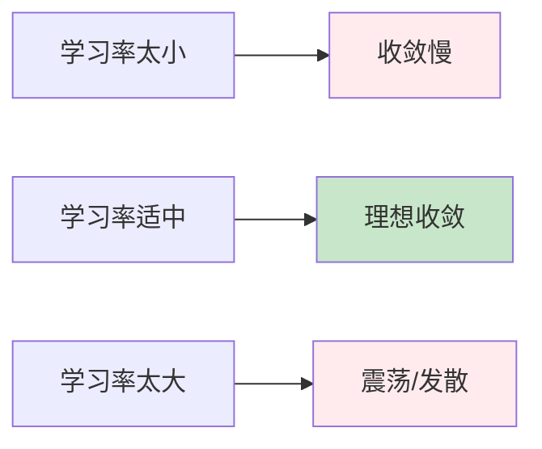
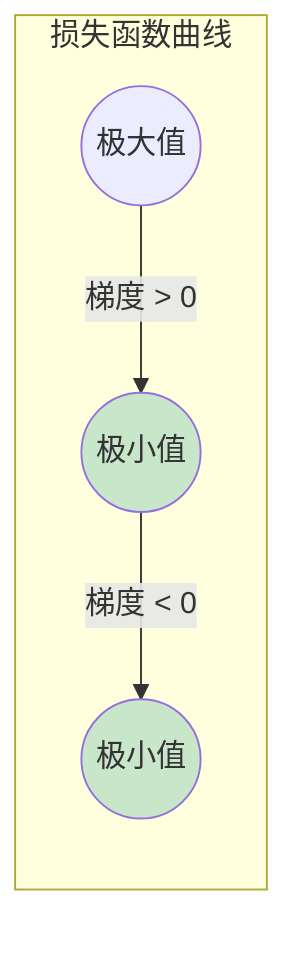
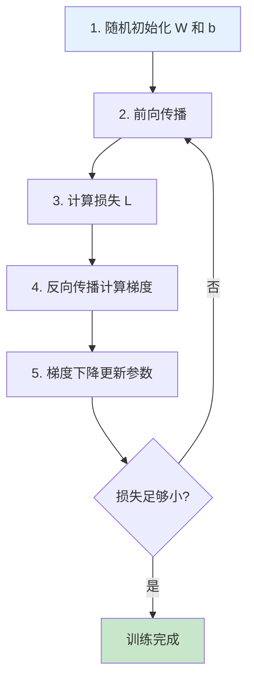

# 第三章：训练过程

> 损失函数、梯度下降与反向传播

---

## 3.1 损失函数

### 3.1.1 什么是损失函数？

**损失函数**（Loss Function）：衡量预测值与真实值之间差距的函数。

$$\text{Loss} = f(\hat{y}, y)$$

### 3.1.2 均方误差（MSE）

$$\text{MSE} = \frac{1}{n}\sum_{i=1}^{n}(y_i - \hat{y}_i)^2$$

**为什么用平方而不是绝对值？**

| 优点 | 说明 |
|------|------|
| 可导 | 平方函数处处可导，便于优化 |
| 惩罚大误差 | 平方让大误差受到更大惩罚 |

### 3.1.3 训练目标

> 训练神经网络的目标：找到使损失函数最小化的参数 $W$ 和 $b$

$$\min_{W, b} \text{Loss}(W, b) = \frac{1}{n}\sum_{i=1}^{n}(y_i - \hat{y}_i)^2$$

---

## 3.2 梯度下降算法

### 3.2.1 核心思想

想象一个乒乓球在凹凸不平的地面上滚动：
- 重力让它往低处滚
- 最终停在某个"坑底"（极小值点）


### 3.2.2 梯度下降公式

$$W_{new} = W_{old} - \eta \cdot \frac{\partial L}{\partial W}$$

其中 $\eta$ 是**学习率**（learning rate）。

### 3.2.3 学习率的影响



| 学习率 | 效果 |
|--------|------|
| 太小 | 收敛极慢，需要很多轮迭代 |
| 适中 | 快速收敛到最优解 |
| 太大 | 跳过最优解，甚至发散 |

### 3.2.4 梯度下降可视化



---

## 3.3 反向传播算法

### 3.3.1 链式法则（Chain Rule）

神经网络是一个**复合函数**：

$$L = f(g(h(x)))$$

**链式法则**：

$$\frac{\partial L}{\partial x} = \frac{\partial L}{\partial f} \cdot \frac{\partial f}{\partial g} \cdot \frac{\partial g}{\partial h} \cdot \frac{\partial h}{\partial x}$$

### 3.3.2 神经网络中的链式法则

$$\frac{\partial L}{\partial W} = \frac{\partial L}{\partial \hat{y}} \cdot \frac{\partial \hat{y}}{\partial a} \cdot \frac{\partial a}{\partial z} \cdot \frac{\partial z}{\partial W}$$

### 3.3.3 反向传播路径


### 3.3.4 反向传播过程

**前向传播**：
$$x \rightarrow z_1 = W_1x + b_1 \rightarrow a_1 = \sigma(z_1) \rightarrow z_2 = W_2a_1 + b_2 \rightarrow \hat{y} = \sigma(z_2) \rightarrow L$$

**反向传播**：
$$\frac{\partial L}{\partial W_2} = \frac{\partial L}{\partial \hat{y}} \cdot \frac{\partial \hat{y}}{\partial z_2} \cdot \frac{\partial z_2}{\partial W_2}$$

$$\frac{\partial L}{\partial W_1} = \frac{\partial L}{\partial \hat{y}} \cdot \frac{\partial \hat{y}}{\partial z_2} \cdot \frac{\partial z_2}{\partial a_1} \cdot \frac{\partial a_1}{\partial z_1} \cdot \frac{\partial z_1}{\partial W_1}$$

---

## 3.4 完整训练流程

### 3.4.1 训练步骤



### 3.4.2 数学总结

| 步骤 | 公式 |
|------|------|
| 前向传播 | $z^{(l)} = W^{(l)} \cdot a^{(l-1)} + b^{(l)}$ |
| 激活 | $a^{(l)} = \sigma(z^{(l)})$ |
| 损失 | $L = \frac{1}{n}\sum(y_i - \hat{y}_i)^2$ |
| 参数更新 | $W \leftarrow W - \eta \cdot \frac{\partial L}{\partial W}$ |

---

## 代码实现

```python
import torch
import torch.nn as nn
import torch.optim as optim

# 生成训练数据: y = 2x + 1 + 噪声
np.random.seed(42)
torch.manual_seed(42)

X_train = torch.randn(100, 1) * 5
y_train = 2 * X_train + 1 + torch.randn(100, 1)

# 定义神经网络
class SimpleNN(nn.Module):
    def __init__(self):
        super().__init__()
        self.hidden = nn.Linear(1, 10)
        self.relu = nn.ReLU()
        self.output = nn.Linear(10, 1)

    def forward(self, x):
        x = self.relu(self.hidden(x))
        x = self.output(x)
        return x

model = SimpleNN()
criterion = nn.MSELoss()
optimizer = optim.SGD(model.parameters(), lr=0.01)

# 训练
losses = []
for epoch in range(100):
    predictions = model(X_train)
    loss = criterion(predictions, y_train)

    optimizer.zero_grad()
    loss.backward()
    optimizer.step()

    losses.append(loss.item())

    if (epoch + 1) % 20 == 0:
        print(f'Epoch {epoch+1}, Loss: {loss.item():.4f}')
```

---

## 核心概念总结

| 概念 | 含义 |
|------|------|
| 前向传播 | 数据从输入层到输出层的计算过程 |
| 反向传播 | 从输出层向输入层计算梯度的过程 |
| 损失函数 | 衡量预测值与真实值差距的函数 |
| 梯度下降 | 通过梯度方向找到损失函数最小值的优化算法 |
| 链式法则 | 复合函数求导的法则，用于反向传播 |
| 学习率 | 控制参数更新步长的超参数 |

---

## 思考题

1. 为什么需要计算梯度而不是直接搜索最优参数？
2. 学习率太大或太小分别会导致什么问题？
3. 链式法则在反向传播中起什么作用？

---

## 下一步

下一章我们将讨论 Transformer 的前置知识，为学习 Transformer 做准备。
