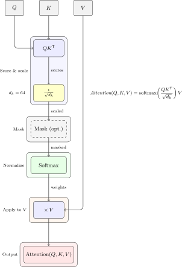
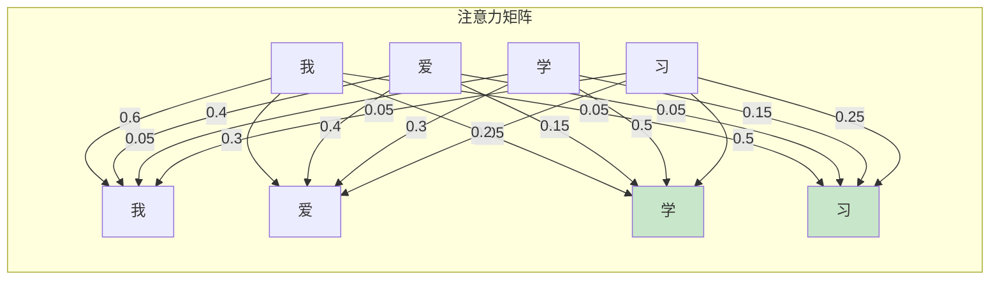
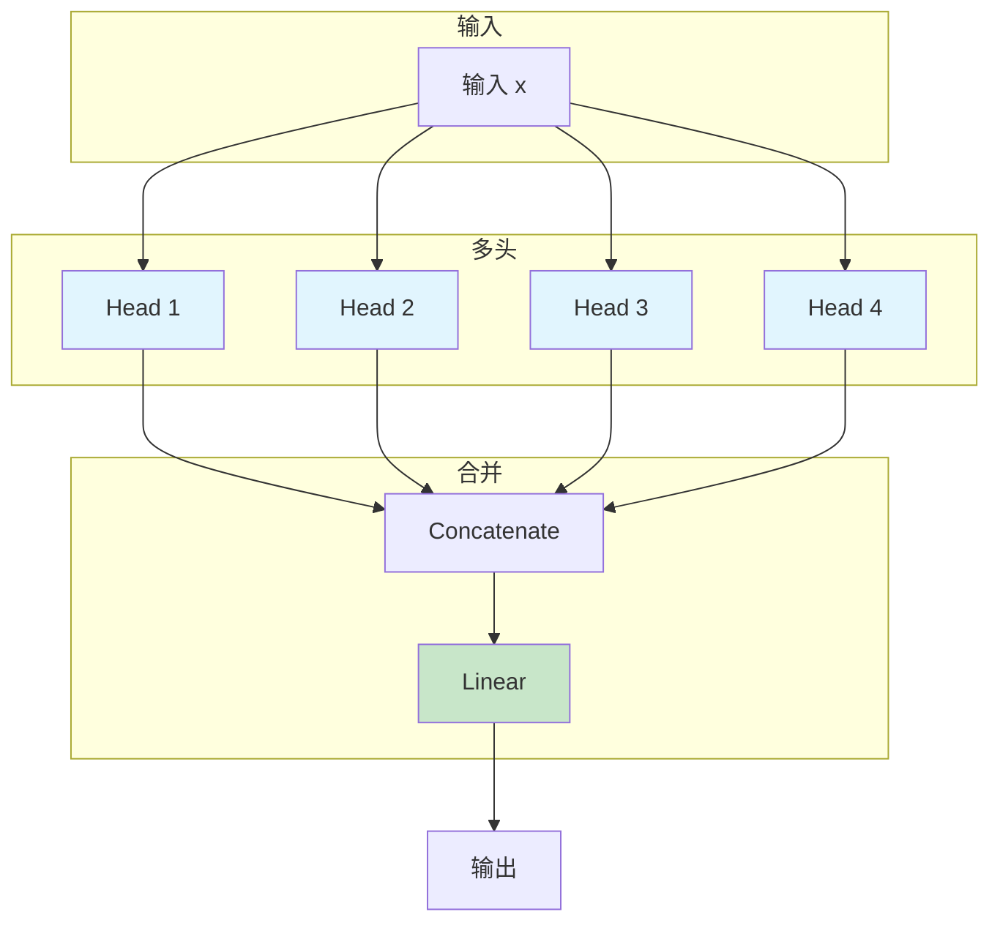

# 第七章：注意力机制


> 让模型学会关注最相关的信息

---

## 7.1 为什么需要注意力？

### 7.1.1 RNN的瓶颈

**问题1：长距离依赖**

```

句子："我出生在中国，所以我说..."


RNN需要记住"中国"才能理解"所以我说..."
→ 长序列时，信息会丢失
```


**问题2：并行化差**

```

RNN必须按顺序处理：t=1 → t=2 → t=3 → ...
→ 无法利用GPU并行计算

```

### 7.1.2 注意力机制的优势

| 特性 | RNN | Attention |
|------|-----|-----------|
| 长距离依赖 | 差（梯度消失） | 优秀（直接连接）|
| 并行化 | 差（顺序计算） | 优秀（可并行）|
| 计算效率 | 低 | 高 |
| 可解释性 | 低 | 高（可以看到关注什么）|

---

## 7.2 基础注意力

### 7.2.1 核心思想

**注意力**：让模型学会关注输入中最相关的部分。

```

类比：人类阅读时，会重点关注关键信息


句子："这只猫在公园里玩球"

理解"猫"时，关注：
- "猫"本身（最强）
- "玩"（主谓关系）
- "球"（宾语关系）
```


### 7.2.2 Q、K、V 模型

注意力机制使用三个向量：

| 向量 | 含义 | 作用 |
|------|------|------|
| Query (Q) | 查询 | "我想找什么" |
| Key (K) | 键 | "我可以匹配什么" |
| Value (V) | 值 | "匹配成功后返回什么" |

**比喻**：在图书馆找书

- Q：我想找一本关于深度学习的书
- K：每本书的标题和分类
- V：书的内容
- 注意力：找到最相关的书

### 7.2.3 注意力公式

$$\text{Attention}(Q, K, V) = \text{softmax}\left(\frac{QK^T}{\sqrt{d_k}}\right)V$$

**步骤**：

1. **计算分数**：$Score = QK^T$ （相似度）
2. **缩放**：$Scale = \frac{Score}{\sqrt{d_k}}$ （防止梯度消失）
3. **归一化**：$Attention = \text{softmax}(Scale)$ （概率分布）
4. **加权求和**：$Output = Attention \times V$



### 7.2.4 PyTorch实现

```python
import torch
import torch.nn as nn
import torch.nn.functional as F

class Attention(nn.Module):
    def __init__(self, embed_dim):
        super().__init__()
        self.embed_dim = embed_dim
        self.scale = embed_dim ** -0.5

    def forward(self, query, key, value, mask=None):
        # Q, K, V: [batch, seq_len, embed_dim]
        scores = torch.matmul(query, key.transpose(-2, -1)) * self.scale

        # Mask（可选，用于padding或decoder）
        if mask is not None:
            scores = scores.masked_fill(mask == 0, -1e9)

        # Softmax归一化
        attention_weights = F.softmax(scores, dim=-1)

        # 加权求和
        output = torch.matmul(attention_weights, value)

        return output, attention_weights

# 使用
embed_dim = 64
seq_len = 10
batch_size = 2

Q = torch.randn(batch_size, seq_len, embed_dim)
K = torch.randn(batch_size, seq_len, embed_dim)
V = torch.randn(batch_size, seq_len, embed_dim)

attention = Attention(embed_dim)
output, weights = attention(Q, K, V)

print(f"输出形状: {output.shape}")  # [2, 10, 64]
print(f"注意力权重形状: {weights.shape}")  # [2, 10, 10]
```


---

## 7.3 Self-Attention

### 7.3.1 什么是Self-Attention？

**Self-Attention**：序列中每个位置都可以关注序列中所有其他位置。

```

序列: "我 爱 学 习"


Self-Attention:
"我" → 关注所有 ["我", "爱", "学", "习"]
"爱" → 关注所有 ["我", "爱", "学", "习"]
"学" → 关注所有 ["我", "爱", "学", "习"]
"习" → 关注所有 ["我", "爱", "学", "习"]
```


### 7.3.2 Self-Attention vs 标准Attention

| 特性 | 标准Attention | Self-Attention |
|------|---------------|----------------|
| Q来源 | 外部查询 | 来自输入序列 |
| K、V来源 | 外部源 | 来自输入序列 |
| 应用场景 | 机器翻译、问答 | 文本分类、编码 |

### 7.3.3 Self-Attention矩阵可视化




### 7.3.4 PyTorch实现

```python
class MultiHeadSelfAttention(nn.Module):
    def __init__(self, embed_dim, num_heads, dropout=0.1):
        super().__init__()
        assert embed_dim % num_heads == 0

        self.embed_dim = embed_dim
        self.num_heads = num_heads
        self.head_dim = embed_dim // num_heads
        self.scale = self.head_dim ** -0.5

        # Q, K, V的线性变换
        self.qkv = nn.Linear(embed_dim, embed_dim * 3)
        self.proj = nn.Linear(embed_dim, embed_dim)
        self.dropout = nn.Dropout(dropout)

    def forward(self, x, mask=None):
        # x: [batch, seq_len, embed_dim]
        batch_size, seq_len, _ = x.shape

        # 生成Q、K、V
        qkv = self.qkv(x).chunk(3, dim=-1)
        q, k, v = map(lambda t: t.view(batch_size, seq_len,
                                       self.num_heads, self.head_dim).transpose(1, 2),
                     qkv)

        # 计算注意力
        scores = torch.matmul(q, k.transpose(-2, -1)) * self.scale

        if mask is not None:
            scores = scores.masked_fill(mask == 0, -1e9)

        attention = F.softmax(scores, dim=-1)
        attention = self.dropout(attention)

        # 加权求和
        output = torch.matmul(attention, v)

        # 合并多头
        output = output.transpose(1, 2).contiguous()
        output = output.view(batch_size, seq_len, self.embed_dim)

        # 输出投影
        output = self.proj(output)

        return output, attention

# 使用
embed_dim = 64
num_heads = 4
seq_len = 10
batch_size = 2

x = torch.randn(batch_size, seq_len, embed_dim)
mhsa = MultiHeadSelfAttention(embed_dim, num_heads)

output, attention = mhsa(x)
print(f"输出: {output.shape}")  # [2, 10, 64]
print(f"注意力: {attention.shape}")  # [2, 4, 10, 10] (heads, seq, seq)
```


---

## 7.4 多头注意力（Multi-Head Attention）

### 7.4.1 为什么需要多头？

**单个注意力的局限**：

- 只能关注一种类型的关系
- 无法同时捕捉多种特征

**多头注意力的优势**：

```

Head 1: 关注语法关系
Head 2: 关注语义关系
Head 3: 关注实体关系
Head 4: 关注指代关系


→ 合并：丰富的特征表示
```


### 7.4.2 多头注意力架构




### 7.4.3 公式

$$\text{MultiHead}(Q, K, V) = \text{Concat}(head_1, ..., head_h)W^O$$

其中：

$$head_i = \text{Attention}(QW_i^Q, KW_i^K, VW_i^V)$$

### 7.4.4 代码示例

上面的`MultiHeadSelfAttention`已经实现了多头注意力。

---

## 7.5 交叉注意力（Cross-Attention）

### 7.5.1 什么是交叉注意力？

**交叉注意力**：Query来自一个序列，Key和Value来自另一个序列。

**应用场景**：

- 机器翻译（Encoder-Decoder）
- 图文匹配
- 问答系统

```

机器翻译：
Q: 目标语言的词
K, V: 源语言的词


Attention: 目标词关注哪些源词
```


### 7.5.2 PyTorch实现

```python
class CrossAttention(nn.Module):
    def __init__(self, embed_dim, num_heads):
        super().__init__()
        self.multihead_attn = nn.MultiheadAttention(
            embed_dim, num_heads, batch_first=True
        )

    def forward(self, query, key_value, mask=None):
        # query: [batch, seq_len_q, embed_dim]
        # key_value: [batch, seq_len_kv, embed_dim]

        attn_output, attn_weights = self.multihead_attn(
            query, key_value, key_value, attn_mask=mask
        )

        return attn_output, attn_weights
```


---

## 7.6 注意力可视化

```python
import matplotlib.pyplot as plt
import seaborn as sns

def visualize_attention(attention_weights, tokens):
    """可视化注意力权重"""
    plt.figure(figsize=(10, 8))
    sns.heatmap(
        attention_weights[0].numpy(),  # 第一个样本
        xticklabels=tokens,
        yticklabels=tokens,
        cmap='Blues',
        annot=True,
        fmt='.2f'
    )
    plt.xlabel('Key')
    plt.ylabel('Query')
    plt.title('Attention Weights')
    plt.show()

# 示例
tokens = ['我', '爱', '学', '习']
attention = torch.softmax(torch.randn(1, 4, 4), dim=-1)
visualize_attention(attention, tokens)
```


---

## 7.7 注意力变体

### 7.7.1 稀疏注意力

**问题**：标准注意力是稠密的，复杂度$O(n^2)$

**解决**：只关注部分位置

| 变体 | 策略 | 复杂度 |
|------|------|--------|
| Local Attention | 只关注局部窗口 | O(n×k) |
| Strided Attention | 步长采样 | O(n×k) |
| Sparse Attention | 稀疏模式 | O(n×log n) |

### 7.7.2 相对位置编码

**问题**：标准注意力没有显式建模相对位置

**解决**：在注意力分数中加入相对位置偏置

---

## 本章小结

**核心概念**：

1. ✅ 注意力机制：Q、K、V模型
2. ✅ Self-Attention：序列内部关注
3. ✅ 多头注意力：捕捉多种关系
4. ✅ 交叉注意力：不同序列间的关注
5. ✅ 注意力可视化：理解模型关注什么

**关键公式**：

- 基础注意力：$\text{softmax}(\frac{QK^T}{\sqrt{d_k}})V$
- 多头：$\text{Concat}(head_1, ..., head_h)W^O$

---

## 思考题

1. 为什么Self-Attention比RNN更适合处理长序列？
2. 多头注意力中的每个头学习不同类型的注意力吗？
3. 交叉注意力适合哪些应用场景？
4. 如何可视化注意力权重来理解模型行为？

---

## 下一步

下一章我们将学习**Transformer完整架构**：

- 位置编码
- Encoder和Decoder
- 残差连接与LayerNorm
- 完整的训练流程

准备好深入理解Transformer了吗？
