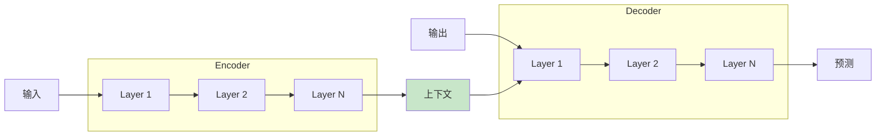

# 第八章：Transformer架构

> 彻底改变深度学习的革命性模型

---

## 8.1 Transformer概述

### 8.1.1 论文与影响

**论文**：《Attention Is All You Need》（Vaswani et al., 2017）

**革命性**：

- 完全基于注意力机制
- 不使用RNN/CNN
- 并行计算，训练效率高
- 成为现代NLP的基石（BERT、GPT等）

### 8.1.2 整体架构



**结构**：

- **Encoder**：编码输入序列
- **Decoder**：生成输出序列
- 完全基于注意力

---

## 8.2 位置编码

### 8.2.1 为什么需要位置编码？

**问题**：Self-Attention不包含顺序信息

```

句子1: "猫追老鼠"
句子2: "老鼠追猫"


Self-Attention认为相同！
→ 需要位置信息
```

### 8.2.2 正弦位置编码

**公式**：

$$PE_{(pos, 2i)} = \sin\left(\frac{pos}{10000^{2i/d_{model}}}\right)$$

$$PE_{(pos, 2i+1)} = \cos\left(\frac{pos}{10000^{2i/d_{model}}}\right)$$

其中：

- $pos$：位置索引
- $i$：维度索引
- $d_{model}$：模型维度

**特点**：

- 不需要学习（固定）
- 可以处理任意长度的序列
- 保持相对位置关系

### 8.2.3 PyTorch实现

```python
import torch
import torch.nn as nn
import math

class PositionalEncoding(nn.Module):
    def __init__(self, d_model, max_len=5000):
        super().__init__()

        # 计算位置编码
        position = torch.arange(max_len).unsqueeze(1)
        div_term = torch.exp(torch.arange(0, d_model, 2) *
                            (-math.log(10000.0) / d_model))

        pe = torch.zeros(max_len, d_model)
        pe[:, 0::2] = torch.sin(position * div_term)
        pe[:, 1::2] = torch.cos(position * div_term)

        self.register_buffer('pe', pe.unsqueeze(0))

    def forward(self, x):
        # x: [batch, seq_len, d_model]
        x = x + self.pe[:, :x.size(1)]
        return x

# 使用
d_model = 512
seq_len = 10
batch_size = 2

pos_encoding = PositionalEncoding(d_model)
x = torch.randn(batch_size, seq_len, d_model)
output = pos_encoding(x)
print(output.shape)  # [2, 10, 512]
```

### 8.2.4 可学习位置编码

```python
# 可学习位置编码（BERT使用）
self.pos_embedding = nn.Embedding(max_len, d_model)

x = x + self.pos_embedding(torch.arange(seq_len, device=x.device))
```

---

## 8.3 Transformer Block

### 8.3.1 Encoder Layer

**组成**：

1. Multi-Head Self-Attention
2. Add & Norm（残差连接 + LayerNorm）
3. Feed-Forward Network
4. Add & Norm

```python
class TransformerEncoderLayer(nn.Module):
    def __init__(self, d_model, num_heads, d_ff, dropout=0.1):
        super().__init__()

        self.self_attn = nn.MultiheadAttention(d_model, num_heads, dropout=dropout)

        self.ffn = nn.Sequential(
            nn.Linear(d_model, d_ff),
            nn.ReLU(),
            nn.Dropout(dropout),
            nn.Linear(d_ff, d_model),
            nn.Dropout(dropout)
        )

        self.norm1 = nn.LayerNorm(d_model)
        self.norm2 = nn.LayerNorm(d_model)
        self.dropout = nn.Dropout(dropout)

    def forward(self, x, mask=None):
        # Self-Attention
        attn_output, _ = self.self_attn(x, x, x, attn_mask=mask)
        x = self.norm1(x + self.dropout(attn_output))

        # Feed-Forward
        ffn_output = self.ffn(x)
        x = self.norm2(x + self.dropout(ffn_output))

        return x
```

### 8.3.2 Decoder Layer

**组成**：

1. Masked Multi-Head Self-Attention（带Mask）
2. Add & Norm
3. Cross-Attention（Encoder-Decoder）
4. Add & Norm
5. Feed-Forward Network
6. Add & Norm

```python
class TransformerDecoderLayer(nn.Module):
    def __init__(self, d_model, num_heads, d_ff, dropout=0.1):
        super().__init__()

        self.self_attn = nn.MultiheadAttention(d_model, num_heads, dropout=dropout)
        self.cross_attn = nn.MultiheadAttention(d_model, num_heads, dropout=dropout)

        self.ffn = nn.Sequential(
            nn.Linear(d_model, d_ff),
            nn.ReLU(),
            nn.Dropout(dropout),
            nn.Linear(d_ff, d_model),
            nn.Dropout(dropout)
        )

        self.norm1 = nn.LayerNorm(d_model)
        self.norm2 = nn.LayerNorm(d_model)
        self.norm3 = nn.LayerNorm(d_model)
        self.dropout = nn.Dropout(dropout)

    def forward(self, x, enc_output, self_mask=None, cross_mask=None):
        # Masked Self-Attention
        attn_output, _ = self.self_attn(x, x, x, attn_mask=self_mask)
        x = self.norm1(x + self.dropout(attn_output))

        # Cross-Attention
        attn_output, _ = self.cross_attn(x, enc_output, enc_output,
                                          attn_mask=cross_mask)
        x = self.norm2(x + self.dropout(attn_output))

        # Feed-Forward
        ffn_output = self.ffn(x)
        x = self.norm3(x + self.dropout(ffn_output))

        return x
```

### 8.3.3 Mask

**Padding Mask**：忽略padding位置

```python
def create_padding_mask(seq, pad_idx=0):
    # seq: [batch, seq_len]
    mask = (seq == pad_idx)
    # 扩展为 [batch, 1, 1, seq_len]
    return mask.unsqueeze(1).unsqueeze(2)
```

**Look-ahead Mask**：Decoder不能看到未来的词

```python
def create_look_ahead_mask(size):
    # 生成上三角矩阵
    mask = torch.triu(torch.ones((size, size)), diagonal=1)
    # True表示需要mask的位置
    return mask == 1
```

---

## 8.4 完整Transformer

### 8.4.1 架构实现

```python
class Transformer(nn.Module):
    def __init__(self, vocab_size, d_model=512, num_heads=8,
                 num_layers=6, d_ff=2048, dropout=0.1):
        super().__init__()

        self.d_model = d_model
        self.embedding = nn.Embedding(vocab_size, d_model)
        self.pos_encoding = PositionalEncoding(d_model)

        self.encoder_layers = nn.ModuleList([
            TransformerEncoderLayer(d_model, num_heads, d_ff, dropout)
            for _ in range(num_layers)
        ])

        self.decoder_layers = nn.ModuleList([
            TransformerDecoderLayer(d_model, num_heads, d_ff, dropout)
            for _ in range(num_layers)
        ])

        self.fc_out = nn.Linear(d_model, vocab_size)
        self.dropout = nn.Dropout(dropout)

    def forward(self, src, tgt, src_mask=None, tgt_mask=None):
        # Embedding + 位置编码
        src = self.dropout(self.pos_encoding(self.embedding(src) *
                                 math.sqrt(self.d_model)))
        tgt = self.dropout(self.pos_encoding(self.embedding(tgt) *
                                 math.sqrt(self.d_model)))

        # Encoder
        enc_output = src
        for layer in self.encoder_layers:
            enc_output = layer(enc_output, src_mask)

        # Decoder
        dec_output = tgt
        for layer in self.decoder_layers:
            dec_output = layer(dec_output, enc_output,
                               tgt_mask, src_mask)

        # 输出层
        output = self.fc_out(dec_output)
        return output

# 使用
vocab_size = 10000
model = Transformer(vocab_size, num_layers=6)
print(f"模型参数量: {sum(p.numel() for p in model.parameters()):,}")
```

### 8.4.2 超参数

| 参数 | 原论文 | 常用值 |
|------|--------|--------|
| d_model | 512 | 512, 768, 1024 |
| num_heads | 8 | 8, 12, 16 |
| num_layers | 6 | 6, 12, 24 |
| d_ff | 2048 | 4×d_model |
| dropout | 0.1 | 0.1 |

---

## 8.5 训练技巧

### 8.5.1 Label Smoothing

```python
class LabelSmoothingLoss(nn.Module):
    def __init__(self, vocab_size, smoothing=0.1):
        super().__init__()
        self.vocab_size = vocab_size
        self.smoothing = smoothing

    def forward(self, pred, target):
        # 预测值：[batch, seq_len, vocab_size]
        # 目标：[batch, seq_len]

        with torch.no_grad():
            # 创建平滑分布
            true_dist = torch.zeros_like(pred)
            true_dist.fill_(self.smoothing / (self.vocab_size - 2))
            true_dist.scatter_(2, target.unsqueeze(-1), 1.0 - self.smoothing)

        # KL散度损失
        return torch.sum(true_dist * -torch.log_softmax(pred, dim=-1), dim=-1).mean()
```

### 8.5.2 学习率预热

```python
class WarmupScheduler:
    def __init__(self, optimizer, d_model, warmup_steps=4000):
        self.optimizer = optimizer
        self.d_model = d_model
        self.warmup_steps = warmup_steps
        self.step_num = 0

    def step(self):
        self.step_num += 1
        lr = self.d_model ** -0.5 * min(
            self.step_num ** -0.5,
            self.step_num * self.warmup_steps ** -1.5
        )

        for param_group in self.optimizer.param_groups:
            param_group['lr'] = lr

        return lr

# 使用
optimizer = optim.Adam(model.parameters(), betas=(0.9, 0.98), eps=1e-9)
scheduler = WarmupScheduler(optimizer, d_model=512)
```

---

## 8.6 应用场景

| 应用 | Encoder | Decoder | 示例 |
|------|---------|---------|------|
| 翻译 | ✓ | ✓ | 机器翻译 |
| 分类 | ✓ | ✗ | 文本分类（BERT）|
| 生成 | ✗ | ✓ | GPT |
| 问答 | ✓ | ✓ | QA系统 |

---

## 本章小结

**核心概念**：

1. ✅ Transformer完全基于注意力
2. ✅ 位置编码提供顺序信息
3. ✅ Encoder-Decoder架构
4. ✅ Masked Attention（Decoder）
5. ✅ 训练技巧：预热、Label Smoothing

**关键公式**：

- 位置编码：$PE_{(pos, 2i)} = \sin(\frac{pos}{10000^{2i/d}})$
- 注意力：$\text{softmax}(\frac{QK^T}{\sqrt{d_k}})V$

---

## 思考题

1. 为什么Transformer不需要RNN的顺序计算？
2. 位置编码的sin/cos公式有什么优势？
3. Decoder的Mask有什么作用？
4. Transformer相比RNN有哪些优势？

---

## 下一步

下一章我们将学习**词嵌入与语言模型**：

- Word2Vec与GloVe
- 语言模型基础
- BERT与GPT的预训练范式
- 从Transformer到LLM

准备好探索现代NLP的核心技术了吗？
