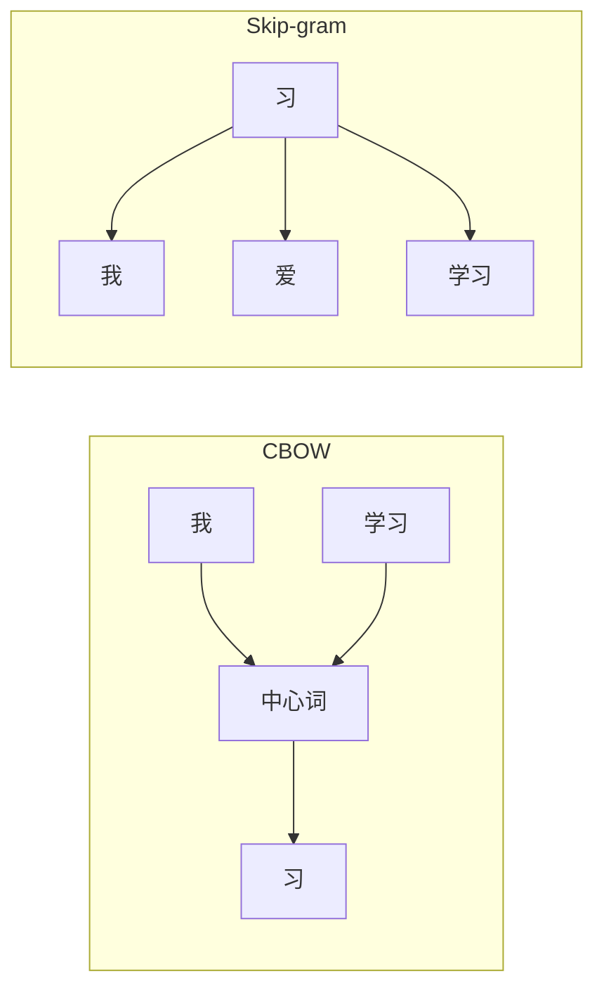

# 第九章：词嵌入与语言模型

> 从静态嵌入到上下文感知的预训练模型

---

## 9.1 词嵌入基础

### 9.1.1 为什么需要词嵌入？

**One-Hot的问题**：

- 稀疏（万维）
- 高维
- 无语义信息

```

One-Hot：
"猫" = [0, 0, ..., 1, 0, ..., 0]  (第42个位置是1）
"狗" = [0, 0, ..., 0, 1, ..., 0]  (第87个位置是1)


问题："猫"和"狗"的距离 = √2，没有语义信息
```

### 9.1.2 词嵌入的优势

| 特性 | One-Hot | 词嵌入 |
|------|---------|--------|
| 维度 | 10,000+ | 50-300 |
| 稀疏性 | 极度稀疏 | 稠密 |
| 语义信息 | 无 | 有 |
| 可计算 | 否 | 是 |

**直观理解**：

```

"猫" → [0.8, 0.1, -0.3]
"狗" → [0.7, 0.2, -0.2]   ← 相似
"车" → [0.1, 0.8, 0.5]    ← 不相似

```

### 9.1.3 PyTorch实现

```python
import torch
import torch.nn as nn

# 词嵌入层
vocab_size = 10000
embedding_dim = 300

embedding = nn.Embedding(vocab_size, embedding_dim)

# 使用
word_indices = torch.tensor([42, 87, 123])  # 词的索引
embeddings = embedding(word_indices)

print(embeddings.shape)  # [3, 300] (3个词，每个300维)
```

---

## 9.2 Word2Vec

### 9.2.1 核心思想

**Word2Vec**：根据词的上下文学习词向量

```

前提：相似上下文的词有相似的语义


例子：
"狗" 的上下文：["可爱", "叫", "毛茸茸"]
"猫" 的上下文：["可爱", "叫", "毛茸茸"]

→ "狗"和"猫"的向量应该相近
```

### 9.2.2 两种架构

**CBOW（Continuous Bag-of-Words）**：

- 用周围词预测中心词
- 适合小数据集

**Skip-gram**：

- 用中心词预测周围词
- 适合大数据集（推荐）



### 9.2.3 训练Word2Vec

```python
from gensim.models import Word2Vec

# 准备语料
sentences = [
    ['我', '爱', '学习'],
    ['深度', '学习', '很', '有趣'],
    ['神经', '网络', '是', '基础']
]

# 训练Skip-gram模型
model = Word2Vec(sentences, vector_size=100, window=5, min_count=1,
                sg=1, epochs=100)

# 获取词向量
cat_vector = model.wv['猫']
print(cat_vector.shape)  # (100,)

# 计算相似词
print(model.wv.most_similar('学习', topn=3))

# 向量运算
result = model.wv.most_similar(positive=['国王', '女人'],
                                 negative=['男人'])
print(result[0])  # ('女王', 0.86)
```

---

## 9.3 GloVe

### 9.3.1 核心思想

**GloVe（Global Vectors）**：结合全局共现统计

**优势**：

- 利用全局词共现信息
- 性能通常优于Word2Vec
- 适用于小数据集

### 9.3.2 使用预训练GloVe

```python
import torch
import torchtext.vocab as vocab

# 加载GloVe
glove = vocab.GloVe(name='6B', dim=300)

# 获取词向量
cat_vector = glove['cat']
print(cat_vector.shape)  # torch.Size([300])

# 计算相似度
similarity = torch.cosine_similarity(
    cat_vector.unsqueeze(0),
    glove['dog'].unsqueeze(0)
)
print(f"猫和狗的相似度: {similarity.item():.4f}")  # ~0.87

# 查找最相似的词
print(glove.similar_by_word('学习', 10))
```

---

## 9.4 语言模型基础

### 9.4.1 什么是语言模型？

**语言模型（Language Model）**：计算词序列概率的模型

$$P(w_1, w_2, ..., w_n) = P(w_1) \times P(w_2 | w_1) \times ... \times P(w_n | w_1, ..., w_{n-1})$$

**应用**：

- 文本生成
- 机器翻译
- 拼写检查

### 9.4.2 N-gram语言模型

**N-gram**：用前N-1个词预测下一个词

```

Bigram (N=2):
P(w_n | w_1, ..., w_{n-1}) ≈ P(w_n | w_{n-1})


P(学习 | 我爱) = count(我爱学习) / count(我爱)
```

**局限**：数据稀疏，无法处理长距离依赖

### 9.4.3 神经语言模型

用RNN/LSTM/Transformer计算词序列概率

$$P(w_t | w_1, ..., w_{t-1}) = \text{softmax}(f(w_1, ..., w_{t-1}))$$

---

## 9.5 预训练范式

### 9.5.1 静态嵌入

**Word2Vec、GloVe**

- 每个词一个固定向量
- 不考虑上下文
- 问题：一词多义

```

"苹果":

- 是水果 → [0.8, 0.2, ...]
- 是科技公司 → [0.3, 0.7, ...]


但Word2Vec只有一个"苹果"向量！
```

### 9.5.2 上下文嵌入（ELMo）

**ELMo（Embeddings from Language Models）**：根据上下文动态计算词向量

$$\text{ELMo}(w) = \sum_{k=1}^L \alpha_k h_k$$

其中 $h_k$ 是第k层LSTM的输出。

### 9.5.3 Transformer时代

**BERT**：双向上下文
**GPT**：单向上下文（自回归）

共同特点：

- 上下文感知
- 大规模预训练
- 下游任务微调

---

## 9.6 BERT预训练

### 9.6.1 掩码语言建模（MLM）

随机mask一些词，让模型预测

```

原文：我爱学习深度学习
Mask：我[MASK]学习深度[MASK]
目标：预测"爱"和"学习"

```

### 9.6.2 下一句预测（NSP）

判断两句话是否连续

```

输入A：我爱学习
输入B：深度学习很有趣
目标：是（连续）


输入A：我爱学习
输入B：明天天气好
目标：否（不连续）
```

### 9.6.3 使用Hugging Face

```python
from transformers import BertTokenizer, BertModel

# 加载预训练模型
tokenizer = BertTokenizer.from_pretrained('bert-base-chinese')
model = BertModel.from_pretrained('bert-base-chinese')

# 编码文本
text = "我爱学习深度学习"
inputs = tokenizer(text, return_tensors='pt')

# 获取嵌入
with torch.no_grad():
    outputs = model(**inputs)
    embeddings = outputs.last_hidden_state  # [1, 11, 768]

print(embeddings.shape)
```

---

## 9.7 GPT预训练

### 9.7.1 自回归语言建模

预测下一个词

$$P(w_t | w_1, ..., w_{t-1}) = \text{softmax}(Decoder(w_1, ..., w_{t-1}))$$

### 9.7.2 文本生成

```python
from transformers import GPT2Tokenizer, GPT2LMHeadModel

tokenizer = GPT2Tokenizer.from_pretrained('gpt2')
model = GPT2LMHeadModel.from_pretrained('gpt2')

# 生成文本
prompt = "深度学习"
input_ids = tokenizer.encode(prompt, return_tensors='pt')

output = model.generate(
    input_ids,
    max_length=50,
    num_return_sequences=1,
    temperature=0.7
)

generated_text = tokenizer.decode(output[0], skip_special_tokens=True)
print(generated_text)
```

---

## 本章小结

**核心概念**：

1. ✅ 词嵌入：稠密、低维、含语义
2. ✅ Word2Vec：Skip-gram与CBOW
3. ✅ GloVe：全局共现统计
4. ✅ 语言模型：计算词序列概率
5. ✅ 预训练范式：静态嵌入 → 上下文嵌入

**关键公式**：

- CBOW：$P(w_c | w_{c-m}, ..., w_{c-1}, w_{c+1}, ..., w_{c+m})$
- Skip-gram：$\prod_{i=-m}^{m} P(w_{c+i} | w_c)$

---

## 思考题

1. Word2Vec和GloVe的核心区别是什么？
2. 静态嵌入（Word2Vec）和上下文嵌入（BERT）的区别？
3. BERT的MLM和GPT的自回归有什么不同？
4. 为什么需要预训练语言模型？

---

## 下一步

下一章我们将学习**生成式模型**：

- VAE：变分自编码器
- GAN：生成对抗网络
- Diffusion：扩散模型
- 生成模型在图像和文本中的应用

准备好探索生成式AI的世界了吗？
