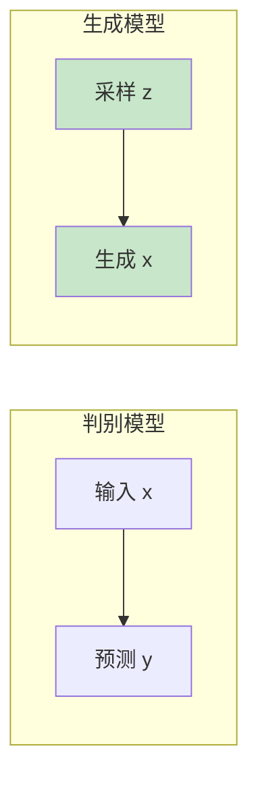

# 第十章：生成式模型（一）VAE与GAN


> 从变分推断到对抗训练

---

## 10.1 生成模型概述

### 10.1.1 判别 vs 生成

| 类型 | 学习目标 | 例子 |
|------|----------|------|
| 判别模型 | $P(y\|x)$ 条件概率 | 分类、检测 |
| **生成模型** | $P(x)$ 或 $P(x,y)$ 联合分布 | 图像生成、文本生成 |

**核心目标**：学习数据分布$P(x)$，生成新样本。




---

## 10.2 VAE（变分自编码器）

### 10.2.1 核心思想

**VAE（Variational Autoencoder）**：编码器→潜在分布→解码器重建

```

x → 编码器 → z（采样）→ 解码器 → x'
                  ↑
            标准正态 N(0,I)

```

### 10.2.2 为什么需要VAE？

**传统自编码器的问题**：

- 潜在空间不连续
- 无法生成新样本

**VAE的解决方案**：

- 编码器输出分布参数（均值μ，方差σ）
- 强制潜在空间接近标准正态分布
- 可以从潜在空间采样生成

### 10.2.3 变分下界（ELBO）

$$\log P(x) \ge \underbrace{E_{q(z\|x)}[\log P(x\|z)]}_{\text{重构}} - \underbrace{D_{KL}(q(z\|x) \| P(z))}_{\text{正则}}$$

**两项含义**：

1. **重构项**：解码器能重建输入
2. **正则项**：迫使$q(z\|x)$ 接近先验 $P(z)$

### 10.2.4 重参数化技巧

**问题**：$z \sim q(z\|x) = N(\mu, \sigma^2)$ 无法反向传播

**解决**：将随机性转移到外部

$$z = \mu + \sigma \odot \epsilon, \quad \epsilon \sim N(0, I)$$

```python
def reparameterize(mu, log_var):
    std = torch.exp(0.5 * log_var)
    eps = torch.randn_like(std)
    return mu + std * eps
```


### 10.2.5 PyTorch实现

```python
import torch
import torch.nn as nn
import torch.nn.functional as F

class VAE(nn.Module):
    def __init__(self, input_dim=784, latent_dim=20, hidden_dim=256):
        super().__init__()

        # 编码器
        self.encoder = nn.Sequential(
            nn.Linear(input_dim, hidden_dim),
            nn.ReLU(),
            nn.Linear(hidden_dim, hidden_dim),
            nn.ReLU()
        )
        self.fc_mu = nn.Linear(hidden_dim, latent_dim)
        self.fc_var = nn.Linear(hidden_dim, latent_dim)

        # 解码器
        self.decoder = nn.Sequential(
            nn.Linear(latent_dim, hidden_dim),
            nn.ReLU(),
            nn.Linear(hidden_dim, hidden_dim),
            nn.ReLU(),
            nn.Linear(hidden_dim, input_dim),
            nn.Sigmoid()  # MNIST像素在[0,1]
        )

    def encode(self, x):
        h = self.encoder(x)
        mu, log_var = self.fc_mu(h), self.fc_var(h)
        return mu, log_var

    def reparameterize(self, mu, log_var):
        std = torch.exp(0.5 * log_var)
        eps = torch.randn_like(std)
        return mu + std * eps

    def decode(self, z):
        return self.decoder(z)

    def forward(self, x):
        mu, log_var = self.encode(x)
        z = self.reparameterize(mu, log_var)
        x_recon = self.decode(z)
        return x_recon, mu, log_var

    def loss_function(self, x_recon, x, mu, log_var):
        # 重构损失（二元交叉熵）
        recon_loss = F.binary_cross_entropy(x_recon, x, reduction='sum')

        # KL散度
        kl_loss = -0.5 * torch.sum(1 + log_var - mu.pow(2) - log_var.exp())

        return recon_loss + kl_loss

# 使用
model = VAE(input_dim=784, latent_dim=20)
x = torch.randn(32, 784)  # MNIST：32张图像
x_recon, mu, log_var = model(x)
loss = model.loss_function(x_recon, x, mu, log_var)

print(f"损失: {loss.item():.2f}")
```


### 10.2.6 生成新样本

```python
# 从潜在空间随机采样
with torch.no_grad():
    z = torch.randn(1, 20)  # [batch_size, latent_dim]
    generated = model.decode(z)

    # 可视化
    import matplotlib.pyplot as plt
    plt.imshow(generated.view(28, 28), cmap='gray')
    plt.axis('off')
    plt.show()
```


---

## 10.3 GAN（生成对抗网络）

### 10.3.1 核心思想

**GAN（Generative Adversarial Network）**：生成器和判别器对抗训练

```

     生成器 G(z) ──→ 生成的图像 ──→ 判别器 D(x) ──→ 真/假
         ▲                                       │
         │                                       │
      随机噪声 z                               │
         │                                       ▼
         └─────────────────────────────────────────
                          对抗训练

```

### 10.3.2 目标函数

$$\min_G \max_D V(D, G) = E_{x \sim P_{data}}[\log D(x)] + E_{z \sim P_z}[\log(1 - D(G(z)))]$$

**判别器D**：最大化区分真假
**生成器G**：最小化被判别器识别

### 10.3.3 PyTorch实现

```python
import torch
import torch.nn as nn

class Generator(nn.Module):
    def __init__(self, latent_dim=100, img_dim=784):
        super().__init__()
        self.model = nn.Sequential(
            nn.Linear(latent_dim, 256),
            nn.ReLU(),
            nn.Linear(256, 512),
            nn.ReLU(),
            nn.Linear(512, img_dim),
            nn.Tanh()  # 输出[-1,1]
        )

    def forward(self, z):
        return self.model(z)

class Discriminator(nn.Module):
    def __init__(self, img_dim=784):
        super().__init__()
        self.model = nn.Sequential(
            nn.Linear(img_dim, 512),
            nn.LeakyReLU(0.2),
            nn.Dropout(0.3),
            nn.Linear(512, 256),
            nn.LeakyReLU(0.2),
            nn.Dropout(0.3),
            nn.Linear(256, 1),
            nn.Sigmoid()  # 输出概率
        )

    def forward(self, x):
        return self.model(x)

# 训练
generator = Generator()
discriminator = Discriminator()

criterion = nn.BCELoss()
optimizer_g = torch.optim.Adam(generator.parameters(), lr=0.0002)
optimizer_d = torch.optim.Adam(discriminator.parameters(), lr=0.0002)

for epoch in range(100):
    for i, (real_images, _) in enumerate(dataloader):
        batch_size = real_images.size(0)

        # 训练判别器
        real_labels = torch.ones(batch_size, 1)
        fake_labels = torch.zeros(batch_size, 1)

        real_output = discriminator(real_images)
        d_loss_real = criterion(real_output, real_labels)

        z = torch.randn(batch_size, 100)
        fake_images = generator(z)
        fake_output = discriminator(fake_images.detach())
        d_loss_fake = criterion(fake_output, fake_labels)

        d_loss = d_loss_real + d_loss_fake

        optimizer_d.zero_grad()
        d_loss.backward()
        optimizer_d.step()

        # 训练生成器
        z = torch.randn(batch_size, 100)
        fake_images = generator(z)
        fake_output = discriminator(fake_images)
        g_loss = criterion(fake_output, real_labels)

        optimizer_g.zero_grad()
        g_loss.backward()
        optimizer_g.step()

    print(f"Epoch {epoch}: D Loss={d_loss.item():.4f}, G Loss={g_loss.item():.4f}")
```


---

## 10.4 VAE vs GAN对比

| 特性 | VAE | GAN |
|------|-----|-----|
| 生成质量 | 模糊 | 清晰 |
| 训练稳定 | 稳定 | 不稳定 |
| 损失函数 | ELBO（闭式解） | Minimax（难以优化）|
| 潜在空间 | 连续、可解释 | 不明确 |
| 采样 | 确定性采样 | 无采样 |

---

## 10.5 改进方法

### 10.5.1 VAE改进

| 问题 | 解决方案 |
|------|----------|
| 模糊生成 | β-VAE, VQ-VAE |
| 后验崩溃 | KL退火 |
| 采样质量 | VAE-GAN |

### 10.5.2 GAN改进

| 方法 | 改进点 |
|------|--------|
| DCGAN | 卷积GAN，稳定训练 |
| WGAN | Wasserstein距离，解决模式崩溃 |
| CycleGAN | 循环一致性，无监督图像转换 |

---

## 本章小结

**核心概念**：

1. ✅ VAE：变分推断，潜在空间采样
2. ✅ 重参数化技巧：可微采样
3. ✅ ELBO：重构项 + KL散度
4. ✅ GAN：对抗训练，生成器vs判别器
5. ✅ VAE/GAN各有优劣

**关键公式**：

- ELBO：$E_{q(z\|x)}[\log P(x\|z)] - D_{KL}(q(z\|x) \| P(z))$
- 重参数化：$z = \mu + \sigma \odot \epsilon$

---

## 思考题

1. VAE为什么需要重参数化技巧？
2. GAN的纳什均衡是什么？
3. VAE和GAN相比，哪个更适合需要潜在空间插值的任务？
4. 为什么GAN训练比VAE不稳定？

---

## 下一步

下一章我们将学习**Diffusion与Flow模型**：

- 扩散模型：逐步去噪
- 归一化流：可逆变换
- Stable Diffusion实战
- 现代生成模型的威力

准备好探索生成式AI的最前沿技术了吗？
