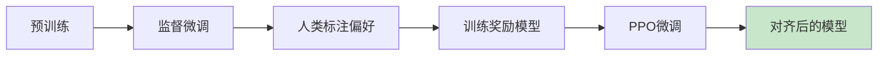

# 第十四章：RLHF与对齐

> 用人类反馈强化学习训练AI

---

## 14.1 RLHF概述

### 14.1.1 为什么需要RLHF？

**问题**：LLM可能生成有害、不安全或不符合人类期望的内容

**解决**：用人类反馈指导模型对齐

### 14.1.2 三阶段流程



---

## 14.2 奖励模型（Reward Model）

### 14.2.1 收集人类偏好

```

问题：解释什么是量子力学？


回复A：量子力学是研究微观粒子...（好）
回复B：我不知道...（差）

人类偏好：A > B
```

### 14.2.2 训练奖励模型

$$\mathcal{L}(\phi) = -\frac{1}{\binom{K}{2}} \sum_{i<j} \log \sigma(\phi(x_i, x_j) - \phi(x_j, x_i))$$

```python
import torch
import torch.nn as nn

class RewardModel(nn.Module):
    def __init__(self, base_model):
        super().__init__()
        self.model = base_model
        self.score_head = nn.Linear(base_model.config.hidden_size, 1)

    def forward(self, input_ids, attention_mask):
        outputs = self.model(input_ids, attention_mask=attention_mask)
        score = self.score_head(outputs.last_hidden_state[:, 0, :])
        return score

# 训练（简化）
def train_reward_model(model, dataset):
    optimizer = torch.optim.Adam(model.parameters(), lr=1e-5)

    for prompt, chosen, rejected in dataset:
        chosen_score = model(chosen_input, chosen_mask)
        rejected_score = model(rejected_input, rejected_mask)

        loss = -torch.log(torch.sigmoid(chosen_score - rejected_score))

        optimizer.zero_grad()
        loss.backward()
        optimizer.step()
```

---

## 14.3 PPO微调

### 14.3.1 PPO目标

$$L^{CLIP}(\theta) = \mathbb{E}_t \left[ \min \left( r_t(\theta) \hat{A}_t, \text{clip}(r_t(\theta), 1-\epsilon, 1+\epsilon) \hat{A}_t \right) \right]$$

其中：

- $r_t(\theta) = \frac{\pi_\theta(a_t \mid x_t)}{\pi_{\theta_{old}}(a_t \mid x_t)}$
- $\hat{A}_t$ 是优势函数

### 14.3.2 KL散度惩罚

$$L^{KL}(\theta) = \mathbb{E}_t \left[ \beta \cdot \text{KL} \left( \pi_\theta(\cdot \mid x_t) \middle\| \pi_{\theta_{old}}(\cdot \mid x_t) \right) \right]$$

### 14.3.3 PPO训练代码

```python
from transformers import PPOTrainer, PPOConfig, AutoModelForCausalLM

config = PPOConfig(
    model_name="gpt2",
    learning_rate=1.41e-5,
    batch_size=64,
    ppo_epochs=4
)

model = AutoModelForCausalLM.from_pretrained("gpt2")
reward_model = RewardModel(base_model)

ppo_trainer = PPOTrainer(
    config=config,
    model=model,
    ref_model=None,
    tokenizer=tokenizer,
    reward_model=reward_model,
    train_dataset=dataset
)

ppo_trainer.train()
```

---

## 14.4 对齐方法对比

| 方法 | 特点 | 优势 |
|------|------|------|
| RLHF | PPO优化 | 稳定，效果好 |
| DPO | 直接优化偏好 | 简单，高效 |
| RLAIF | AI反馈 | 可扩展 |
| CAI | 体制式 | 安全性 |

---

## 本章小结

**核心概念**：

1. ✅ RLHF：三阶段对齐流程
2. ✅ 奖励模型：学习人类偏好
3. ✅ PPO：稳定优化策略
4. ✅ 对齐：让模型符合人类价值观

---

## 思考题

1. 为什么不能直接用监督学习训练对齐？
2. PPO的clip操作有什么作用？
3. 奖励模型的训练数据如何收集？

---

## 下一步

下一章我们将学习**推理增强技术**：

- Chain-of-Thought
- Self-Consistency
- Tree-of-Thought
- Graph-of-Thought

准备好探索AI的推理能力了吗？
