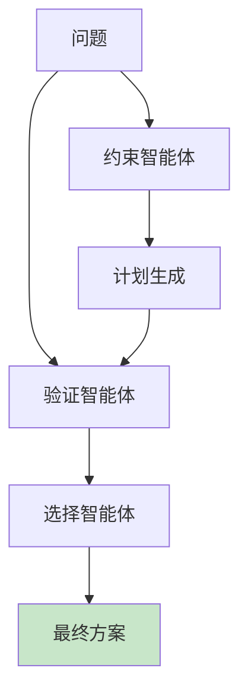

# 第十六章：多智能体系统

> 让多个AI协作解决复杂任务

---

## 16.1 多智能体概述

### 16.1.1 单体 vs 多体

| 特性 | 单智能体 | 多智能体 |
|------|---------|-----------|
| 决策 | 集中式 | 分布式 |
| 通信 | 无 | 有 |
| 协作 | 不需要 | 需要 |
| 扩展性 | 有限 | 高 |

### 16.1.2 协作模式

```

层次协作：
[规划智能体] → [执行智能体1] → [执行智能体2]


平行协作：
[任务A] → [智能体1]
[任务B] → [智能体2]

混合协作：
[任务] → [智能体1] → [智能体2] → [智能体3]
           ↘           ↘           ↘
         [协调者]
```

---

## 16.2 PlanGEN框架

### 16.2.1 核心组件



### 16.2.2 约束智能体（Constraint Agent）

**作用**：确保方案满足所有约束

```python
class ConstraintAgent:
    def __init__(self, constraints):
        self.constraints = constraints

    def check(self, solution):
        for constraint in self.constraints:
            if not constraint(solution):
                return False
        return True
```

### 16.2.3 验证智能体（Validation Agent）

**作用**：评估方案质量

```python
class ValidationAgent:
    def __init__(self, criteria):
        self.criteria = criteria

    def score(self, solution):
        score = 0
        for criterion in self.criteria:
            score += criterion(solution)
        return score
```

### 16.2.4 选择智能体（Selection Agent）

**作用**：从多个候选方案中选择最优

```python
class SelectionAgent:
    def select(self, candidates, validation_agent):
        best_score = -1
        best_candidate = None

        for candidate in candidates:
            score = validation_agent.score(candidate)
            if score > best_score:
                best_score = score
                best_candidate = candidate

        return best_candidate
```

---

## 16.3 任务分解

### 16.3.1 分层分解

```

[主任务：开发一个聊天机器人]
    ├── [任务1：数据准备]
    ├── [任务2：模型训练]
    ├── [任务3：API开发]
    └── [任务4：测试部署]

```

### 16.3.2 分工协作

```python
def assign_tasks(tasks, agents):
    assignments = {}

    for task in tasks:
        # 找到最合适的智能体
        best_agent = None
        best_skill = 0
        for agent in agents:
            skill = agent.get_skill_level(task)
            if skill > best_skill:
                best_skill = skill
                best_agent = agent

        assignments[task] = best_agent

    return assignments
```

---

## 16.4 通信机制

### 16.4.1 通信类型

| 类型 | 描述 | 示例 |
|------|------|------|
| 直接消息 | 点对点通信 | "我完成了任务A" |
| 共享黑板 | 全局信息共享 | 黑板：任务A完成 |
| 广播 | 所有人接收 | "紧急：系统故障" |

### 16.4.2 协议设计

```python
class MessageProtocol:
    def __init__(self):
        self.inbox = []

    def send(self, from_agent, to_agent, message):
        message_obj = {
            'from': from_agent,
            'to': to_agent,
            'content': message,
            'timestamp': time.time()
        }
        to_agent.receive(message_obj)

    def receive(self, message):
        self.inbox.append(message)
```

---

## 16.5 实战案例

### 16.5.1 自动化编程

```

[规划智能体]：分解任务
    ├── [代码生成智能体]
    ├── [测试智能体]
    └── [优化智能体]

```

### 16.5.2 科研助手

```

[用户提问] → [搜索智能体] → [论文分析智能体] → [综合智能体] → [用户]

```

---

## 本章小结

**核心概念**：

1. ✅ 多智能体：分布式决策系统
2. ✅ PlanGEN：约束-验证-选择
3. ✅ 任务分解：复杂问题拆解
4. ✅ 智能体协作：通信与协调
5. ✅ 自动化：多智能体解决复杂任务

---

## 思考题

1. 多智能体相比单体智能体有什么优势？
2. PlanGEN的三个智能体各起什么作用？
3. 智能体间如何避免通信冲突？
4. 如何设计多智能体的激励机制？

---

## 下一步

最后一章我们将总结全书并展望未来：

- 知识图谱回顾
- 进阶学习路径
- 最新研究趋势
- 个人发展建议

准备好回顾整个旅程了吗？
