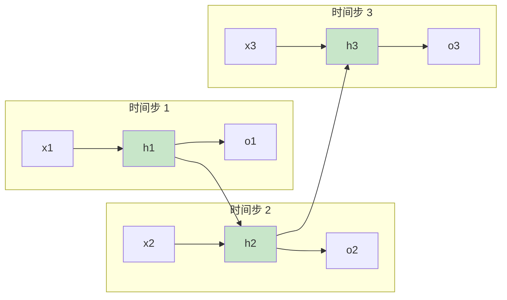

# 第四章：RNN（循环神经网络）

> 处理序列数据的神经网络

---

## 4.1 什么是 RNN？

**RNN（Recurrent Neural Network）**：处理序列数据的神经网络。

**核心思想**：记忆之前的输入，影响当前输出

```
序列数据：              RNN 处理：
"我 爱你"          →    [记忆]→[记忆]→[记忆]
                        ↑       ↑       ↑
                       词1     词2     词3
```

**应用领域**：

- 机器翻译
- 文本生成
- 语音识别
- 时间序列预测

---

## 4.2 RNN 结构



**公式**：
$$h_t = \text{tanh}(W_{xh} \cdot x_t + W_{hh} \cdot h_{t-1} + b_h)$$

$$y_t = W_{hy} \cdot h_t$$

---

## 4.3 PyTorch RNN 实现

```python
import torch
import torch.nn as nn

class SimpleRNN(nn.Module):
    def __init__(self, vocab_size, embed_dim, hidden_dim, num_classes):
        super().__init__()

        # 词嵌入层
        self.embedding = nn.Embedding(vocab_size, embed_dim)

        # RNN 层
        self.rnn = nn.RNN(
            input_size=embed_dim,
            hidden_size=hidden_dim,
            num_layers=1,
            batch_first=True
        )

        # 输出层
        self.fc = nn.Linear(hidden_dim, num_classes)

    def forward(self, x):
        # x: (batch, seq_len)
        embedded = self.embedding(x)  # (batch, seq_len, embed_dim)

        # RNN 输出
        # hidden: (num_layers, batch, hidden_dim)
        output, hidden = self.rnn(embedded)

        # 取最后一个时间步的输出
        last_output = output[:, -1, :]  # (batch, hidden_dim)

        return self.fc(last_output)

# 使用
model = SimpleRNN(
    vocab_size=10000,
    embed_dim=300,
    hidden_dim=128,
    num_classes=2
)

# 输入：batch=2, 序列长度=10
x = torch.randint(0, 10000, (2, 10))
output = model(x)
print(output.shape)  # torch.Size([2, 2])
```

---

## 4.4 RNN 的问题

| 问题 | 描述 | 解决方案 |
|------|------|----------|
| 梯度消失 | 长序列信息丢失 | LSTM, GRU |
| 梯度爆炸 | 训练不稳定 | 梯度裁剪 |
| 并行化差 | 无法并行计算 | Transformer |

---

## 4.5 LSTM vs RNN

**LSTM（Long Short-Term Memory）**：带门控机制的 RNN

```
RNN：只有一种记忆
LSTM：长期记忆 + 短期记忆

LSTM 门控：
- 遗忘门：决定丢弃什么信息
- 输入门：决定记住什么信息
- 输出门：决定输出什么
```

```python
# PyTorch LSTM
self.lstm = nn.LSTM(
    input_size=embed_dim,
    hidden_size=hidden_dim,
    num_layers=2,      # 多层
    batch_first=True,
    dropout=0.2        # 防止过拟合
)
```

---

## 思考题

1. RNN 如何实现"记忆"功能？
2. 为什么 RNN 难以处理长序列？
3. LSTM 的门控机制是如何解决梯度消失问题的？

---

## 下一步

下一章我们将讨论神经网络的训练过程：[训练过程（基础篇）](./05-1-training-basics.md)
