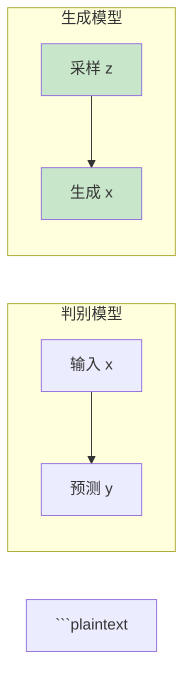

# 第五章：生成模型

```plaintext
> 从 VAE 到 Diffusion Model
```plaintext
---
```plaintext
## 5.1 什么是生成模型？
```plaintext
### 1.1 判别模型 vs 生成模型
```plaintext
| 类型 | 学习目标 | 例子 |
|------|----------|------|
| **判别模型** | 学习 $P(y\|x)$（条件概率） | 分类、检测 |
| **生成模型** | 学习 $P(x)$ 或 $P(x,y)$（联合分布） | 图像生成、文本生成 |
```plaintext
**生成模型的核心目标**：学习数据的分布 $P(x)$，从而能够**生成新样本**。
```plaintext


```plaintext
### 1.2 生成模型分类
```plaintext
| 类型 | 代表方法 | 核心思想 |
|------|----------|----------|
| 自回归模型 | Transformer, PixelCNN | $P(x) = \prod_i P(x_i \| x_{<i})$ |
| VAE | Variational Autoencoder | 变分推断，潜在空间采样 |
| GAN | Generative Adversarial Network | 对抗训练，生成器 vs 判别器 |
| Flow | RealNVP, Glow | 可逆变换，精确对数似然 |
| Diffusion | DDPM, Stable Diffusion | 扩散去噪 |
```plaintext
---
```plaintext
## 5.2 VAE（变分自编码器）
```plaintext
### 2.1 核心思想
```plaintext
**VAE（Variational Autoencoder）**：通过编码器将数据映射到潜在分布，通过解码器从潜在空间重建数据。
```plaintext
```

x → 编码器 → z（采样）→ 解码器 → x'
                    ↑
              标准正态分布 N(0, I)

```
```plaintext
### 2.2 为什么需要 VAE？
```plaintext
**传统自编码器的问题**：
```plaintext
- 潜在空间不连续，无法插值
- 只能编码-解码，无法生成新样本
```plaintext
**VAE 的解决方案**：
```plaintext
- 编码器输出分布参数（均值 μ，方差 σ）
- 强制潜在空间接近标准正态分布
- 可以从潜在空间任意采样生成新样本
```plaintext
### 2.3 VAE 的数学原理
```plaintext
**目标**：最大化数据的对数似然 $\log P(x)$
```plaintext
$$P(x) = \int P(x|z)P(z) dz$$
```plaintext
**问题**：这个积分无法直接计算。
```plaintext
**解决方案**：引入近似后验 $q(z|x)$
```plaintext
**变分下界（ELBO）**：
```plaintext
$$\log P(x) \ge E_{q(z|x)}[\log P(x|z)] - D_{KL}(q(z|x) \| P(z))$$
```plaintext
**两项含义**：
```plaintext
1. **重构项**：$E_{q(z|x)}[\log P(x|z)]$ - 确保解码器能重建输入
2. **正则项**：$-D_{KL}(q(z|x) \| P(z))$ - 迫使 $q(z|x)$ 接近先验 $P(z)$
```plaintext
### 2.4 重参数化技巧（Reparameterization Trick）
```plaintext
**问题**：$z \sim q(z|x) = N(\mu, \sigma^2)$ 无法反向传播。
```plaintext
**解决方案**：将随机性转移到外部：
```plaintext
$$z = \mu + \sigma \odot \epsilon, \quad \epsilon \sim N(0, I)$$
```plaintext
```python
# PyTorch 实现
class Encoder(nn.Module):
    def forward(self, x):
        mu = self.fc_mu(x)      # 均值
        log_var = self.fc_var(x)  # 对数方差
        # 重参数化
        std = torch.exp(0.5 * log_var)
        eps = torch.randn_like(std)
        z = mu + std * eps
        return z, mu, log_var
```

```plaintext
### 2.5 VAE PyTorch 实现
```plaintext
```python
import torch
import torch.nn as nn
import torch.nn.functional as F
```plaintext
class VAE(nn.Module):
    def __init__(self, input_dim, latent_dim):
        super().__init__()
```plaintext
        # 编码器
        self.encoder = nn.Sequential(
            nn.Linear(input_dim, 256),
            nn.ReLU(),
            nn.Linear(256, 128),
            nn.ReLU()
        )
        self.fc_mu = nn.Linear(128, latent_dim)
        self.fc_var = nn.Linear(128, latent_dim)
```plaintext
        # 解码器
        self.decoder = nn.Sequential(
            nn.Linear(latent_dim, 128),
            nn.ReLU(),
            nn.Linear(128, 256),
            nn.ReLU(),
            nn.Linear(256, input_dim)
        )
```plaintext
    def encode(self, x):
        h = self.encoder(x)
        mu, log_var = self.fc_mu(h), self.fc_var(h)
        return mu, log_var
```plaintext
    def reparameterize(self, mu, log_var):
        std = torch.exp(0.5 * log_var)
        eps = torch.randn_like(std)
        return mu + std * eps
```plaintext
    def decode(self, z):
        return self.decoder(z)
```plaintext
    def forward(self, x):
        mu, log_var = self.encode(x)
        z = self.reparameterize(mu, log_var)
        x_recon = self.decode(z)
        return x_recon, mu, log_var
```plaintext
    def loss_function(self, x_recon, x, mu, log_var):
        # 重构损失（均方误差）
        recon_loss = F.mse_loss(x_recon, x, reduction='sum')
```plaintext
        # KL 散度（闭式解）
        kl_loss = -0.5 * torch.sum(1 + log_var - mu.pow(2) - log_var.exp())
```plaintext
        return recon_loss + kl_loss
```plaintext
# 使用
model = VAE(input_dim=784, latent_dim=20)
x = torch.randn(32, 784)  # batch=32, MNIST 展平
x_recon, mu, log_var = model(x)
loss = model.loss_function(x_recon, x, mu, log_var)
```

```plaintext
### 2.6 VAE 的问题与改进
```plaintext
| 问题 | 改进方法 |
|------|----------|
| 模糊生成 | β-VAE, SS-VAE, VQ-VAE |
| 后验崩溃 | KL 退火、自由位 |
| 采样质量 | 结合 GAN、对抗训练 |
```plaintext
---
```plaintext
## 5.3 GAN（生成对抗网络）
```plaintext
### 3.1 核心思想
```plaintext
**GAN（Generative Adversarial Network）**：通过对抗训练，让生成器和判别器相互竞争、共同进化。
```plaintext
```

       ┌─────────────────────────────────┐
       │                                 │
       ▼                                 │
生成器 G(z) ──→ 生成的图像 ──→ 判别器 D(x) ──→ 真/假
       ▲                                │
       │                                │
    随机噪声 z                           │
       └─────────────────────────────────┘

```
```plaintext
**核心博弈**：
```plaintext
$$\min_G \max_D V(D, G) = E_{x \sim P_{data}}[\log D(x)] + E_{z \sim P_z}[\log(1 - D(G(z)))]$$
```plaintext
### 3.2 GAN 的训练过程
```plaintext
```python
import torch
import torch.nn as nn
```plaintext
class Generator(nn.Module):
    """生成器：从噪声生成图像"""
    def __init__(self, latent_dim, img_dim):
        super().__init__()
        self.net = nn.Sequential(
            nn.Linear(latent_dim, 256),
            nn.LeakyReLU(0.2),
            nn.Linear(256, 512),
            nn.LeakyReLU(0.2),
            nn.Linear(512, 1024),
            nn.LeakyReLU(0.2),
            nn.Linear(1024, img_dim),
            nn.Tanh()
        )
```plaintext
    def forward(self, z):
        return self.net(z)
```plaintext
class Discriminator(nn.Module):
    """判别器：区分真伪"""
    def __init__(self, img_dim):
        super().__init__()
        self.net = nn.Sequential(
            nn.Linear(img_dim, 512),
            nn.LeakyReLU(0.2),
            nn.Dropout(0.3),
            nn.Linear(512, 256),
            nn.LeakyReLU(0.2),
            nn.Dropout(0.3),
            nn.Linear(256, 1),
            nn.Sigmoid()
        )
```plaintext
    def forward(self, x):
        return self.net(x)
```plaintext
# 初始化
latent_dim = 100
img_dim = 784  # 28*28
G = Generator(latent_dim, img_dim)
D = Discriminator(img_dim)
```plaintext
# 优化器
optimizer_G = torch.optim.Adam(G.parameters(), lr=0.0002, betas=(0.5, 0.999))
optimizer_D = torch.optim.Adam(D.parameters(), lr=0.0002, betas=(0.5, 0.999))
```plaintext
# 训练步骤
def train_step(real_imgs):
    batch_size = real_imgs.size(0)
```plaintext
    # 训练判别器
    z = torch.randn(batch_size, latent_dim)
    fake_imgs = G(z).detach()
```plaintext
    real_loss = nn.BCELoss()(D(real_imgs), torch.ones(batch_size, 1))
    fake_loss = nn.BCELoss()(D(fake_imgs), torch.zeros(batch_size, 1))
    d_loss = (real_loss + fake_loss) / 2
```plaintext
    optimizer_D.zero_grad()
    d_loss.backward()
    optimizer_D.step()
```plaintext
    # 训练生成器
    z = torch.randn(batch_size, latent_dim)
    fake_imgs = G(z)
    g_loss = nn.BCELoss()(D(fake_imgs), torch.ones(batch_size, 1))
```plaintext
    optimizer_G.zero_grad()
    g_loss.backward()
    optimizer_G.step()
```plaintext
    return d_loss.item(), g_loss.item()
```

```plaintext
### 3.3 GAN 的问题
```plaintext
| 问题 | 描述 | 解决方案 |
|------|------|----------|
| 模式崩塌 | 生成器只产生有限种样本 | WGAN, Unroll GAN |
| 训练不稳定 | 判别器过强或过弱 | 标签平滑、Spectral Norm |
| 梯度消失 | 判别器太强 | 使用 ReLU/LeakyReLU |
```plaintext
### 3.4 GAN 变体
```plaintext
| 变体 | 改进 |
|------|------|
| DCGAN | 深度卷积、BatchNorm |
| WGAN | Wasserstein 距离 |
| StyleGAN | 风格控制、渐进式增长 |
| BigGAN | 大规模、高质量 |
| SAGAN | 自注意力机制 |
```plaintext
---
```plaintext
## 5.4 Diffusion Model（扩散模型）
```plaintext
### 4.1 核心思想
```plaintext
**Diffusion Model**：通过两个过程生成数据：
```plaintext
1. **前向过程**：逐步向数据添加噪声，直到变成纯噪声
2. **反向过程**：逐步去除噪声，从噪声中恢复数据
```plaintext
```

真实数据 x₀ ────加噪───→ x₁ ────加噪───→ x₂ ────...───→ xₜ（纯噪声）
                                                    │
                                                    ▼去噪───→ xₜ₋₁ ────...───→ x₀（生成）

```
```plaintext
### 4.2 前向过程（Forward Process）
```plaintext
**逐步加噪**：
```plaintext
$$q(x_t | x_{t-1}) = N(x_t; \sqrt{1-\beta_t} x_{t-1}, \beta_t I)$$
```plaintext
其中 $\beta_t$ 是噪声调度（noise schedule），通常逐渐增大。
```plaintext
**闭式采样**（可直接从 $x_0$ 到任意 $x_t$）：
```plaintext
$$x_t = \sqrt{\bar{\alpha}_t} x_0 + \sqrt{1 - \bar{\alpha}_t} \epsilon$$
```plaintext
其中 $\epsilon \sim N(0, I)$，$\bar{\alpha}_t = \prod_{i=1}^t (1 - \beta_i)$
```plaintext
### 4.3 反向过程（Reverse Process）
```plaintext
**逐步去噪**：
```plaintext
$$p_\theta(x_{t-1} | x_t) = N(x_{t-1}; \mu_\theta(x_t, t), \sigma_t^2 I)$$
```plaintext
**训练目标**（简化版）：
```plaintext
$$L = E_{t, x_0, \epsilon} \left[ \|\epsilon - \epsilon_\theta(x_t, t)\|^2 \right]$$
```plaintext
### 4.4 DDPM PyTorch 实现
```plaintext
```python
import torch
import torch.nn as nn
import torch.nn.functional as F
```plaintext
class Diffusion:
    def __init__(self, T=1000, beta_start=1e-4, beta_end=0.02):
        self.T = T
        # 噪声调度
        self.betas = torch.linspace(beta_start, beta_end, T)
        self.alphas = 1 - self.betas
        self.alpha_bars = torch.cumprod(self.alphas, dim=0)
```plaintext
    def q_sample(self, x_0, t, noise=None):
        """前向过程：从 x_0 采样 x_t"""
        if noise is None:
            noise = torch.randn_like(x_0)
        alpha_bar = self.alpha_bars[t].view(-1, 1, 1, 1)
        return torch.sqrt(alpha_bar) * x_0 + torch.sqrt(1 - alpha_bar) * noise
```plaintext
    def p_sample(self, model, x_t, t):
        """反向过程：从 x_t 采样 x_{t-1}"""
        t = torch.tensor([t])
        betas_t = self.betas[t].view(-1, 1, 1, 1)
        alpha_t = self.alphas[t].view(-1, 1, 1, 1)
        alpha_bar_t = self.alpha_bars[t].view(-1, 1, 1, 1)
```plaintext
        # 预测噪声
        eps_pred = model(x_t, t)
```plaintext
        # 计算均值
        mean = (1 / torch.sqrt(alpha_t)) * (x_t - (1 - alpha_t) / torch.sqrt(1 - alpha_bar_t) * eps_pred)
```plaintext
        # 如果不是最后一步，添加噪声
        if t[0] > 0:
            noise = torch.randn_like(x_t)
            sigma = torch.sqrt(betas_t)
            mean = mean + sigma * noise
```plaintext
        return mean
```plaintext
class UNet(nn.Module):
    """简化的 U-Net 用于预测噪声"""
    def __init__(self, in_channels=1, time_emb_dim=32):
        super().__init__()
        self.time_mlp = nn.Sequential(
            nn.Linear(1, time_emb_dim),
            nn.SiLU(),
            nn.Linear(time_emb_dim, time_emb_dim)
        )
```plaintext
        self.down = nn.ModuleList([
            nn.Conv2d(in_channels, 64, 3, padding=1),
            nn.Conv2d(64, 128, 3, padding=1),
            nn.Conv2d(128, 256, 3, padding=1),
        ])
        self.down_mlp = nn.ModuleList([
            nn.Linear(time_emb_dim, 64),
            nn.Linear(time_emb_dim, 128),
            nn.Linear(time_emb_dim, 256),
        ])
        self.up = nn.ModuleList([
            nn.Conv2d(256 + 128, 128, 3, padding=1),
            nn.Conv2d(128 + 64, 64, 3, padding=1),
        ])
        self.final = nn.Conv2d(64, in_channels, 3, padding=1)
```plaintext
    def forward(self, x, t):
        t = t.float() / self.T
        t_emb = self.time_mlp(t)
```plaintext
        h = x
        feats = []
        for conv, mlp in zip(self.down, self.down_mlp):
            h = F.relu(conv(h))
            h = h + mlp(t_emb)[:, :, None, None]
            feats.append(h)
            h = F.max_pool2d(h, 2)
```plaintext
        for conv, skip in zip(self.up, reversed(feats)):
            h = F.relu(conv(torch.cat([h, skip], dim=1)))
```plaintext
        return self.final(h)
```plaintext
# 训练
diffusion = Diffusion(T=1000)
model = UNet()
```plaintext
# 采样
@torch.no_grad()
def sample(model, diffusion, img_shape):
    img = torch.randn(img_shape)
    for t in reversed(range(diffusion.T)):
        img = diffusion.p_sample(model, img, t)
    return img
```

```plaintext
### 4.5 Diffusion vs GAN vs VAE
```plaintext
| 特性 | VAE | GAN | Diffusion |
|------|-----|-----|-----------|
| 训练稳定性 | 稳定 | 不稳定 | 稳定 |
| 生成质量 | 模糊 | 清晰 | 非常清晰 |
| 采样速度 | 快 | 快 | 慢（需多步） |
| 模式覆盖 | 好 | 可能模式崩塌 | 好 |
| 可控生成 | 困难 | 困难 | 通过引导实现 |
```plaintext
### 4.6 引导生成（Classifier Guidance）
```plaintext
**classifier guidance**：通过分类器引导生成方向。
```plaintext
$$p_\theta(x_{t-1} | x_t, y) \propto p_\theta(x_{t-1} | x_t) \cdot p(y | x_{t-1})^{s}$$
```plaintext
```python
# 简化的分类器引导采样
def classifier_guidance_sample(x_t, t, eps_pred, classifier, y, s=2.0):
    # 预测噪声
    eps = eps_pred
```plaintext
    # 计算分类器梯度
    with torch.enable_grad():
        x_t.requires_grad_(True)
        log_probs = classifier(x_t, t)
        log_prob = log_probs[range(len(y)), y].sum()
        grad = torch.autograd.grad(log_prob, x_t)[0]
```plaintext
    # 引导：调整噪声预测方向
    eps_pred_guided = eps - s * grad
```plaintext
    # 继续去噪...
```

```plaintext
---
```plaintext
## 5.5 Flow Model（归一化流）
```plaintext
### 5.1 核心思想
```plaintext
**Flow Model**：通过一系列**可逆变换**，将简单分布（如高斯分布）转换为复杂分布。
```plaintext
$$z_0 \sim P(z_0) \quad \xrightarrow{f_1} \quad z_1 = f_1(z_0) \quad \xrightarrow{f_2} \quad \dots \quad \xrightarrow{f_K} \quad z_K = x$$
```plaintext
### 5.2 变量变换定理
```plaintext
**核心公式**：
```plaintext
$$p_X(x) = p_Z(z) \cdot \left| \det \frac{\partial f^{-1}}{\partial x} \right| = p_Z(z) \cdot \left| \det \frac{\partial f}{\partial z} \right|^{-1}$$
```plaintext
**对数似然**：
```plaintext
$$\log p_X(x) = \log p_Z(z) + \log \det \left| \frac{\partial f}{\partial z} \right|^{-1}$$
```plaintext
### 5.3 耦合层（Coupling Layer）
```plaintext
**RealNVP** 使用的耦合层：
```plaintext
$$z_{1:d} = x_{1:d}$$
$$z_{d+1:D} = x_{d+1:D} \odot \exp(s(x_{1:d})) + t(x_{1:d})$$
```plaintext
其中 $s$ 和 $t$ 是任意神经网络。
```plaintext
```python
import torch
import torch.nn as nn
import torch.nn.functional as F
```plaintext
class CouplingLayer(nn.Module):
    def __init__(self, in_dim, hidden_dim):
        super().__init__()
        self.net = nn.Sequential(
            nn.Linear(in_dim // 2, hidden_dim),
            nn.ReLU(),
            nn.Linear(hidden_dim, hidden_dim),
            nn.ReLU(),
            nn.Linear(hidden_dim, in_dim)  # 输出 s 和 t
        )
```plaintext
    def forward(self, x, reverse=False):
        x1, x2 = x.chunk(2, dim=-1)
        s_t = self.net(x1)
        s, t = s_t.chunk(2, dim=-1)
        s = torch.tanh(s)  # 限制 s 范围
```plaintext
        if not reverse:
            z1 = x1
            z2 = x2 * torch.exp(s) + t
            log_det = torch.sum(s, dim=-1)
        else:
            z1 = x1
            z2 = (x2 - t) * torch.exp(-s)
            log_det = -torch.sum(s, dim=-1)
```plaintext
        return torch.cat([z1, z2], dim=-1), log_det
```plaintext
class FlowModel(nn.Module):
    def __init__(self, dim, hidden_dim, num_flows=4):
        super().__init__()
        self.base_dist = torch.distributions.MultivariateNormal(
            torch.zeros(dim), torch.eye(dim)
        )
        self.flows = nn.ModuleList([
            CouplingLayer(dim, hidden_dim) for _ in range(num_flows)
        ])
```plaintext
    def forward(self, x):
        log_det = torch.zeros(x.size(0), device=x.device)
        z = x
```plaintext
        for flow in self.flows:
            z, ld = flow(z)
            log_det += ld
```plaintext
        return z, log_det
```plaintext
    def log_prob(self, x):
        z, log_det = self.forward(x)
        log_pz = self.base_dist.log_prob(z)
        return log_pz + log_det
```plaintext
    def sample(self, num_samples):
        z = self.base_dist.sample((num_samples,))
        log_det = torch.zeros(z.size(0), device=z.device)
```plaintext
        for flow in reversed(self.flows):
            z, ld = flow(z, reverse=True)
            log_det += ld
```plaintext
        return z
```

```plaintext
### 5.4 Glow 模型
```plaintext
**Glow**（Kingma & Dhariwal, 2018）改进了 RealNVP：
```plaintext
1. **ActNorm**：可学习的归一化层
2. **Invertible 1x1 Convolution**：可逆的 1x1 卷积
3. **Affine Coupling**：仿射耦合层
```plaintext
### 5.5 Flow vs VAE vs Diffusion
```plaintext
| 特性 | VAE | Flow | Diffusion |
|------|-----|------|-----------|
| 精确对数似然 | 近似 | 精确 | ELBO |
| 采样速度 | 快 | 快 | 慢 |
| 实现复杂度 | 中 | 高 | 中 |
| 潜在空间 | 有 | 有 | 隐式 |
```plaintext
---
```plaintext
## 5.6 总结
```plaintext
| 生成模型 | 优点 | 缺点 | 代表工作 |
|----------|------|------|----------|
| VAE | 稳定训练、潜在空间 | 生成模糊 | β-VAE, VQ-VAE |
| GAN | 高质量、快速采样 | 训练不稳定 | StyleGAN, BigGAN |
| Diffusion | 最高质量、可控 | 采样慢 | DDPM, Stable Diffusion |
| Flow | 精确似然、可逆 | 内存开销大 | RealNVP, Glow |
```plaintext
### 学习路线
```plaintext
```

VAE → GAN → Flow → Diffusion
  ↓      ↓      ↓       ↓
变分推断 对抗训练 可逆变换 去噪扩散

```
```plaintext
---
```plaintext
## 思考题
```plaintext
1. VAE 和自编码器的核心区别是什么？
2. 为什么 GAN 训练不稳定？如何改进？
3. Diffusion Model 的前向和反向过程分别做了什么？
4. Flow Model 如何保证变换的可逆性？
```plaintext
---
```plaintext
## 下一步
```plaintext
下一章我们将学习 [循环神经网络（RNN）](./04-rnn.md)，了解如何处理序列数据。
```plaintext
或者直接跳转到 [训练过程基础篇](./05-1-training-basics.md) 学习如何训练神经网络。
```plaintext
---
```plaintext
## 参考资料
```plaintext
1. **Kingma & Welling (2013)** - "Auto-Encoding Variational Bayes"
2. **Goodfellow et al. (2014)** - "Generative Adversarial Networks"
3. **Ho et al. (2020)** - "Denoising Diffusion Probabilistic Models"
4. **Dinh et al. (2016)** - "Density Estimation using Real NVP"
