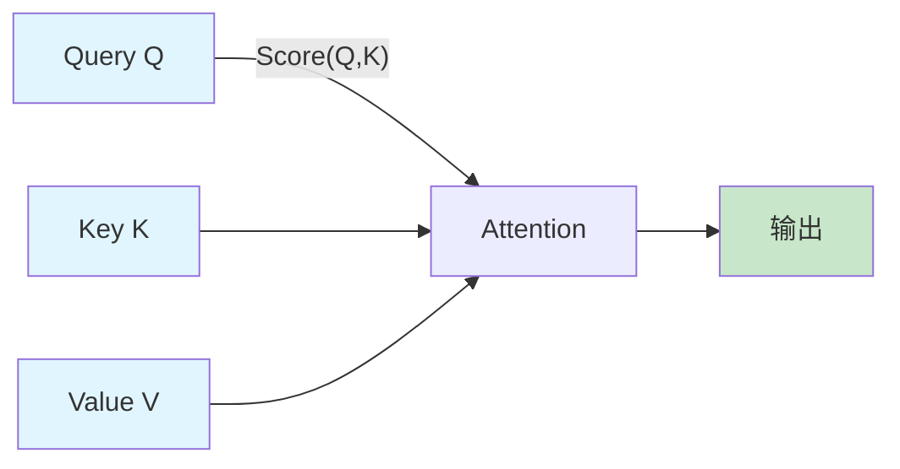
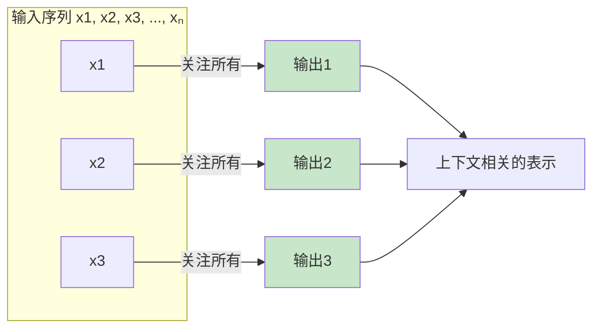
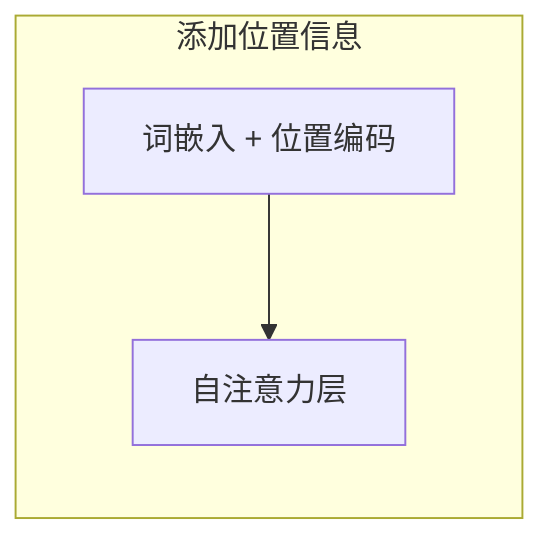
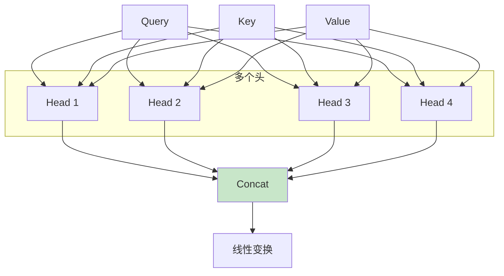
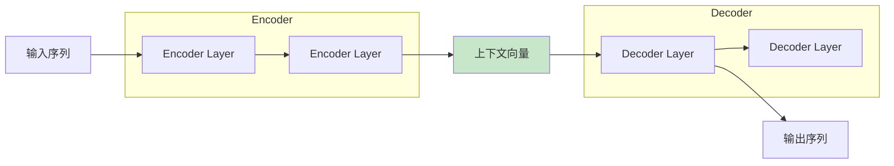
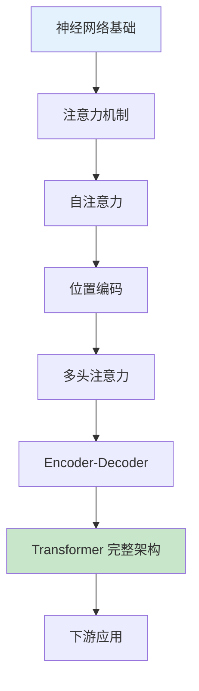

# 第四章：下一步与总结

> Transformer 前置知识与核心概念回顾

---

## 4.1 核心概念回顾

| 概念 | 含义 |
|------|------|
| **前向传播** | 数据从输入层到输出层的计算过程 |
| **反向传播** | 从输出层向输入层计算梯度的过程 |
| **损失函数** | 衡量预测值与真实值差距的函数 |
| **梯度下降** | 通过梯度方向找到损失函数最小值的优化算法 |
| **链式法则** | 复合函数求导的法则，用于反向传播 |
| **学习率** | 控制参数更新步长的超参数 |
| **激活函数** | 引入非线性的函数（ReLU, Sigmoid 等） |

---

## 4.2 Transformer 前置知识

在理解了神经网络的基础后，我们可以开始探索 Transformer。以下是学习 Transformer 所需的核心概念：

### 4.2.1 注意力机制（Attention）

**核心思想**：让模型学会关注输入中最相关的部分。

**公式**：
$$\text{Attention}(Q, K, V) = \text{softmax}\left(\frac{QK^T}{\sqrt{d_k}}\right)V$$

### 4.2.2 自注意力（Self-Attention）

**核心思想**：序列中的每个位置都可以关注序列中的所有其他位置。

**解决的问题**：

- 解决长距离依赖问题
- 平行计算，提高效率
- 直接建模任意位置之间的关系

### 4.2.3 位置编码（Positional Encoding）

**问题**：自注意力机制不包含位置信息，需要额外添加。

**解决方案**：为每个位置添加唯一的位置编码。

$$PE_{(pos, 2i)} = \sin\left(\frac{pos}{10000^{2i/d_{model}}}\right)$$

$$PE_{(pos, 2i+1)} = \cos\left(\frac{pos}{10000^{2i/d_{model}}}\right)$$

### 4.2.4 多头注意力（Multi-Head Attention）

**核心思想**：并行执行多个注意力函数，捕捉不同类型的关系。

### 4.2.5 Encoder-Decoder 架构

**Encoder**：将输入序列编码成上下文表示。

**Decoder**：基于编码表示生成输出序列。

---

## 4.3 学习路线图

---

## 4.4 推荐资源

| 资源类型 | 推荐内容 |
|----------|----------|
| 书籍 | 《深度学习》（Ian Goodfellow） |
| 书籍 | 《神经网络与深度学习》（Michael Nielsen） |
| 论文 | "Attention Is All You Need"（Transformer 原始论文） |
| 在线课程 | CS231n（斯坦福深度学习视觉课程） |
| 框架 | PyTorch 官方教程 |

---

## 4.5 总结

我们从最基础的概念出发，逐步理解了：

1. **用函数描述世界**：理解了机器学习的核心思想
2. **两种思维范式**：符号主义 vs 连接主义
3. **从线性到非线性**：激活函数的作用
4. **神经网络结构**：前向传播的计算过程
5. **训练过程**：损失函数、梯度下降、反向传播

这些知识为学习 Transformer 奠定了坚实的基础。Transformer 通过注意力机制彻底改变了深度学习的格局，值得深入学习。

---

## 附录：常见问题

**Q: 为什么 Transformer 比 RNN 更好？**

A: Transformer 可以并行计算，处理长距离依赖关系，不存在梯度消失问题。

**Q: 需要多少数学基础才能理解 Transformer？**

A: 线性代数（矩阵运算）、概率论（ softmax）、微积分（梯度）是基础。

**Q: 实践 Transformer 需要什么？**

A: PyTorch 或 TensorFlow 框架，大量数据，GPU 算力。
