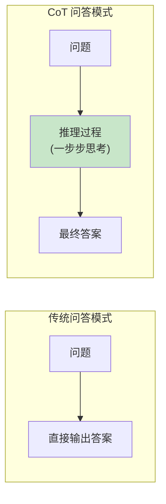
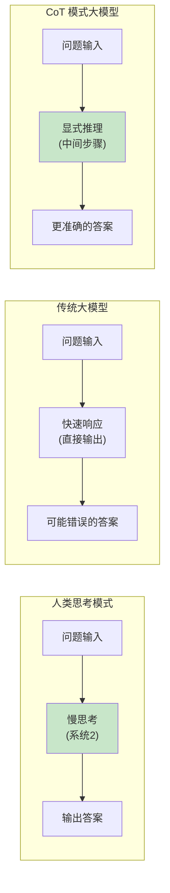
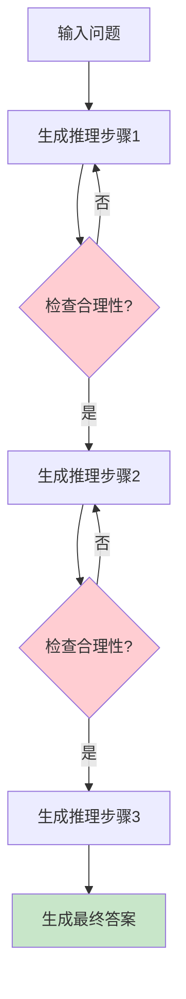
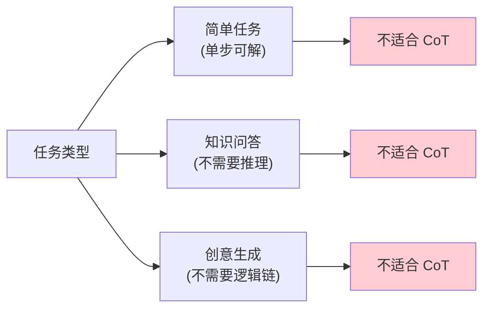
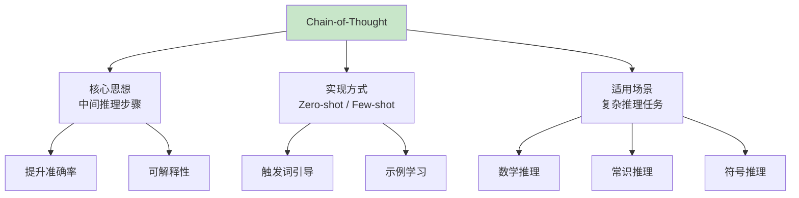

# 第七章：Chain-of-Thought 思维链推理

> 从"直接给答案"到"展示思考过程"的范式转变

---

## 7.1 什么是 Chain-of-Thought？

### 7.1.1 核心概念

**Chain-of-Thought（思维链，简称 CoT）** 是一种提示工程技术，由 Google 在 2022 年论文 "Chain-of-Thought Prompting Elicits Reasoning in Large Language Models" 中首次提出。其核心思想是：

> 引导大语言模型在生成最终答案前，先输出一系列中间推理步骤。



### 7.1.2 为什么需要 CoT？

**问题场景**：复杂推理任务

| 任务类型 | 示例 | 传统方法的问题 |
|---------|------|---------------|
| 算术推理 | "小明有5个苹果，又买了3个，给了朋友2个，还剩几个？" | 可能计算错误 |
| 常识推理 | "如果把冰块放在太阳下会怎样？" | 缺乏常识关联 |
| 符号推理 | "A、B、C 三个字母排列有多少种可能？" | 逻辑链条断裂 |
| 多步推理 | "已知 A>B，B>C，求 A、C 的大小关系" | 中间步骤遗漏 |

**CoT 的解决方案**：通过显式输出推理过程，让模型"慢思考"，减少错误。

---

## 7.2 CoT 的两种实现方式

### 7.2.1 Zero-shot CoT（零样本思维链）

**方法**：在问题后添加触发词，引导模型输出推理过程。

```python
# 零样本 CoT 提示模板
zero_shot_prompt = """
问题：Roger 有 5 个网球，他又买了 2 罐网球，每罐有 3 个网球。他现在有多少个网球？

让我们一步步思考：
"""

# 模型输出：
# Roger 最初有 5 个网球。
# 他买了 2 罐网球，每罐有 3 个，所以买了 2 × 3 = 6 个网球。
# 现在他总共有 5 + 6 = 11 个网球。
# 答案：11 个
```

**常用触发词**：

- "Let's think step by step"（让我们一步步思考）
- "Let's reason step by step"（让我们逐步推理）
- "First, ... Then, ... Finally, ..."

### 7.2.2 Few-shot CoT（少样本思维链）

**方法**：在提示中提供几个"问题-推理过程-答案"的示例，让模型学习推理模式。

```python
# 少样本 CoT 示例
few_shot_prompt = """
示例 1:
问题：停车场有 3 辆车，又来了 5 辆车，现在有几辆车？
推理：停车场最初有 3 辆车，又来了 5 辆车，所以总共有 3 + 5 = 8 辆车。
答案：8 辆

示例 2:
问题：书架上有 15 本书，拿走了 7 本，还剩几本？
推理：书架上有 15 本书，拿走了 7 本，所以还剩 15 - 7 = 8 本书。
答案：8 本

问题：小明有 8 块钱，买了 3 块钱的糖果，还剩多少钱？
推理：
"""

# 模型输出：
# 小明有 8 块钱，买了 3 块钱的糖果，所以还剩 8 - 3 = 5 块钱。
# 答案：5 块钱
```

### 7.2.3 两种方法对比

| 特性 | Zero-shot CoT | Few-shot CoT |
|-----|---------------|--------------|
| **示例数量** | 0 | 1-10+ |
| **实现难度** | 简单 | 需要设计示例 |
| **效果** | 一般 | 更好 |
| **适用场景** | 通用场景 | 特定任务优化 |
| **示例设计** | 无需 | 需要高质量示例 |

---

## 7.3 CoT 的工作原理

### 7.3.1 认知科学基础

CoT 的灵感来自人类的认知过程：



**系统 1 vs 系统 2（来自《思考，快与慢》）**：

- **系统 1**：快速、直觉、自动化 → 对应模型的直接输出
- **系统 2**：缓慢、分析、需要努力 → CoT 激活的就是这种模式

### 7.3.2 内部机制

虽然大模型的具体工作机制仍在研究中，但 CoT 的有效性可以这样理解：

1. **计算分配**：推理步骤将复杂计算分散到多个 token 生成过程
2. **上下文利用**：每个中间步骤都可以利用之前的上下文信息
3. **错误恢复**：如果某步出错，后续步骤可能发现并纠正



---

## 7.4 CoT 在不同任务上的效果

### 7.4.1 数学推理

**数据集**：GSM8K、MATH

```python
# 数学推理示例
math_problem = """
问题：小明有 24 个糖果，他分给了 3 个朋友，每个朋友得到 6 个糖果，还剩多少个？

CoT 推理：
1. 小明最初有 24 个糖果
2. 他分给了 3 个朋友，每个 6 个，共分出 3 × 6 = 18 个糖果
3. 剩下的糖果 = 24 - 18 = 6 个

答案：6 个
"""
```

**效果提升**：

| 模型 | 不使用 CoT | 使用 CoT | 提升 |
|-----|-----------|---------|------|
| GPT-3 | 15% | 55% | +40% |
| PaLM 540B | 25% | 63% | +38% |

### 7.4.2 常识推理

**数据集**：StrategyQA、CommonsenseQA

```python
# 常识推理示例
commonsense_problem = """
问题：为什么在海里游泳后眼睛会变红？

CoT 推理：
1. 海水含有盐分
2. 盐分会刺激眼睛的黏膜
3. 眼睛受到刺激后会扩张血管，导致眼睛变红
4. 这是一种正常的生理反应

答案：因为海水中的盐分刺激眼睛，导致血管扩张。
"""
```

### 7.4.3 符号推理

**数据集**：字母拼接、逻辑推理

```python
# 符号推理示例
symbolic_problem = """
问题：给定字母序列 "A B C"，将它们按字母表逆序排列，结果是什么？

CoT 推理：
1. 原始序列：A, B, C
2. 字母表顺序：A < B < C
3. 逆序排列：C, B, A
4. 验证：C 在 B 前，B 在 A 前

答案：C B A
"""
```

---

## 7.5 CoT 的局限性

### 7.5.1 已知问题

| 问题 | 描述 | 示例 |
|-----|------|-----|
| **幻觉问题** | 中间步骤可能包含错误信息 | "5+5=11"（算错） |
| **步骤遗漏** | 跳过关键推理步骤 | 直接得出答案 |
| **重复推理** | 循环推理，不收敛 | 重复同一逻辑 |
| **格式不稳定** | 推理格式不统一 | 难以解析 |

### 7.5.2 不适用场景



---

## 7.6 CoT 实践指南

### 7.6.1 设计原则

1. **示例质量 > 数量**
   - 提供 3-5 个高质量示例比 20 个低质量示例更好
   - 确保推理逻辑清晰、步骤完整

2. **推理步骤要明确**

   ```python
   # 不好的示例
   "因为小明有 5 个苹果，所以还剩 5-3=2 个"

   # 好的示例
   "首先，小明有 5 个苹果；
   然后，他吃了 3 个苹果；
   最后，5 - 3 = 2，所以还剩 2 个苹果。"
   ```

3. **格式一致性**

   ```python
   # 固定格式
   COT_TEMPLATE = """
   问题：{question}

   推理步骤：
   1. {step1}
   2. {step2}
   3. {step3}

   答案：{answer}
   """
   ```

### 7.6.2 代码实现

```python
class ChainOfThought:
    def __init__(self, model):
        self.model = model

    def zero_shot_prompt(self, question):
        """零样本 CoT"""
        prompt = f"""
{question}

让我们一步步思考：
1.
2.
3.

最终答案：
"""
        return self.model.generate(prompt)

    def few_shot_prompt(self, question, examples):
        """少样本 CoT"""
        prompt = ""
        for ex in examples:
            prompt += f"问题：{ex['question']}\n"
            prompt += f"推理：{ex['reasoning']}\n"
            prompt += f"答案：{ex['answer']}\n\n"

        prompt += f"问题：{question}\n推理："
        return self.model.generate(prompt)

    def structured_cot(self, question, steps):
        """结构化 CoT - 指定推理步骤数"""
        prompt = f"""
{question}

请按照以下 {steps} 个步骤推理：

步骤 1：
步骤 2：
步骤 3：
...
步骤 {steps}：

最终答案：
"""
        return self.model.generate(prompt)
```

---

## 7.7 总结



**关键要点**：

1. CoT 通过显式推理步骤提升模型在复杂任务上的表现
2. Zero-shot CoT 简单有效，Few-shot CoT 效果更好
3. 不是所有任务都需要 CoT，简单任务直接回答即可
4. CoT 是后续许多高级推理技术的基础

---

## 参考文献

1. "Chain-of-Thought Prompting Elicits Reasoning in Large Language Models" (Wei et al., 2022)
2. "Large Language Models are Zero-Shot Reasoners" (Kojima et al., 2022)
3. "Thinking, Fast and Slow" - Daniel Kahneman
