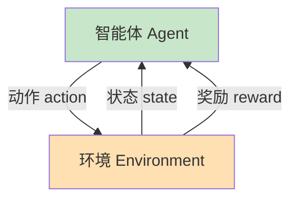
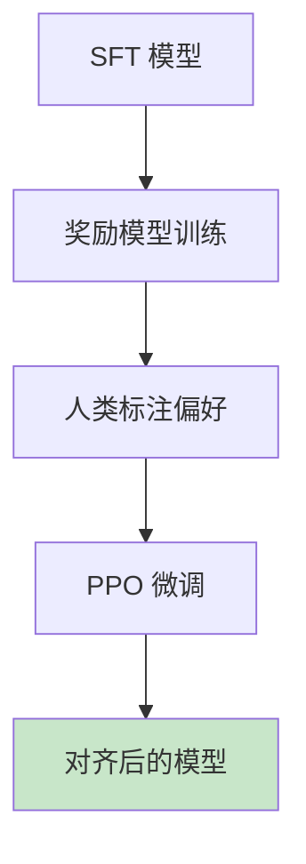

# 第七章：强化学习

> 让智能体通过与环境交互学习最优策略

---

## 7.1 什么是强化学习？

### 1.1 核心要素

**强化学习（Reinforcement Learning, RL）**：智能体通过与环境交互，根据获得的奖励信号学习最优策略。



| 要素 | 描述 | 例子 |
|------|------|------|
| **智能体 (Agent)** | 学习决策的系统 | 下棋AI、机器人 |
| **环境 (Environment)** | 智能体交互的对象 | 游戏、物理世界 |
| **状态 (State)** | 环境/智能体的当前情况 | 棋盘布局、机器人位置 |
| **动作 (Action)** | 智能体的行为 | 移动棋子、关节转动 |
| **奖励 (Reward)** | 环境对动作的反馈 | 得分、惩罚 |

### 1.2 强化学习 vs 其他学习范式

| 类型 | 数据形式 | 目标 |
|------|----------|------|
| **监督学习** | $(x, y)$ 标注对 | 拟合 $P(y\|x)$ |
| **无监督学习** | $x$ 无标签数据 | 学习数据分布 $P(x)$ |
| **强化学习** | $(s, a, r, s')$ 交互序列 | 最大化长期累积奖励 |

### 1.3 强化学习应用

| 领域 | 应用 |
|------|------|
| 游戏 | AlphaGo、星际争霸AI |
| 机器人 | 运动控制、抓取 |
| 自动驾驶 | 决策规划 |
| 推荐系统 | 用户交互优化 |
| 大语言模型 | RLHF（人类反馈强化学习） |

---

## 7.2 马尔可夫决策过程（MDP）

### 2.1 MDP 定义

**马尔可夫决策过程**是强化学习问题的数学框架：

$$MDP = (S, A, P, R, \gamma)$$

| 符号 | 含义 |
|------|------|
| $S$ | 状态空间 |
| $A$ | 动作空间 |
| $P(s'\|s, a)$ | 状态转移概率 |
| $R(s, a, s')$ | 奖励函数 |
| $\gamma \in [0, 1)$ | 折扣因子 |

### 2.2 马尔可夫性质

**马尔可夫性质**：未来只依赖于当前状态，与历史无关。

$$P(s_{t+1} | s_t, a_t, s_{t-1}, a_{t-1}, ...) = P(s_{t+1} | s_t, a_t)$$

### 2.3 轨迹与回报

**轨迹（Trajectory）**：智能体与环境交互产生的状态-动作序列。

$$\tau = (s_0, a_0, r_0, s_1, a_1, r_1, ...)$$

**回报（Return）**：累积折扣奖励。

$$G_t = r_t + \gamma r_{t+1} + \gamma^2 r_{t+2} + ... = \sum_{k=0}^{\infty} \gamma^k r_{t+k}$$

**折扣因子 $\gamma$ 的作用**：

- 权衡短期与长期奖励
- $\gamma \approx 0$：短视，只关注即时奖励
- $\gamma \approx 1$：远视，考虑长期影响

### 2.4 价值函数

**状态价值函数 $V(s)$**：从状态 $s$ 开始的期望回报。

$$V(s) = E_{\tau \sim \pi} \left[ \sum_{k=0}^{\infty} \gamma^k r_{t+k} | s_0 = s \right]$$

**动作价值函数 $Q(s, a)$**：在状态 $s$ 执行动作 $a$ 后的期望回报。

$$Q(s, a) = E_{\tau \sim \pi} \left[ \sum_{k=0}^{\infty} \gamma^k r_{t+k} | s_0 = s, a_0 = a \right]$$

**贝尔曼方程**：

$$V(s) = \sum_a \pi(a|s) \left[ R(s, a) + \gamma \sum_{s'} P(s'|s, a) V(s') \right]$$

### 2.5 最优策略

**最优价值函数**：

$$V^*(s) = \max_\pi V^\pi(s)$$
$$Q^*(s, a) = \max_\pi Q^\pi(s, a)$$

**贝尔曼最优方程**：

$$V^*(s) = \max_a \left[ R(s, a) + \gamma \sum_{s'} P(s'|s, a) V^*(s') \right]$$

---

## 7.3 动态规划方法

### 3.1 策略迭代

**策略迭代**交替进行策略评估和策略改进：

```python
def policy_iteration(env, gamma=0.9, theta=1e-6):
    # 初始化策略
    policy = np.ones((env.n_states, env.n_actions)) / env.n_actions
    V = np.zeros(env.n_states)

    while True:
        # 策略评估
        while True:
            delta = 0
            for s in range(env.n_states):
                v = V[s]
                V[s] = sum(policy[s, a] * sum(
                    prob * (reward + gamma * V[next_state])
                    for prob, next_state, reward in env.P[s][a]
                ) for a in range(env.n_actions))
                delta = max(delta, abs(v - V[s]))
            if delta < theta:
                break

        # 策略改进
        policy_stable = True
        for s in range(env.n_states):
            old_action = np.argmax(policy[s])
            new_action = np.argmax([
                sum(prob * (reward + gamma * V[next_state])
                    for prob, next_state, reward in env.P[s][a])
                for a in range(env.n_actions)
            ])
            if old_action != new_action:
                policy_stable = False
            policy[s] = np.eye(env.n_actions)[new_action]

        if policy_stable:
            break

    return policy, V
```

### 3.2 价值迭代

**价值迭代**直接迭代最优价值函数：

```python
def value_iteration(env, gamma=0.9, theta=1e-6):
    V = np.zeros(env.n_states)

    while True:
        delta = 0
        for s in range(env.n_states):
            v = V[s]
            V[s] = max([
                sum(prob * (reward + gamma * V[next_state])
                    for prob, next_state, reward in env.P[s][a])
                for a in range(env.n_actions)
            ])
            delta = max(delta, abs(v - V[s]))

        if delta < theta:
            break

    # 提取策略
    policy = np.zeros((env.n_states, env.n_actions))
    for s in range(env.n_states):
        best_action = np.argmax([
            sum(prob * (reward + gamma * V[next_state])
                for prob, next_state, reward in env.P[s][a])
            for a in range(env.n_actions)
        ])
        policy[s, best_action] = 1.0

    return policy, V
```

---

## 7.4 时序差分学习

### 4.1 Monte Carlo vs TD

| 方法 | 更新时机 | 优缺点 |
|------|----------|--------|
| **MC** | 完整轨迹后 | 无偏但方差大 |
| **TD(0)** | 每步后 | 低方差，可能有偏 |
| **TD($\lambda$)** | 介于两者之间 | 平衡方差与偏差 |

### 4.2 Q-Learning

**Q-Learning**是经典的离线 TD 算法：

$$Q(s, a) \leftarrow Q(s, a) + \alpha \left[ r + \gamma \max_{a'} Q(s', a') - Q(s, a) \right]$$

```python
import numpy as np

class QLearning:
    def __init__(self, n_states, n_actions, gamma=0.99, alpha=0.1, epsilon=0.1):
        self.n_states = n_states
        self.n_actions = n_actions
        self.gamma = gamma
        self.alpha = alpha
        self.epsilon = epsilon
        self.Q = np.zeros((n_states, n_actions))

    def select_action(self, state):
        if np.random.random() < self.epsilon:
            return np.random.randint(self.n_actions)
        return np.argmax(self.Q[state])

    def update(self, state, action, reward, next_state):
        td_target = reward + self.gamma * np.max(self.Q[next_state])
        td_error = td_target - self.Q[state, action]
        self.Q[state, action] += self.alpha * td_error

    def train(self, env, n_episodes=10000):
        for episode in range(n_episodes):
            state = env.reset()
            done = False

            while not done:
                action = self.select_action(state)
                next_state, reward, done, _ = env.step(action)
                self.update(state, action, reward, next_state)
                state = next_state
```

### 4.3 SARSA

**SARSA**是在线 TD 算法（与 Q-Learning 对比）：

$$Q(s, a) \leftarrow Q(s, a) + \alpha \left[ r + \gamma Q(s', a') - Q(s, a) \right]$$

| 特性 | Q-Learning | SARSA |
|------|------------|-------|
| 策略 | 离线（Max） | 在线（实际动作） |
| 特点 | 激进 | 保守 |
| 收敛 | $Q \to Q^*$ | $Q \to Q^\pi$ |

---

## 7.5 深度 Q 网络（DQN）

### 5.1 DQN 核心思想

用深度神经网络近似 $Q(s, a)$，解决状态空间过大的问题。

```python
import torch
import torch.nn as nn

class DQN(nn.Module):
    def __init__(self, state_dim, action_dim, hidden_dim=128):
        super().__init__()
        self.net = nn.Sequential(
            nn.Linear(state_dim, hidden_dim),
            nn.ReLU(),
            nn.Linear(hidden_dim, hidden_dim),
            nn.ReLU(),
            nn.Linear(hidden_dim, action_dim)
        )

    def forward(self, x):
        return self.net(x)

class ReplayBuffer:
    """经验回放缓冲区"""
    def __init__(self, capacity=10000):
        self.buffer = []
        self.capacity = capacity

    def push(self, state, action, reward, next_state, done):
        self.buffer.append((state, action, reward, next_state, done))
        if len(self.buffer) > self.capacity:
            self.buffer.pop(0)

    def sample(self, batch_size=64):
        batch = np.random.choice(len(self.buffer), batch_size, replace=False)
        states, actions, rewards, next_states, dones = zip(*[self.buffer[i] for i in batch])
        return (np.array(states), np.array(actions), np.array(rewards),
                np.array(next_states), np.array(dones))

class DQNAgent:
    def __init__(self, state_dim, action_dim, gamma=0.99, lr=1e-3):
        self.q_net = DQN(state_dim, action_dim)
        self.target_net = DQN(state_dim, action_dim)
        self.target_net.load_state_dict(self.q_net.state_dict())
        self.optimizer = torch.optim.Adam(self.q_net.parameters(), lr=lr)
        self.gamma = gamma
        self.replay_buffer = ReplayBuffer()

    def select_action(self, state, epsilon=0.1):
        if np.random.random() < epsilon:
            return np.random.randint(action_dim)
        with torch.no_grad():
            return self.q_net(torch.FloatTensor(state)).argmax().item()

    def update(self, batch_size=64):
        if len(self.replay_buffer) < batch_size:
            return

        states, actions, rewards, next_states, dones = self.replay_buffer.sample(batch_size)

        states = torch.FloatTensor(states)
        actions = torch.LongTensor(actions)
        rewards = torch.FloatTensor(rewards)
        next_states = torch.FloatTensor(next_states)
        dones = torch.FloatTensor(dones)

        # 计算当前 Q 值
        current_q = self.q_net(states).gather(1, actions.unsqueeze(1)).squeeze()

        # 计算目标 Q 值（使用 Double DQN 减少过估计）
        with torch.no_grad():
            next_actions = self.q_net(next_states).argmax(1)
            next_q = self.target_net(next_states).gather(1, next_actions.unsqueeze(1)).squeeze()
            target_q = rewards + self.gamma * next_q * (1 - dones)

        # 损失函数
        loss = nn.MSELoss()(current_q, target_q)

        self.optimizer.zero_grad()
        loss.backward()
        self.optimizer.step()

        return loss.item()

    def update_target(self):
        self.target_net.load_state_dict(self.q_net.state_dict())
```

### 5.2 DQN 改进技术

| 技术 | 作用 |
|------|------|
| **经验回放** | 打破数据相关性 |
| **目标网络** | 稳定训练 |
| **Double DQN** | 减少 Q 值过估计 |
| **Dueling DQN** | 分解 V 和 A |
| **优先级回放** | 重要经验优先学习 |
| **Noisy Net** | 探索与利用平衡 |

---

## 7.6 策略梯度方法

### 6.1 REINFORCE 算法

直接优化策略 $\pi_\theta(a|s)$：

$$\nabla_\theta J(\theta) = E_{\tau \sim \pi_\theta} \left[ \nabla_\theta \log \pi_\theta(a|s) \cdot G_t \right]$$

```python
class REINFORCE:
    def __init__(self, state_dim, action_dim, lr=1e-3):
        self.policy_net = nn.Sequential(
            nn.Linear(state_dim, 64),
            nn.ReLU(),
            nn.Linear(64, 64),
            nn.ReLU(),
            nn.Linear(64, action_dim),
            nn.Softmax(dim=-1)
        )
        self.optimizer = torch.optim.Adam(self.policy_net.parameters(), lr=lr)

    def select_action(self, state):
        probs = self.policy_net(torch.FloatTensor(state))
        dist = torch.distributions.Categorical(probs)
        return dist.sample().item()

    def update(self, states, actions, rewards):
        states = torch.FloatTensor(np.array(states))
        actions = torch.LongTensor(actions)
        rewards = torch.FloatTensor(rewards)

        # 计算折扣回报
        returns = []
        G = 0
        for r in reversed(rewards):
            G = r + 0.99 * G
            returns.insert(0, G)
        returns = torch.tensor(returns)

        # 策略梯度更新
        log_probs = torch.log(self.policy_net(states))
        log_prob_actions = log_probs.gather(1, actions.unsqueeze(1)).squeeze()

        loss = -(log_prob_actions * returns).mean()

        self.optimizer.zero_grad()
        loss.backward()
        self.optimizer.step()
```

### 6.2 Actor-Critic

结合价值函数估计，减少策略梯度的方差：

```python
class ActorCritic(nn.Module):
    def __init__(self, state_dim, action_dim, hidden_dim=64):
        super().__init__()
        # Actor：策略网络
        self.actor = nn.Sequential(
            nn.Linear(state_dim, hidden_dim),
            nn.ReLU(),
            nn.Linear(hidden_dim, hidden_dim),
            nn.ReLU(),
            nn.Linear(hidden_dim, action_dim),
            nn.Softmax(dim=-1)
        )
        # Critic：价值网络
        self.critic = nn.Sequential(
            nn.Linear(state_dim, hidden_dim),
            nn.ReLU(),
            nn.Linear(hidden_dim, hidden_dim),
            nn.ReLU(),
            nn.Linear(hidden_dim, 1)
        )

    def forward(self, x):
        probs = self.actor(x)
        value = self.critic(x)
        return probs, value

class A2CAgent:
    def __init__(self, state_dim, action_dim, gamma=0.99, lr=3e-4):
        self.model = ActorCritic(state_dim, action_dim)
        self.optimizer = torch.optim.Adam(self.model.parameters(), lr=lr)
        self.gamma = gamma

    def select_action(self, state):
        probs, value = self.model(torch.FloatTensor(state))
        dist = torch.distributions.Categorical(probs)
        action = dist.sample()
        return action.item(), dist.log_prob(action), value

    def update(self, states, actions, rewards, next_states, dones, log_probs, values):
        # 计算折扣回报和优势函数
        returns = []
        R = 0
        for r, done in zip(reversed(rewards), reversed(dones)):
            if done:
                R = 0
            R = r + self.gamma * R
            returns.insert(0, R)
        returns = torch.tensor(returns)

        values = torch.stack(values)
        advantages = returns - values.detach()

        # Actor 损失
        actor_loss = -(torch.stack(log_probs) * advantages).mean()

        # Critic 损失
        critic_loss = nn.MSELoss()((values, returns))

        # 总损失
        loss = actor_loss + 0.5 * critic_loss

        self.optimizer.zero_grad()
        loss.backward()
        self.optimizer.step()
```

---

## 7.7 PPO（近端策略优化）

**PPO**是目前最流行的强化学习算法之一：

```python
class PPO:
    def __init__(self, state_dim, action_dim, lr=3e-4, eps_clip=0.2, gamma=0.99):
        self.policy = ActorCritic(state_dim, action_dim)
        self.optimizer = torch.optim.Adam(self.policy.parameters(), lr=lr)
        self.eps_clip = eps_clip
        self.gamma = gamma

    def update(self, states, actions, rewards, next_states, dones, old_log_probs):
        # 收集新策略的概率
        probs, values = self.policy(torch.FloatTensor(states))
        dist = torch.distributions.Categorical(probs)
        new_log_probs = dist.log_prob(torch.LongTensor(actions))
        new_probs = torch.exp(new_log_probs)
        old_probs = torch.exp(torch.stack(old_log_probs))

        # 计算优势函数（简化的 GAE）
        advantages = []
        G = 0
        for r, done in zip(reversed(rewards), reversed(dones)):
            if done:
                G = 0
            G = r + self.gamma * G
            advantages.insert(0, G)
        advantages = torch.tensor(advantages) - values.detach()
        advantages = (advantages - advantages.mean()) / (advantages.std() + 1e-8)

        # PPO 损失
        ratios = new_probs / old_probs
        surr1 = ratios * advantages
        surr2 = torch.clamp(ratios, 1 - self.eps_clip, 1 + self.eps_clip) * advantages
        loss = -torch.min(surr1, surr2).mean() + 0.5 * nn.MSELoss()(values.squeeze(), torch.tensor(advantages + values.detach().numpy()))

        self.optimizer.zero_grad()
        loss.backward()
        self.optimizer.step()
```

---

## 7.8 强化学习与语言模型

### 8.1 RLHF（基于人类反馈的强化学习）

**RLHF**用于让语言模型与人类偏好对齐：



**步骤**：

1. **监督微调（SFT）**：用高质量数据微调语言模型
2. **奖励模型（RM）**：训练模型预测人类偏好
3. **PPO 微调**：用 RM 的奖励信号微调语言模型

### 8.2 关键公式

**KL 散度正则化**（防止偏离原始模型太远）：

$$L_{PPO} = E_{x \sim D} \left[ E_{a \sim \pi_\theta(\cdot|x)} \left[ r_\phi(x, a) - \beta \log \frac{\pi_\theta(a|x)}{\pi_{ref}(a|x)} \right] \right]$$

---

## 7.9 总结

### 算法对比

| 算法 | 类型 | 适用场景 | 优缺点 |
|------|------|----------|--------|
| Q-Learning | 值函数 | 离散动作、小状态 | 简单但难扩展 |
| DQN | 值函数（深度） | 高维状态 | 需要经验回放 |
| REINFORCE | 策略梯度 | 连续动作 | 高方差 |
| Actor-Critic | 策略+值函数 | 平衡方差 | 需调参 |
| PPO | 策略梯度 | 大多数场景 | 稳定、易用 |

### 学习路线

```

MDP 基础 → Q-Learning → DQN → Actor-Critic → PPO → RLHF
            ↓            ↓           ↓
         表格方法      深度强化学习   策略优化

```

---

## 思考题

1. 马尔可夫性质是什么？为什么它对强化学习重要？
2. Q-Learning 和 SARSA 的核心区别是什么？
3. 为什么要用折扣因子 $\gamma$？
4. Experience Replay 的作用是什么？
5. PPO 相比其他策略梯度方法有什么优势？

---

## 上一步

先学习 [生成模型](./05-generative-models.md)，了解各种生成方法。

或者先学习 [训练过程（基础篇）](./05-1-training-basics.md)，掌握神经网络训练的核心概念。

---

## 下一步

下一章我们将讨论 [Transformer 前置知识](./06-next-steps.md)，了解注意力机制的历史与发展。

---

## 参考资料

1. **Sutton & Barto (2018)** - "Reinforcement Learning: An Introduction"
2. **Mnih et al. (2013)** - "Playing Atari with Deep Reinforcement Learning"
3. **Schulman et al. (2017)** - "Proximal Policy Optimization Algorithms"
4. **Ouyang et al. (2022)** - "Training language models to follow instructions with human feedback"
