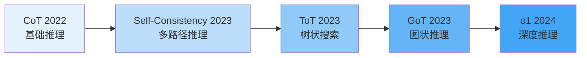
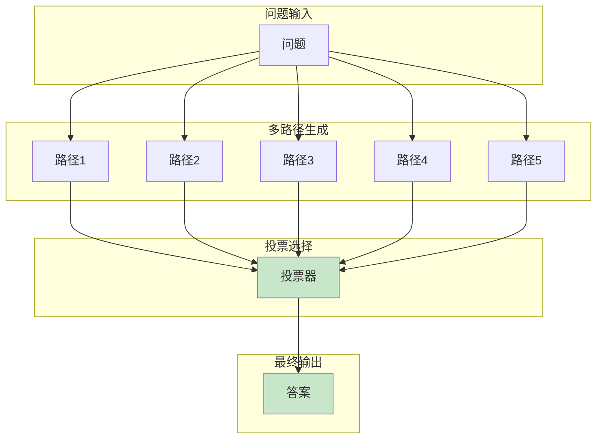
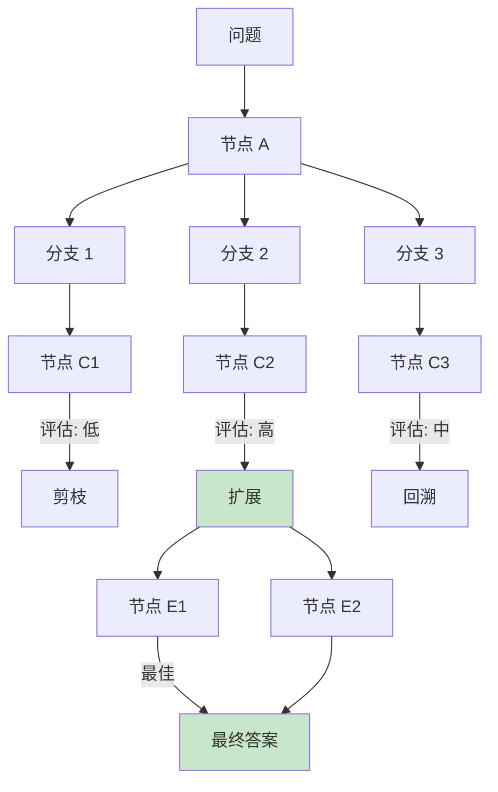
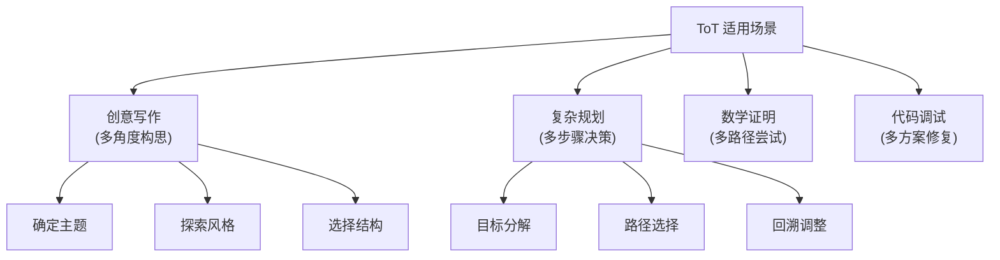
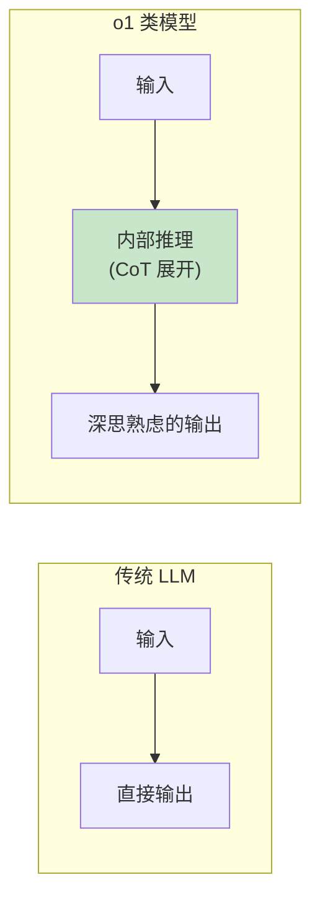
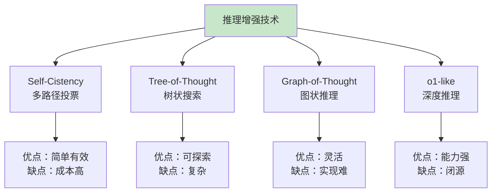
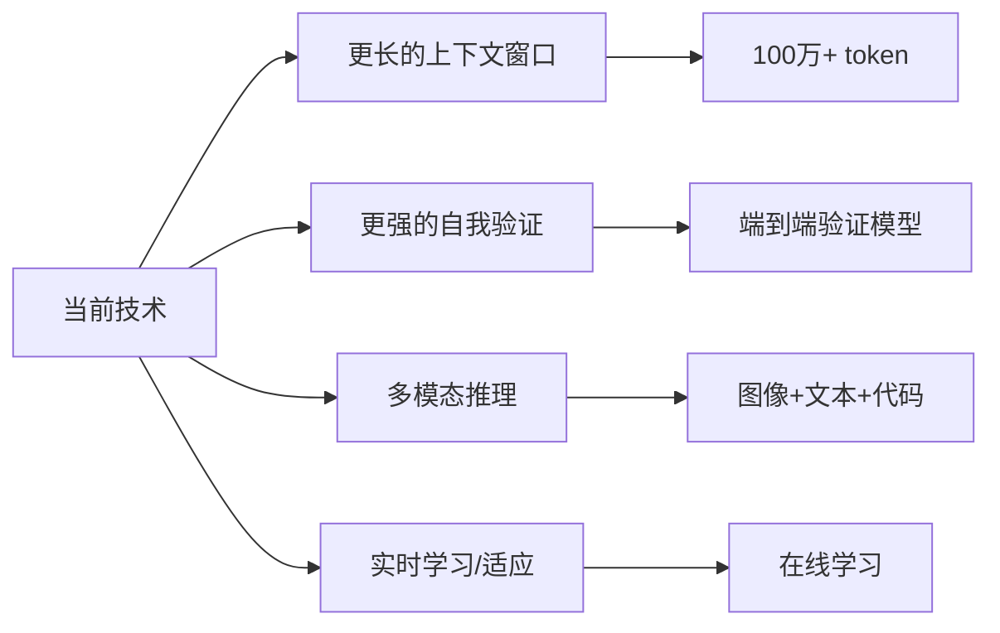

# 第八章：推理增强技术的演进

> 从 Chain-of-Thought 到 o1-like 模型的技术进化之路

---

## 8.1 技术演进概览



---

## 8.2 Self-Consistency（自我一致性）

### 8.2.1 核心思想

**论文**：Self-Consistency Improves Chain-of-Thought Reasoning in Language Models (2023)

**核心思想**：不仅仅生成一条推理路径，而是生成多条不同的推理路径，然后通过投票选择最一致的答案。



### 8.2.2 实现原理

```python
class SelfConsistency:
    def __init__(self, model, n_samples=5):
        self.model = model
        self.n_samples = n_samples

    def generate(self, question):
        """生成多条推理路径并投票"""
        # 1. 采样多条推理路径
        paths = []
        for _ in range(self.n_samples):
            # 使用温度采样增加多样性
            path = self.model.generate(
                question,
                temperature=0.7,  # 较高温度增加多样性
                do_sample=True
            )
            paths.append(path)

        # 2. 提取答案
        answers = [self._extract_answer(p) for p in paths]

        # 3. 投票选择
        final_answer = self._vote(answers)

        return {
            "answer": final_answer,
            "all_paths": paths,
            "vote_counts": self._count_votes(answers)
        }

    def _extract_answer(self, path):
        """从推理路径中提取最终答案"""
        # 解析最后一行或特定格式
        pass

    def _vote(self, answers):
        """多数投票"""
        from collections import Counter
        counts = Counter(answers)
        return counts.most_common(1)[0][0]
```

### 8.2.3 效果分析

| 模型 | CoT 准确率 | Self-Consistency | 提升 |
|-----|-----------|-----------------|------|
| PaLM 540B | 63% | 77% | +14% |
| GPT-4 | 74% | 86% | +12% |

**优势**：

- 无需额外训练
- 可以与任何 CoT 方法结合
- 提供不确定性估计（投票分布）

**成本**：

- 需要生成多次，计算成本 N 倍

---

## 8.3 Tree-of-Thought（思维树）

### 8.3.1 核心思想

**论文**：Tree of Thought: Deliberate Problem Solving with Large Language Models (2023)

**核心思想**：将推理过程组织成树状结构，支持回溯和探索不同分支。



### 8.3.2 ToT 的四个关键操作

```python
class TreeOfThought:
    def __init__(self, model):
        self.model = model
        self.tree = {}  # 存储树结构

    def think(self, initial_thought, max_depth=5):
        """思维树推理主循环"""
        # 1. 生成（Generate）：从当前节点生成多个候选
        candidates = self._generate_candidates(initial_thought)

        # 2. 评估（Evaluate）：评估每个候选的价值
        scores = {c: self._evaluate(c) for c in candidates}

        # 3. 排序（Rank）：按分数排序
        ranked = sorted(scores.items(), key=lambda x: x[1], reverse=True)

        # 4. 搜索（Search）：深度优先或广度优先搜索
        return self._search(ranked, max_depth)

    def _generate_candidates(self, thought):
        """生成候选分支"""
        prompt = f"""
当前思考：{thought}

请从不同角度生成 3 个可能的推理方向：
1. 角度一：
2. 角度二：
3. 角度三：
"""
        response = self.model.generate(prompt)
        return self._parse_candidates(response)

    def _evaluate(self, candidate):
        """评估候选的价值/可行性"""
        prompt = f"""
请评估以下推理方向的成功可能性（0-100分）：

{candidate}

评估：
"""
        response = self.model.generate(prompt)
        return self._parse_score(response)

    def backtrack(self, node_id):
        """回溯到父节点"""
        if node_id in self.tree:
            parent_id = self.tree[node_id].parent
            if parent_id:
                return self.tree[parent_id]
        return None
```

### 8.3.3 ToT vs CoT 对比

| 特性 | CoT | ToT |
|-----|-----|-----|
| **结构** | 线性链状 | 树状分支 |
| **探索** | 单路径 | 多路径 |
| **回溯** | 不支持 | 支持 |
| **剪枝** | 不支持 | 支持 |
| **适用** | 简单推理 | 复杂规划 |
| **计算量** | 低 | 高 |

### 8.3.4 应用场景



---

## 8.4 Graph-of-Thought（思维图）

### 8.4.1 核心思想

**论文**：Graph of Thought: Unifying Large Language Models of Reasoning (2023)

**核心思想**：将推理过程建模为有向图，支持更复杂的推理结构（合并、分叉、循环）。

```mermaid
flowchart TD
    Q[问题] --> A[节点 A]
    A --> B[节点 B]
    A --> C[节点 C]

    B --> D[节点 D\n(合并)]
    C --> D

    D --> E[节点 E]
    E --> F[节点 F]
    F --> E  <!-- 循环/反馈 -->

    D --> G[节点 G]

    E --> H[最终答案]

    style D fill:#c8e6c9
    style H fill:#c8e6c9
```

### 8.4.2 GoT 的五种操作

| 操作 | 符号 | 描述 | 示例 |
|-----|------|------|------|
| **聚合** | ⊕ | 合并多个输入 | 多个方案综合评估 |
| **细化** | ↱ | 改进已有思考 | 优化解决方案 |
| **分叉** | ↘ | 复制并分支 | 从一点探索多方向 |
| **回溯** | ↩ | 返回之前状态 | 发现错误时纠正 |
| **循环** | ↻ | 重复直到满足条件 | 迭代优化 |

### 8.4.3 代码框架

```python
class GraphOfThought:
    def __init__(self, model):
        self.model = model
        self.graph = nx.DiGraph()

    def aggregate(self, node_ids, name):
        """聚合操作：合并多个节点的输出"""
        inputs = [self.graph.nodes[n]['output'] for n in node_ids]
        prompt = f"""
综合以下多个推理结果，给出最终结论：

{chr(10).join(inputs)}

综合结论：
"""
        output = self.model.generate(prompt)
        new_node = self._add_node(name, output)
        for n in node_ids:
            self.graph.add_edge(n, new_node)
        return new_node

    def refine(self, node_id, feedback):
        """细化操作：改进已有思考"""
        current = self.graph.nodes[node_id]['output']
        prompt = f"""
当前解决方案：
{current}

改进建议：
{feedback}

改进后的解决方案：
"""
        output = self.model.generate(prompt)
        new_node = self._add_node(f"{node_id}_refined", output)
        self.graph.add_edge(node_id, new_node)
        return new_node

    def loop_until(self, node_id, condition_prompt):
        """循环操作：迭代直到满足条件"""
        while True:
            current = self.graph.nodes[node_id]['output']
            condition = self._check_condition(condition_prompt, current)
            if condition:
                return node_id
            node_id = self.refine(node_id, "请改进以满足条件")
```

---

## 8.5 o1-like 推理模型

### 8.5.1 OpenAI o1 的突破

**发布时间**：2024年9月

**核心特点**：通过强化学习训练，具备"深度思考"能力



### 8.5.2 o1 的工作原理（推测）

```python
class O1LikeModel:
    def __init__(self, base_model, reasoning训练数据):
        self.base_model = base_model
        self.reasoning_data = reasoning数据

    def generate(self, prompt):
        """o1 风格的推理生成"""

        # 1. 问题分析阶段
        problem_analysis = self._analyze_problem(prompt)

        # 2. 规划阶段
        plan = self._create_plan(problem_analysis)

        # 3. 逐步推理阶段
        reasoning_steps = []
        for step in plan:
            step_result = self._execute_step(step)
            reasoning_steps.append(step_result)

            # 4. 中间检查
            if self._needs_revision(step_result):
                step_result = self._revise(step_result)

        # 5. 最终答案
        final_answer = self._synthesize(reasoning_steps)

        return final_answer
```

### 8.5.3 与传统 CoT 的对比

| 特性 | 基础 CoT | o1-like |
|-----|---------|---------|
| **训练方式** | 提示工程 | RLHF/强化学习 |
| **推理深度** | 浅（Few-shot） | 深（内部展开） |
| **错误恢复** | 弱 | 强（自我纠错） |
| **规划能力** | 弱 | 强 |
| **成本** | 低（单次调用） | 高（多次调用） |

### 8.5.4 代表性模型

| 模型 | 发布者 | 特点 |
|-----|-------|------|
| **o1** | OpenAI | 深度推理，数学/代码能力强 |
| **o3** | OpenAI | o1 的改进版本 |
| **Claude 3.5 Sonnet** | Anthropic | 带有思考过程 |
| **Gemini 1.5 Pro** | Google | 多模态推理 |

---

## 8.6 技术对比总结



### 8.6.1 选择指南

```python
def choose_reasoning_technique(task, budget, accuracy_requirement):
    """
    选择推理技术

    参数:
        task: 任务复杂度 ('simple', 'moderate', 'complex')
        budget: 计算预算 ('low', 'medium', 'high')
        accuracy_requirement: 准确率要求 (0-1)
    """

    if task == 'simple':
        return "CoT"  # 简单任务直接用 CoT

    if budget == 'low':
        if accuracy_requirement > 0.8:
            return "Self-Consistency (n=3)"  # 轻度投票
        return "CoT"

    if task == 'complex' and budget == 'high':
        return "Tree-of-Thought or Graph-of-Thought"

    if accuracy_requirement > 0.9:
        return "Self-Consistency (n=5-10) or o1-like"

    return "CoT or Self-Consistency"
```

### 8.6.2 性能-成本权衡

```
        准确率
          ↑
    100% ──┤                    ┌── o1-like
          │              ┌──────┘
     90% ──┤        ┌────┘
          │   ┌────┘
     80% ──┤──┘
          │
     70% ──┤
          │
     60% ──┤
          │
          └───────────────────────────────→ 计算成本
              低    中    高   很高
```

---

## 8.7 未来方向



---

## 8.8 总结

| 技术 | 年份 | 核心思想 | 适用场景 |
|-----|------|---------|---------|
| **CoT** | 2022 | 显式推理步骤 | 基础推理任务 |
| **Self-Consistency** | 2023 | 多路径投票 | 需要高准确率 |
| **Tree-of-Thought** | 2023 | 树状探索 | 复杂规划 |
| **Graph-of-Thought** | 2023 | 图状推理 | 迭代优化 |
| **o1-like** | 2024 | 深度强化学习 | 极复杂任务 |

**发展趋势**：

1. 从外部提示到内部训练
2. 从单路径到多路径
3. 从静态到动态规划
4. 从通用到专业化

---

## 参考文献

1. "Self-Consistency Improves Chain-of-Thought Reasoning" (Wang et al., 2023)
2. "Tree of Thought: Deliberate Problem Solving" (Yao et al., 2023)
3. "Graph of Thought: Unifying LLM Reasoning" (Besta et al., 2023)
4. OpenAI o1 技术报告 (2024)
