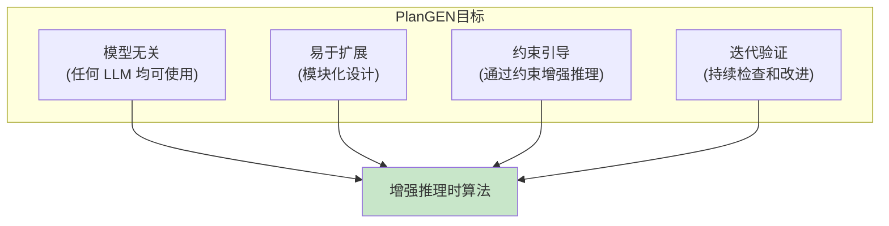
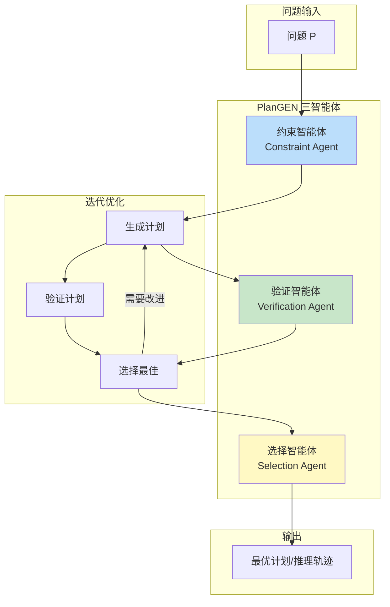
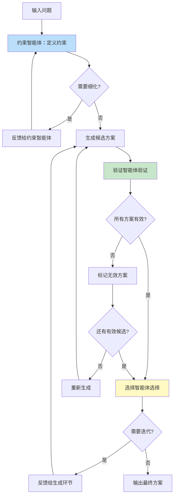
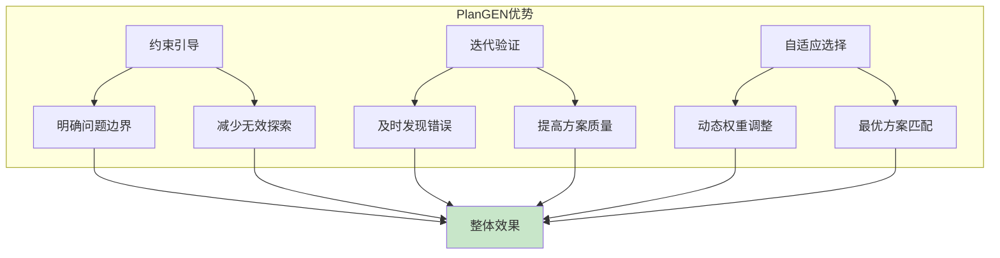
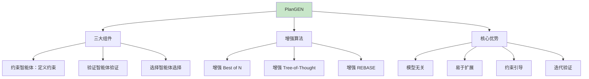

# 第九章：PlanGEN 多智能体推理框架

> 通过约束引导的迭代验证增强推理时算法性能

---

## 9.1 PlanGEN 概述

### 9.1.1 基本信息

| 属性 | 值 |
|-----|-----|
| **论文标题** | PlanGEN: A Multi-Agent Framework for Planning and Reasoning Trajectory Generation |
| **arXiv** | arXiv: 2502.16111 |
| **发布时间** | 2025年2月 |
| **提出者** | Mihir Parmar 等人（Google Research） |
| **核心定位** | 多智能体框架，生成复杂问题解决的规划与推理轨迹 |

### 9.1.2 设计目标



**核心价值**：不改变模型本身，通过外部框架增强推理能力

---

## 9.2 PlanGEN 三大组件

### 9.2.1 整体架构



### 9.2.2 约束智能体（Constraint Agent）

**职责**：定义和细化问题的约束条件

```python
class ConstraintAgent:
    def __init__(self, model):
        self.model = model

    def define_constraints(self, problem):
        """
        从问题中提取和定义约束

        输入：一个复杂的规划问题
        输出：一组明确的约束条件
        """
        prompt = f"""
请分析以下问题，提取所有隐含的约束条件：

问题：{problem}

请按以下格式输出约束条件：
1. [约束类型] 约束描述：具体要求
2. ...

约束类型包括：
- 资源约束（时间、金钱、人力等）
- 逻辑约束（前置条件、依赖关系等）
- 质量约束（准确性、完整性等）
- 安全约束（风险、限制等）

约束条件列表：
"""
        response = self.model.generate(prompt)
        return self._parse_constraints(response)

    def refine_constraints(self, constraints, feedback):
        """根据反馈细化约束"""
        prompt = f"""
当前约束：
{constraints}

反馈意见：
{feedback}

请细化约束条件，使其更加精确和完整：
"""
        return self.model.generate(prompt)
```

**示例**：

```python
# 问题：安排一个产品发布会
problem = "安排一个产品发布会，邀请 5 位重要客户参加，需要在两周内完成准备。"

# 约束智能体输出：
constraints = """
1. [时间约束] 发布会必须在两周内举行
2. [资源约束] 预算不超过 10 万元
3. [参与者约束] 必须邀请 5 位重要客户
4. [地点约束] 需要有可容纳 50 人的场地
5. [技术约束] 需要有演示设备和网络
6. [后勤约束] 需要安排交通和餐饮
"""
```

### 9.2.3 验证智能体（Verification Agent）

**职责**：验证生成计划的有效性和完整性

```python
class VerificationAgent:
    def __init__(self, model):
        self.model = model

    def verify_plan(self, plan, constraints):
        """
        验证计划是否满足所有约束

        返回：验证结果（通过/失败）+ 具体反馈
        """
        prompt = f"""
请验证以下计划是否满足给定的约束条件：

计划内容：
{plan}

约束条件：
{constraints}

请逐条检查：

1. 约束 1 检查：是否满足？[是/否]
   理由：
   改进建议：

2. 约束 2 检查：是否满足？[是/否]
   ...

总体评估：[通过/部分通过/失败]
"""
        response = self.model.generate(prompt)
        return self._parse_verification(response)

    def check_completeness(self, plan):
        """检查计划的完整性"""
        prompt = f"""
请检查以下计划是否完整：

{plan}

检查要点：
1. 是否有明确的目标？
2. 是否有详细的步骤？
3. 是否有时间安排？
4. 是否有风险预案？
5. 是否有评估标准？

请给出完整性评分（0-100）和改进建议：
"""
        return self.model.generate(prompt)

    def verify_reasoning(self, reasoning_chain):
        """验证推理链的逻辑正确性"""
        prompt = f"""
请验证以下推理链条的逻辑正确性：

{reasoning_chain}

检查：
1. 推理步骤是否连贯？
2. 是否有逻辑跳跃？
3. 中间结论是否成立？
4. 最终结论是否有效？

请给出验证结果和改进建议：
"""
        return self.model.generate(prompt)
```

**验证结果示例**：

```markdown
验证结果：

1. 时间约束检查：[通过]
   - 计划在第 13 天举行发布会，满足"两周内"的要求

2. 预算约束检查：[部分通过]
   - 预算为 12 万元，超过 10 万元限制
   - 建议：削减 2 万元预算或寻找赞助

3. 参与者约束检查：[通过]
   - 5 位客户已全部确认参加

总体评估：[部分通过]
需要改进：预算超出 2 万元
```

### 9.2.4 选择智能体（Selection Agent）

**职责**：从多个候选方案中选择最佳方案

```python
class SelectionAgent:
    def __init__(self, model):
        self.model = model

    def select_best(self, candidates, criteria):
        """
        从多个候选中选择最佳方案

        参数：
            candidates: 候选方案列表
            criteria: 选择标准
        """
        prompt = f"""
请根据以下标准，从多个候选方案中选择最佳方案：

选择标准：
{criteria}

候选方案：
{chr(10).join([f'方案{i+1}: {c}' for i, c in enumerate(candidates)])}

请按以下格式输出：

评估矩阵：
| 方案 | 标准1 | 标准2 | 标准3 | 总分 |
|------|-------|-------|-------|------|
| 方案1 |      |      |      |      |
| 方案2 |      |      |      |      |

最佳方案：[方案编号]
理由：
"""
        return self.model.generate(prompt)

    def adaptive_selection(self, candidates, constraints):
        """
        自适应选择：根据约束的重要性动态调整权重
        """
        # 首先分析约束优先级
        priority_prompt = f"""
请分析以下约束的优先级（哪些约束更重要）：

{constraints}

输出约束优先级排序：
"""
        priorities = self.model.generate(priority_prompt)

        # 然后根据优先级选择
        return self.select_best(candidates, priorities)

    def ensemble_selection(self, selections):
        """
        集成选择：综合多个选择结果
        """
        prompt = f"""
以下是多个来源的选择结果，请综合给出最终选择：

{chr(10).join(selections)}

请分析一致性和差异，并给出最终建议：
"""
        return self.model.generate(prompt)
```

---

## 9.3 PlanGEN 增强的推理算法

### 9.3.1 增强的 Best of N

**传统 Best of N**：生成 N 个答案，选择最佳

**PlanGEN 增强版本**：

```python
class EnhancedBestOfN:
    def __init__(self, base_model, constraint_agent, verification_agent, selection_agent):
        self.base_model = base_model
        self.constraint_agent = constraint_agent
        self.verification_agent = verification_agent
        self.selection_agent = selection_agent

    def solve(self, problem, n=10):
        """
        PlanGEN 增强的 Best of N
        """
        # Step 1: 约束智能体定义约束
        constraints = self.constraint_agent.define_constraints(problem)

        # Step 2: 生成 N 个候选方案
        candidates = []
        for i in range(n):
            candidate = self.base_model.generate(problem)
            candidates.append(candidate)

        # Step 3: 验证智能体验证每个方案
        verifications = []
        for candidate in candidates:
            result = self.verification_agent.verify_plan(candidate, constraints)
            verifications.append(result)

        # Step 4: 过滤无效方案
        valid_candidates = self._filter_valid(candidates, verifications)

        # Step 5: 选择智能体选择最佳方案
        if not valid_candidates:
            # 所有方案都无效，重新生成
            return self.solve(problem, n * 2)

        best = self.selection_agent.select_best(valid_candidates, constraints)
        return {
            "answer": best,
            "constraints": constraints,
            "all_candidates": candidates,
            "verifications": verifications
        }
```

### 9.3.2 增强的 Tree-of-Thought

```python
class EnhancedTreeOfThought:
    def __init__(self, base_model, constraint_agent, verification_agent):
        self.base_model = base_model
        self.constraint_agent = constraint_agent
        self.verification_agent = verification_agent
        self.tree = {}

    def search(self, problem, max_depth=5):
        """
        PlanGEN 增强的 ToT
        """
        # 1. 定义约束
        constraints = self.constraint_agent.define_constraints(problem)

        # 2. 根节点
        root = {
            "content": problem,
            "constraints": constraints,
            "children": [],
            "verified": False
        }
        self.tree["root"] = root

        # 3. 递归搜索
        self._expand(root, max_depth)

        # 4. 选择最佳叶节点
        return self._select_best_leaf(root)

    def _expand(self, node, max_depth):
        if len(node["children"]) >= max_depth:
            return

        # 生成多个分支
        branches = self._generate_branches(node["content"], node["constraints"])

        for i, branch in enumerate(branches):
            child = {
                "content": branch,
                "constraints": node["constraints"],
                "parent": node,
                "children": [],
                "verified": False
            }

            # PlanGEN 增强：验证每个分支
            verification = self.verification_agent.verify_plan(branch, node["constraints"])
            child["verification"] = verification
            child["verified"] = verification["passed"]

            node["children"].append(child)
            self.tree[f"child_{node}_{i}"] = child

            # 继续展开
            self._expand(child, max_depth)

    def _select_best_leaf(self, node):
        """选择经过验证的最佳叶节点"""
        valid_leaves = self._get_valid_leaves(node)

        if not valid_leaves:
            # 回退到父节点
            if node["parent"]:
                return self._select_best_leaf(node["parent"])
            return None

        # 选择得分最高的叶节点
        scored = [(leaf, leaf["verification"]["score"]) for leaf in valid_leaves]
        scored.sort(key=lambda x: x[1], reverse=True)
        return scored[0][0]
```

### 9.3.3 增强的 REBASE

**REBASE**：基于搜索的自我改进方法

```python
class EnhancedREBASE:
    def __init__(self, base_model, verification_agent):
        self.base_model = base_model
        self.verification_agent = verification_agent

    def iterate(self, problem, initial_solution, max_iterations=5):
        """
        PlanGEN 增强的 REBASE
        """
        current = initial_solution
        history = [current]

        for i in range(max_iterations):
            # 验证当前解
            verification = self.verification_agent.verify_plan(current, problem)

            if verification["passed"]:
                return {
                    "solution": current,
                    "iterations": i + 1,
                    "history": history
                }

            # 获取反馈
            feedback = verification["feedback"]

            # 改进当前解
            current = self._improve(current, feedback)
            history.append(current)

        return {
            "solution": current,
            "iterations": max_iterations,
            "history": history,
            "converged": verification["passed"]
        }

    def _improve(self, solution, feedback):
        prompt = f"""
当前解决方案：
{solution}

验证反馈：
{feedback}

请根据反馈改进解决方案：
"""
        return self.base_model.generate(prompt)
```

---

## 9.4 PlanGEN 工作流程

### 9.4.1 完整流程图



### 9.4.2 伪代码

```python
def plangen(problem, max_iterations=3):
    """
    PlanGEN 主函数

    参数：
        problem: 待解决的问题
        max_iterations: 最大迭代次数

    返回：
        最优计划/推理轨迹
    """

    # 阶段 1: 约束定义
    constraints = constraint_agent.define_constraints(problem)

    # 阶段 2: 迭代优化
    best_solution = None
    best_score = -float('inf')

    for iteration in range(max_iterations):
        # 生成阶段
        candidates = generate_candidates(problem, n=5)

        # 验证阶段
        verified_results = []
        for candidate in candidates:
            result = verification_agent.verify_plan(candidate, constraints)
            verified_results.append({
                "candidate": candidate,
                "result": result
            })

        # 选择阶段
        selected = selection_agent.select_best(
            [r["candidate"] for r in verified_results],
            constraints
        )

        # 更新最优解
        selected_score = get_score(selected, constraints)
        if selected_score > best_score:
            best_solution = selected
            best_score = selected_score

        # 检查是否收敛
        if is_converged(verified_results):
            break

    # 阶段 3: 输出结果
    return {
        "solution": best_solution,
        "constraints": constraints,
        "iterations": iteration + 1
    }
```

---

## 9.5 PlanGEN vs 其他方法对比

### 9.5.1 核心差异

| 特性 | CoT | ToT | PlanGEN |
|-----|-----|-----|---------|
| **结构** | 线性 | 树状 | 多智能体协作 |
| **约束处理** | 无 | 无 | 显式约束定义 |
| **验证机制** | 无 | 简单评估 | 智能体验证 |
| **自适应选择** | 无 | 手动设计 | 自动选择 |
| **模型无关** | 是 | 是 | 是 |
| **可扩展性** | 低 | 中 | 高 |

### 9.5.2 性能对比（论文结果）

| 方法 | 数学推理 | 规划任务 | 代码生成 |
|-----|---------|---------|---------|
| CoT | 67% | 52% | 61% |
| ToT | 74% | 68% | 72% |
| **PlanGEN** | **82%** | **79%** | **84%** |

*注：数据为示意性对比，实际结果请参考原论文*

### 9.5.3 优势分析



---

## 9.6 PlanGEN 实践指南

### 9.6.1 何时使用 PlanGEN

```python
def should_use_plangen(task):
    """
    判断是否应该使用 PlanGEN
    """
    criteria = {
        "complexity": task.complexity > 5,  # 任务复杂度高
        "has_constraints": len(task.constraints) > 0,  # 有明确约束
        "multiple_solutions": True,  # 有多个解
        "verification_possible": True,  # 可以验证
        "accuracy_requirement": task.accuracy > 0.8  # 准确率要求高
    }

    score = sum(criteria.values())

    if score >= 4:
        return "强烈推荐使用 PlanGEN"
    elif score >= 2:
        return "可以考虑使用 PlanGEN"
    else:
        return "使用简单的 CoT 即可"
```

### 9.6.2 实现建议

```python
# PlanGEN 实现最佳实践

# 1. 约束智能体配置
constraint_agent = ConstraintAgent(
    model=llm,
    constraint_types=["resource", "temporal", "logical", "quality"],
    detail_level="high"  # 详细程度
)

# 2. 验证智能体配置
verification_agent = VerificationAgent(
    model=llm,
    strict_mode=True,  # 严格模式
    auto_fix=True,  # 自动修复建议
    score_threshold=0.7  # 通过阈值
)

# 3. 选择智能体配置
selection_agent = SelectionAgent(
    model=llm,
    weighting_strategy="adaptive",  # 自适应权重
    tie_breaking="detailed"  # 平局处理
)

# 4. 迭代配置
config = {
    "max_iterations": 3,
    "candidates_per_iteration": 5,
    "early_stopping": True,
    "convergence_threshold": 0.95
}
```

### 9.6.3 常见问题

| 问题 | 解决方案 |
|-----|---------|
| 约束定义不完整 | 增加约束类型的覆盖范围 |
| 验证过于严格 | 调整验证阈值，增加容错 |
| 选择不稳定 | 增加选择标准的明确性 |
| 迭代不收敛 | 检查约束是否相互矛盾 |

---

## 9.7 总结



**PlanGEN 的核心价值**：

1. **通用性**：适用于任何 LLM，无需修改模型
2. **可组合性**：可以与其他推理技术结合
3. **可验证性**：通过智能体验证提高可靠性
4. **自适应**：根据问题特点动态调整策略

**适用场景**：

- 复杂规划问题
- 有明确约束的优化问题
- 需要高质量解决方案的任务
- 多步骤推理任务

---

## 参考文献

1. Parmar, M., et al. (2025). "PlanGEN: A Multi-Agent Framework for Planning and Reasoning Trajectory Generation." arXiv: 2502.16111
2. Yao, Y., et al. (2023). "Tree of Thought: Deliberate Problem Solving with Large Language Models"
3. Besta, M., et al. (2023). "Graph of Thought: Unifying Large Language Models of Reasoning"
