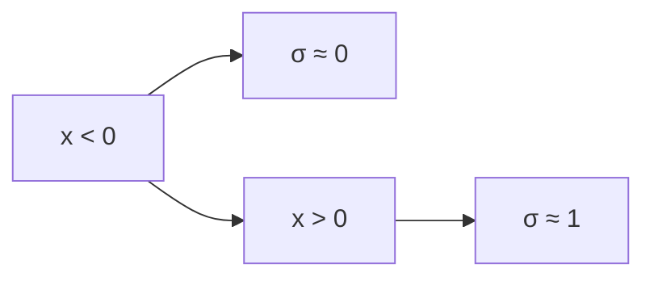
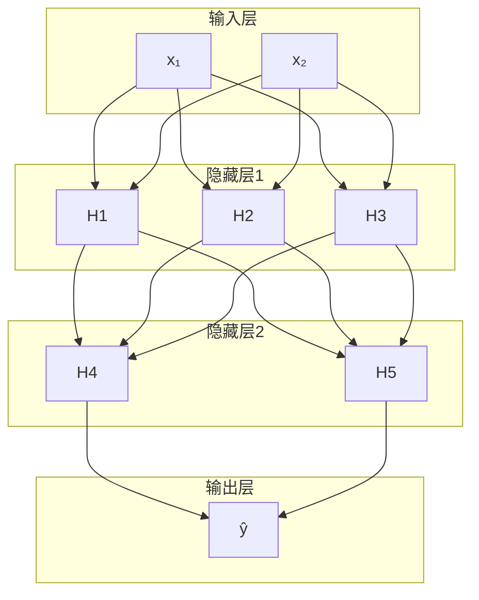
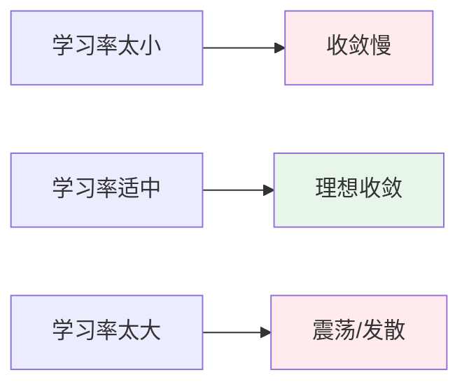
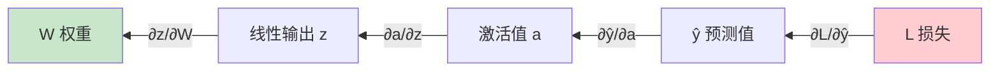
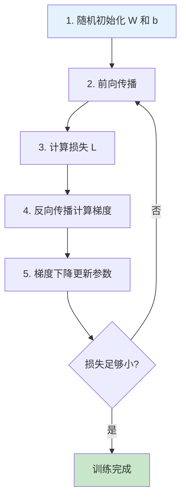

# 从函数到 Transformer：神经网络基础详解

## 引言：用函数描述世界

在深入理解现代深度学习之前，我们需要先理解一个核心思想：**用函数来描述世界的规律**。

无论是物理定律、经济规律还是语言规律，本质上都可以看作是一个函数：

$$y = f(x)$$

其中：
- $x$ 是输入（已知信息）
- $y$ 是输出（预测结果）
- $f$ 是函数本身（描述了输入和输出之间的规律）

---

## 第一章：两种思维范式

### 1.1 符号主义（Symbolic AI）

符号主义的核心思想是：**通过人类的观察和总结，发现事物背后的规律，用明确的数学函数来描述**。

**典型例子**：
- 勾股定理：$a^2 + b^2 = c^2$
- 牛顿第二定律：$F = ma$
- 欧姆定律：$V = IR$

**局限性**：
随着问题复杂度增加，符号主义面临瓶颈：
- 机器翻译：无法用明确规则描述语言转换
- 图像识别：无法用规则描述所有视觉模式
- 天气预测：变量太多，规律太复杂

### 1.2 连接主义（Connectionism）

连接主义的核心思想是：**不试图发现明确的规律，而是根据输入-输出数据来"学习"出规律**。

**核心思路**：

```mermaid
flowchart LR
    A[输入数据 X] --> B[猜测函数 fθ]
    B --> C[预测值 ŷ]
    C --> D[计算误差 L = |y - ŷ|]
    D --> E{调整参数}
    E --> B
```

**关键步骤**：
1. 收集大量输入-输出数据对 $(x_i, y_i)$
2. 假设一个函数形式 $f_\theta(x)$（参数 $\theta$ 待定）
3. 计算预测值与真实值的偏差
4. 最小化偏差，调整参数 $\theta$
5. 最终得到的 $f_\theta$ 就是学到的规律

---

## 第二章：从线性到非线性

### 2.1 线性回归：最简单的连接主义

最简单的一元线性函数：

$$y = kx + b$$

其中 $k$ 是斜率（权重），$b$ 是截距（偏置）。

**最小二乘法**用于求解最优的 $k$ 和 $b$：

$$k = \frac{n\sum(xy) - \sum x \sum y}{n\sum(x^2) - (\sum x)^2}$$

$$b = \frac{\sum y - k\sum x}{n}$$

### 2.2 为什么需要非线性？

现实世界中的规律往往是**非线性**的。线性函数（直线）无法拟合复杂的现实规律。

**解决方案**：引入**激活函数**（Activation Function）

### 2.3 常用激活函数

#### Sigmoid 函数

$$\sigma(x) = \frac{1}{1 + e^{-x}}$$

**特点**：
- 输出范围：$(0, 1)$
- 常用于二分类问题
- 缺点：梯度消失问题



#### ReLU 函数

$$\text{ReLU}(x) = \max(0, x)$$

**特点**：
- 输出范围：$[0, +\infty)$
- 解决了梯度消失问题
- **现代深度学习最常用的激活函数**

### 2.4 神经网络的结构

神经网络 = 多个线性变换 + 激活函数 组合：

$$z = W \cdot x + b \quad \text{(线性变换)}$$

$$a = \text{激活函数}(z) \quad \text{(非线性变换)}$$

---

## 第三章：神经网络结构详解

### 3.1 网络层次结构



**术语解释**：
- **输入层**：接收原始数据
- **隐藏层**：中间的计算层，不直接与外界交互
- **输出层**：产生最终预测结果
- **神经元**：每个圆圈代表一个神经元

### 3.2 前向传播（Forward Propagation）

数据从输入层 → 隐藏层 → 输出层的传播过程。

**数学表示**：

对于第 $l$ 层：
$$z^{(l)} = W^{(l)} \cdot a^{(l-1)} + b^{(l)}$$
$$a^{(l)} = \text{激活函数}(z^{(l)})$$

其中：
- $W^{(l)}$：第 $l$ 层的权重矩阵
- $b^{(l)}$：第 $l$ 层的偏置向量
- $a^{(l-1)}$：第 $l-1$ 层的输出

**前向传播流程**：

```mermaid
flowchart LR
    X[输入 x] --> W1[权重 W¹]
    W1 --> A1[a¹ = σ(z¹)]
    A1 --> W2[权重 W²]
    W2 --> A2[a² = σ(z²)]
    A2 --> Y[输出 ŷ]

    style X fill:#e1f5fe
    style Y fill:#fff3e0
```

---

## 第四章：损失函数

### 4.1 均方误差（MSE）

$$\text{MSE} = \frac{1}{n}\sum_{i=1}^{n}(y_i - \hat{y}_i)^2$$

**为什么用平方而不是绝对值？**

| 优点 | 说明 |
|------|------|
| 可导 | 平方函数处处可导，便于优化 |
| 惩罚大误差 | 平方让大误差受到更大惩罚 |

### 4.2 训练目标

> 训练神经网络的目标：找到使损失函数最小化的参数 $W$ 和 $b$

$$\min_{W, b} \text{Loss}(W, b) = \frac{1}{n}\sum_{i=1}^{n}(y_i - \hat{y}_i)^2$$

---

## 第五章：梯度下降算法

### 5.1 核心思想

想象一个乒乓球在凹凸不平的地面上滚动：
- 重力让它往低处滚
- 最终停在某个"坑底"（极小值点）

**梯度下降公式**：

$$W_{new} = W_{old} - \eta \cdot \frac{\partial L}{\partial W}$$

其中 $\eta$ 是**学习率**（learning rate）。

### 5.2 学习率的影响



| 学习率 | 效果 |
|--------|------|
| 太小 | 收敛极慢，需要很多轮迭代 |
| 适中 | 快速收敛到最优解 |
| 太大 | 跳过最优解，甚至发散 |

### 5.3 梯度下降可视化

```
        局部极大值
            ▲
           ╱ ╲
          ╱   ╲
         ╱     ╲
        ╱       ╲
───────●────────●───────→ W
      极小值    极小值
```

梯度下降会沿着梯度的**反方向**移动，因此总是能找到（局部）极小值。

---

## 第六章：反向传播算法

### 6.1 链式法则（Chain Rule）

神经网络是一个**复合函数**：

$$L = f(g(h(x)))$$

**链式法则**：

$$\frac{\partial L}{\partial x} = \frac{\partial L}{\partial f} \cdot \frac{\partial f}{\partial g} \cdot \frac{\partial g}{\partial h} \cdot \frac{\partial h}{\partial x}$$

### 6.2 神经网络中的链式法则

在神经网络中：

$$\frac{\partial L}{\partial W} = \frac{\partial L}{\partial \hat{y}} \cdot \frac{\partial \hat{y}}{\partial a} \cdot \frac{\partial a}{\partial z} \cdot \frac{\partial z}{\partial W}$$

**反向传播路径**：



### 6.3 反向传播过程

**前向传播**：
$$x \rightarrow z_1 = W_1x + b_1 \rightarrow a_1 = \sigma(z_1) \rightarrow z_2 = W_2a_1 + b_2 \rightarrow \hat{y} = \sigma(z_2) \rightarrow L$$

**反向传播**：
$$\frac{\partial L}{\partial W_2} = \frac{\partial L}{\partial \hat{y}} \cdot \frac{\partial \hat{y}}{\partial z_2} \cdot \frac{\partial z_2}{\partial W_2}$$

$$\frac{\partial L}{\partial W_1} = \frac{\partial L}{\partial \hat{y}} \cdot \frac{\partial \hat{y}}{\partial z_2} \cdot \frac{\partial z_2}{\partial a_1} \cdot \frac{\partial a_1}{\partial z_1} \cdot \frac{\partial z_1}{\partial W_1}$$

---

## 第七章：完整训练流程

### 7.1 训练步骤



### 7.2 数学总结

| 步骤 | 公式 |
|------|------|
| 前向传播 | $z^{(l)} = W^{(l)} \cdot a^{(l-1)} + b^{(l)}$ |
| 激活 | $a^{(l)} = \sigma(z^{(l)})$ |
| 损失 | $L = \frac{1}{n}\sum(y_i - \hat{y}_i)^2$ |
| 参数更新 | $W \leftarrow W - \eta \cdot \frac{\partial L}{\partial W}$ |

---

## 第八章：核心概念总结

| 概念 | 含义 |
|------|------|
| **前向传播** | 数据从输入层到输出层的计算过程 |
| **反向传播** | 从输出层向输入层计算梯度的过程 |
| **损失函数** | 衡量预测值与真实值差距的函数 |
| **梯度下降** | 通过梯度方向找到损失函数最小值的优化算法 |
| **链式法则** | 复合函数求导的法则，用于反向传播 |
| **学习率** | 控制参数更新步长的超参数 |
| **激活函数** | 引入非线性的函数（ReLU, Sigmoid 等） |

---

## 下一步：探索 Transformer

在理解了这些基础概念后，你可以继续探索：

1. **注意力机制（Attention）**：让模型学会关注最重要的输入
2. **自注意力（Self-Attention）**：序列内部的关系建模
3. **位置编码（Positional Encoding）**：为序列添加位置信息
4. **多头注意力（Multi-Head Attention）**：并行学习多种关系
5. **Encoder-Decoder 架构**：处理序列到序列的任务

---

## 参考资料

- 《深度学习》（Deep Learning）- Ian Goodfellow
- 《神经网络与深度学习》- Michael Nielsen
- PyTorch 官方教程
